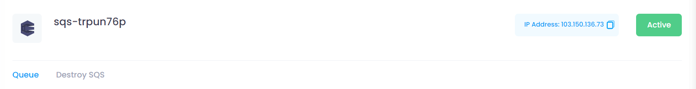
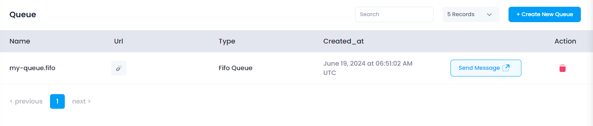
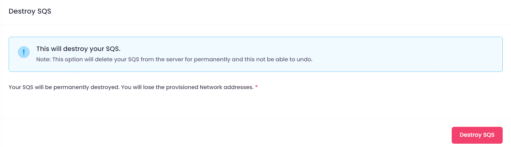
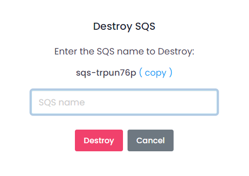

## SQS Configuration Info

At the top of the Manage section, users can view the configuration information of the selected SQS. This includes:

* **SQS Name:** The unique name assigned to the SQS.
* **Datacenter Location:** The chosen datacenter location.
* **Status:** The current status of the SQS (e.g., active, inactive, pending).

## Manage Queue

In the Manage SQS section, users have the ability to add new queues, delete existing queues, and send messages. This section provides the following functionalities:

* **Add User:** Click the **Add User** button to open a form where you can enter the user details such as queue type, Visibility timeout, Message retention period, Maximum message size,and queue name.
* **Remove User:** Select a user from the list and click the **Remove** button to remove the queue from the SQS.
* **Send Message:** Select a user from the list, click the **Download** button, which will download your vpn user into your brows.

## Destroy

In the Destroy section, users can terminate the SQS. This action is irreversible and will permanently delete the SQS and all associated data. To destroy a SQS

Click the **Destroy SQS** button.

##### **Confirmation:**

A confirmation dialog will appear. Confirm the action to proceed with destroying the SQS.

When you provide the confirmation then your SQS Instance will destroy.
