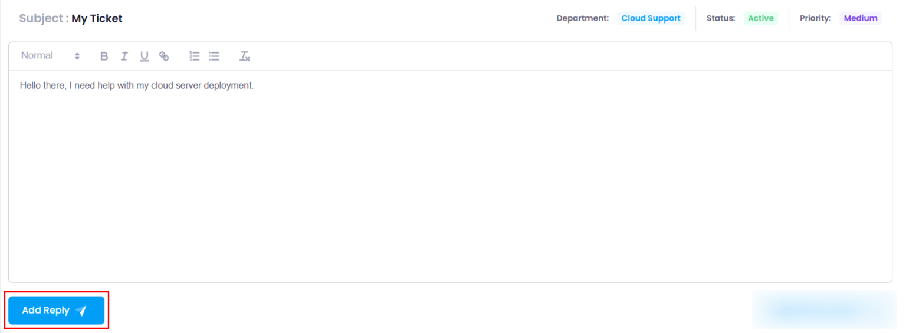
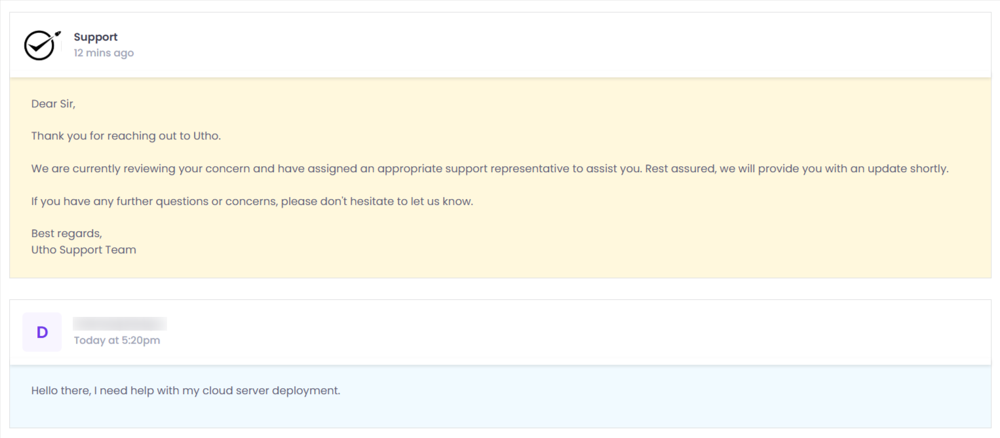

# **How to Add Reply on a Ticket**

## **Overview**

The **Add Reply** feature allows you to respond to a ticket after it has been opened. You can provide additional details or clarify your issue for the respective team handling the ticket.

---

## **Login or Sign Up**

1. Visit the **Utho Cloud Platform** [login](https://console.utho.com/login) page.
2. Enter your credentials and click  **Login** .
3. If you’re not registered, sign up [here](https://console.utho.com/signup).

---

## **Steps to Add Reply on a Ticket**

1. **Navigate to the Ticket Listing Page**
   * You can access the **Ticket Listing Page** by clicking [here](https://console.utho.com/ticket "Ticket Listing Page").
   * On the listing page, find and select the ticket for which you want to add a reply.
2. **Access the Manage Page of the Ticket**
   * In the ticket list, click on the **Manage** button at the end of the desired ticket entry.
   * This will redirect you to the **Manage Page** of the ticket.

     
3. **Add Your Reply**
   * On the  **Manage Page** , you will see a **text editor**.
   * Enter your reply in the provided text editor.
4. **Click the "Add Reply" Button**
   * After writing your reply, click on the **Add Reply** button to submit it.
   * Your reply will then be added to the ticket conversation.

     
5. **Verify the Reply**
   * Once your reply has been added, scroll down to the **Replies** section.
   * Here, you can verify if your response has been successfully added. You will see the entire conversation, including your reply and previous replies from the team.

     
