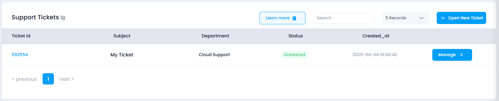

# **How to View Answered Tickets**

## **Overview**

This guide will help you view all the answered tickets in your Utho Cloud Platform account. By following the steps below, you can filter the tickets that have been marked as answered.

## **Login or Sign Up**

1. Visit the **Utho Cloud Platform** [login](https://console.utho.com/login) page.
2. Enter your credentials and click  **Login** .
3. If you’re not registered, sign up [here](https://console.utho.com/signup).

## **Steps to View Answered Tickets**

1. **Access the Tickets Listing Page**

   * Navigate to the tickets listing page in your account, or click [here]( "Tickets Listing Page") to directly access it.
2. **Locate the "Answered Tickets" Card**

   * At the top of the tickets listing page, you will see a green-colored card.
   * This card displays the total number of **Answered Tickets** and is labeled with the title  '**Answered Tickets'.**

     
3. **Click on the "Answered Tickets" Card**

   * Clicking on this card will update the ticket list in the table below, showing only the tickets that have been answered.
4. **View the Answered Tickets**

   * In the listing below, you will now see only the tickets marked as answered. The table will display key details, including:
     * **Ticket ID**
     * **Subject**
     * **Department**
     * **Status** (Answered)
     * **Creation Date**

       

   This allows you to easily access and review all tickets that have received a response from the team.
