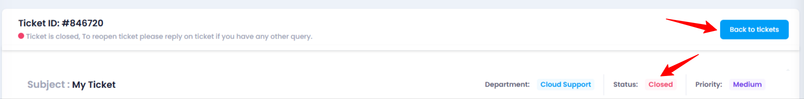

# **How to Close a Ticket**

## **Overview**

The **Close Ticket** feature allows you to mark a ticket as resolved or temporarily closed. This can help you keep track of tickets that have been addressed but may need to be reopened if further assistance is required.

## **Steps to Close a Ticket**

1. **Login to Utho Cloud Platform**
   * Visit the **Utho Cloud Platform** [login](https://console.utho.com/login) page.
   * Enter your credentials and click  **Login** .
   * If you’re not registered, sign up [here](https://console.utho.com/signup).
2. **Navigate to the Ticket Listing Page**
   * After logging in, go to the  **Ticket Listing Page** .
   * You can navigate to the listing page by clicking [here](https://console.utho.com/ticket "Ticket Listing Page").
   * You will see a list of all your tickets with their current statuses.
3. **Select the Ticket to Close**
   * Find the ticket that you want to close from the listing page.
   * Click on the **Manage** button next to the ticket you wish to close.
     * This will take you to the  **Manage Ticket Page** .

       
4. **Click the "Set to Close" Button**
   * In the  **Manage Ticket Page** , look for the **Set to Close** button on the top-right corner of the page.
   * Click on this button to initiate the closing process.

     
5. **Confirm the Action**
   * A confirmation popup will appear asking you to confirm the closure of the ticket temporarily.
   * You will also see a note that allows you to reopen the ticket if you need further assistance on this issue.
   * Click **OK** to proceed with closing the ticket.

     
6. **Verify the Change**
   * After closing the ticket, the button text will change to  **Back to Tickets** .
   * To verify if the ticket has been closed, you can check the status at the top of the manage page.

     
7. **Go to the "Closed Tickets" Section**
   * On the  **Ticket Listing Page** , locate the **Closed Tickets** card, which will have a red color.
   * Click on the **Closed Tickets** card, and you will be able to see the list of closed tickets, including the one you just closed.
