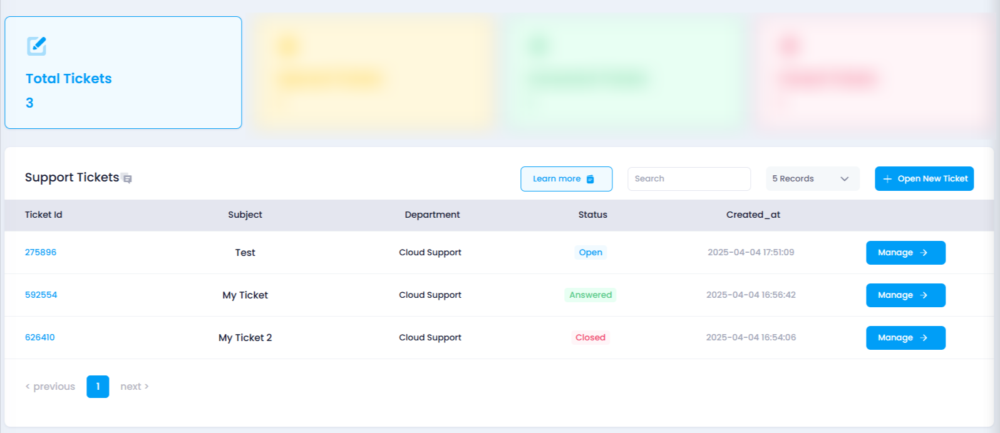

# **How to View All Tickets**

## **Overview**

The **View All Tickets** feature allows users to access a comprehensive list of all tickets they’ve raised. From here, users can monitor the status, department, and other details of their support, billing, or sales queries.

## **Login or Sign Up**

1. Visit the **Utho Cloud Platform** [login](https://console.utho.com/login) page.
2. Enter your credentials and click  **Login** .
3. If you’re not registered, sign up [here](https://console.utho.com/signup).

## **Steps to View All Tickets**

1. **Access the Tickets Listing Page**
   * Navigate to the **Tickets** listing page in your account, or click [here ](https://console.utho.com/ticket "Tickets Listing Page")to directly access it.
2. **View the List of All Tickets**
   * By default, the page will display a list of all your raised tickets, which include the following details:
     * **Ticket ID** : The unique identifier for each ticket.
     * **Subject** : The title or subject of the ticket, indicating the issue or query raised.
     * **Department** : The department the ticket is assigned to (Support, Sales, Billing).
     * **Status** : The current status of the ticket, which could be  **Open** ,  **Answered** , or  **Closed** .
     * **Creation Date** : The date when the ticket was created.
       
3. **Filter and Search Tickets (Optional)**
   * If you want to find a specific ticket, use the **search bar** or **filters** available on the page to narrow down the list by ticket ID, department, or status.
