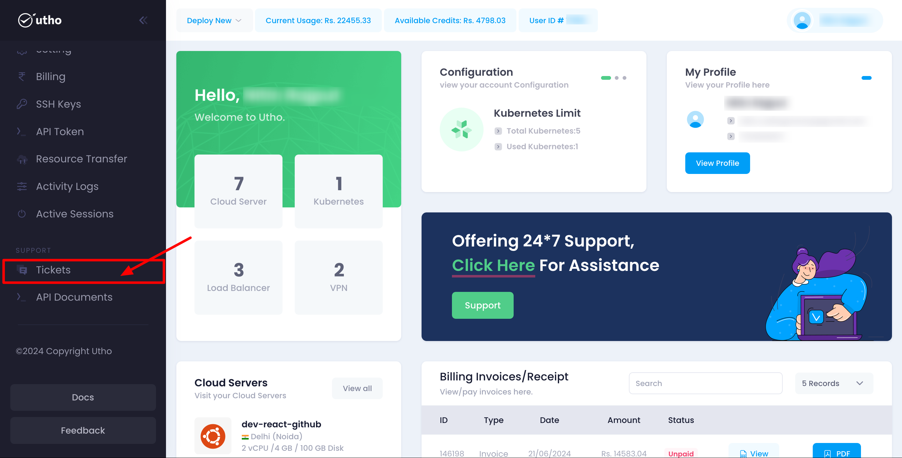
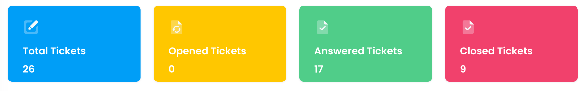
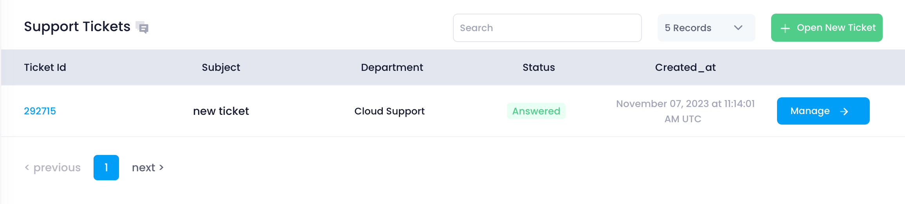
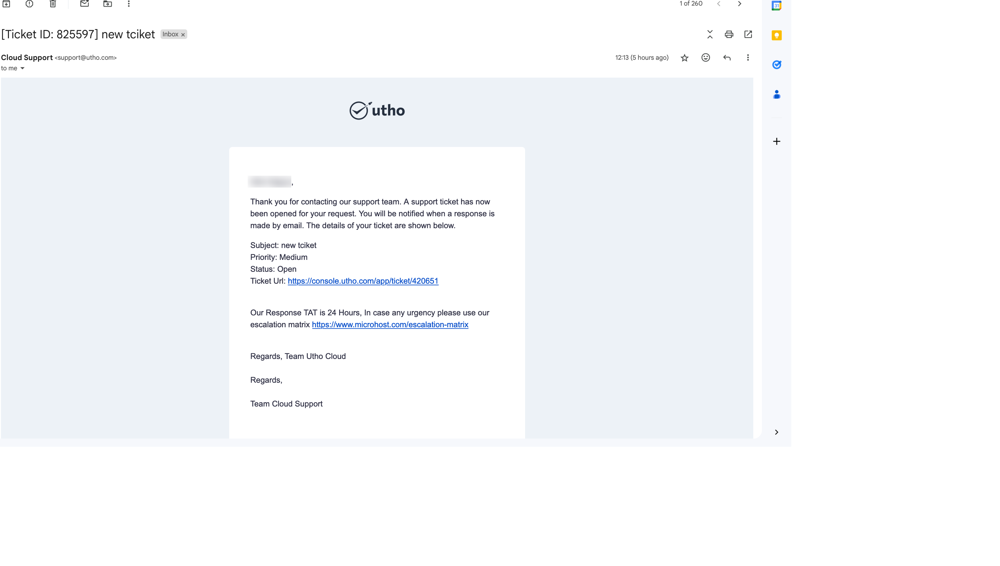

## Initial Start

* **Log in** to your account on our platform.
* **Navigate** to the aside bar and locate the **Ticket** and **click** that tab

## Quick Start

##### Open the Ticket Page:

After click on the above Ticket button a ticketpage will open

The Ticket Dashboard provides a comprehensive view of your support tickets. At a glance, you can see the following metrics:

* **Total Tickets:** The total number of tickets created in your account.
* **Open Tickets:** Tickets that are currently open and awaiting resolution.
* **Answered Tickets:** Tickets that have received a response but are not yet closed.
* **Closed Tickets:** Tickets that have been resolved and closed.

Below the metrics, there is a table listing all the tickets created in your account.

### Tickets Table

The table displays the following columns:

* **Ticket ID:** A unique identifier for each ticket.
* **Subject:** The subject line of the ticket, summarizing the issue.
* **Department:** The department the ticket is assigned to (e.g., Support, Account, Sales).
* **Status:** The current status of the ticket (e.g., Open, Answered, Closed).
* **Created At:** The date and time when the ticket was created.

At the top of the table, there is an **Open Ticket** button for creating new tickets.

### Creating a New Ticket

To create a new ticket, follow these steps:

1. **Click on the Open Ticket Button:**
   * Located at the top of the tickets table, clicking this button will open a drawer from the right side of the screen.
2. **Fill in the Open Ticket Form:**
   * **Department:** Select the department relevant to your issue (Support, Account, Sales).
   * **Priority:** Choose the priority level of the ticket (Urgent, Medium, Low).
   * **Subject:** Enter a brief subject line summarizing the issue.
   * **Message:** Provide a detailed description of the issue or request.
3. **Submit the Form:**
   * Click the **Open New Ticket** button at the bottom of the form. Upon submission, a new ticket will be created.
4. **Ticket Creation Confirmation:**
   * After creating the ticket, you will be redirected to the newly created ticket's details page.
   * An email confirmation will also be sent to notify you of the ticket creation.

     
