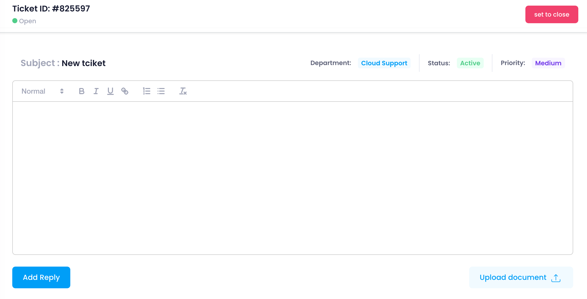
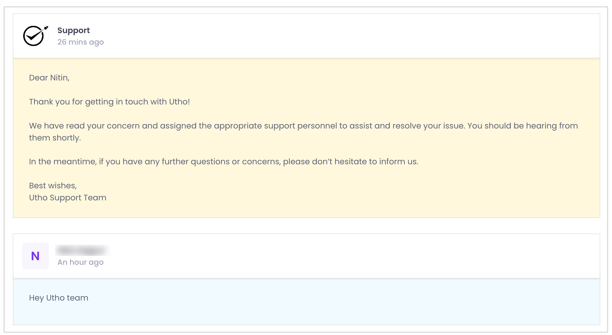

When you click on a ticket from the tickets table, you are taken to the ticket detail view. Here, you can see comprehensive information about the ticket, including:

* **Ticket Name:** The name or title of the ticket.
* **Ticket ID:** The unique identifier for the ticket.
* **Subject:** The subject line summarizing the issue.
* **Department:** The department handling the ticket.
* **Status:** The current status of the ticket (Open, Answered, Closed).
* **Priority:** The priority level of the ticket (Urgent, Medium, Low).

#### Closing a Ticket

If a ticket has been resolved, you can close it by clicking the **set to close**  button in the ticket detail view. This changes the ticket's status to closed and updates the ticket log.

### Responding to Tickets

1. **Enter a Response:**
   Use the message input field at the bottom of the ticket detail view to enter your response.
2. **Send Reply:**
   Click the **Reply** button to send your response. The message will be added to the ticket's conversation history, and all involved parties will be notified of the update.

### Viewing Ticket Conversation History

At the bottom of the ticket detail view, you can see the conversation history. This section logs all interactions and updates related to the ticket, providing a complete record of communications and actions taken.
