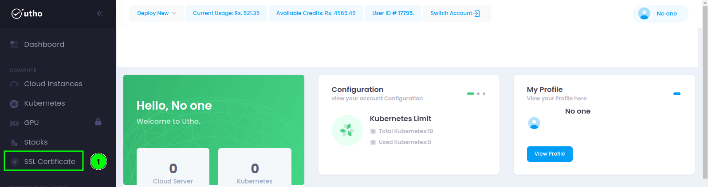
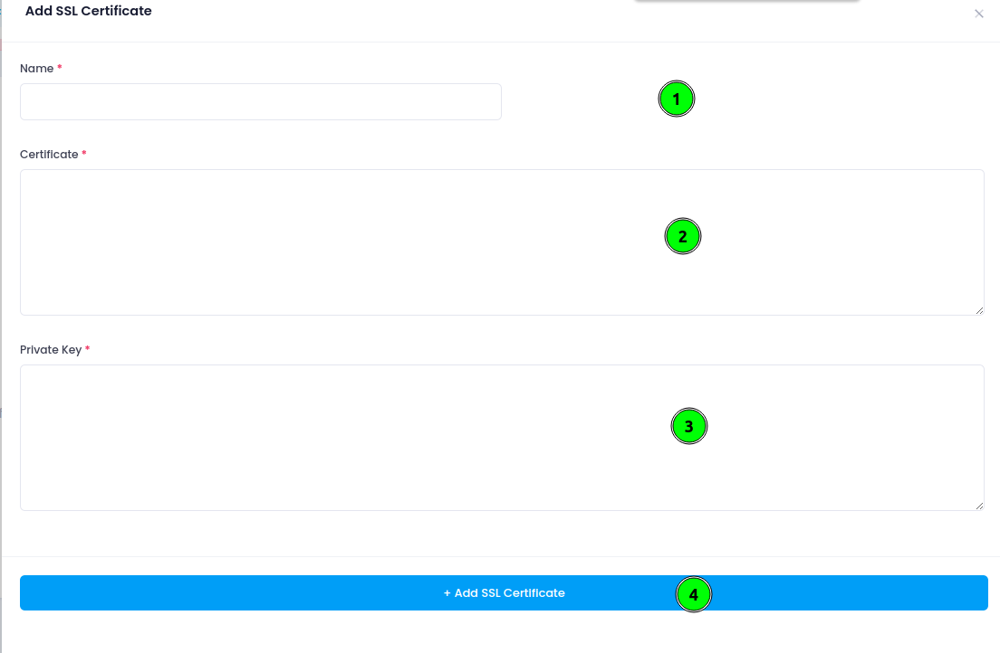
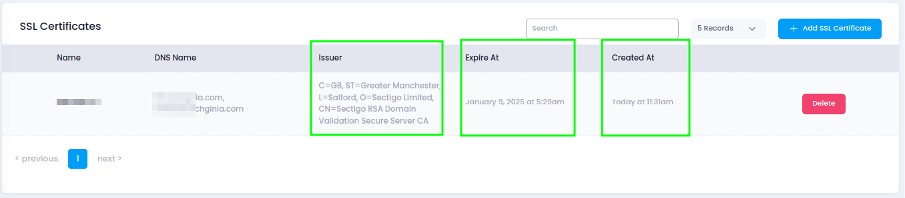

## Introduction:

Securing your website with an SSL certificate is crucial for safeguarding sensitive data and ensuring a trusted connection. On the Utho Cloud platform, adding an SSL certificate is a straightforward process, especially when preparing to attach it to a load balancer.

## Steps to upload SSL certificate:

Step 1: To begin, navigate to the Utho Cloud dashboard and locate the SSL certificate section. Here, you'll find an option to upload your certificate and its associated private key. Ensure that the certificate is in the correct format, commonly PEM or DER, and includes the full certificate chain.

Step 2: Once ready, select the 'Add SSL Certificate' option and provide the necessary details.

Step 3: Utho Cloud will guide you through the process, ensuring that the certificate and private key are securely added to the platform. As shown below in the image, first mention the SSL certificate name. Next, paste the content of .crt file you should have received when you applied for the SSL. And now, paste the content of the private key you generated while creating the CSR for your SSL. Then click on the "Add SSL Certificate" button.

Step 4: That's is it. You have successfully uploaded the SSL certificate on your profile.

