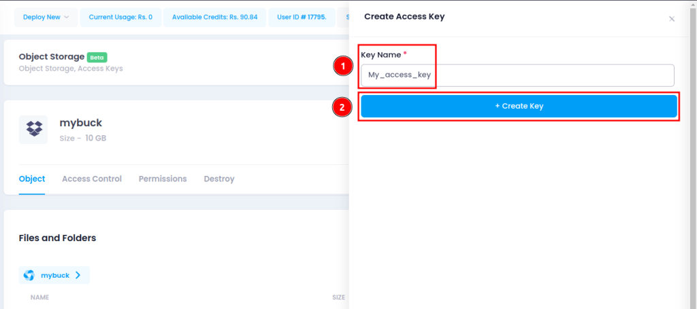

An object storage system that works with S3 and is intended for cloud-based unstructured data management, access, and storage

### Enable Object Storage

Object storage is disabled by default. Simply create a bucket in the Utho Cloud dashboard to enable object storage.

### Create a bucket

The Utho Cloud Manager provides a web interface for creating buckets. To create a bucket:

Step 1: Login to the Utho cloud dashboard.  

Step 2: Click on the Object Storage menu option in the sidebar, and then click on Create Bucket.  

Step 3: The Create a bucket page appears.  

Step 4: Determine which cluster the bucket will live in and how much data it will hold.  

Step 5: Now, give the name you want to give to your Bucket  

Step 6: Click Submit. Congratulations! You are now ready to upload objects to your bucket.  

### Generate an Access Key

Step 1: Login to the Utho cloud dashboard.

Step 2: Click on the Object Storage link in the sidebar, and then click the Create Access Key link.

Step 3: Type the key's name here. In the Utho Cloud Manager, you can refer to your key pair by this title. Next, select "Create Key."

Step 4: Your secret key and access key are displayed in a window. Put these in writing somewhere safe. The access key is displayed in the Utho Cloud Manager, but once the window is closed, you are unable to get your secret key back.

### Upload an Object to a Bucket

Step 1: If you have not already, log into the Utho Cloud Dashboard.  

Step 2: On the sidebar, select the link for "Object Storage." All of your buckets are listed. To start uploading items, click on the bucket of your choice. Drag and drop a file from your computer into your object storage bucket using the Upload Files Pane.  

Step 3: Alternatively, you can use the Browse Files option to open the file browser on your computer and choose a file to upload to your bucket.  

Step 4: When the upload is complete, your object should be visible on the Objects Listing Page. It is possible to drag and drop more than one file at once into the Upload Files Panel.  

#### Access Control & Permission

Sharing access to objects and buckets with other Utho Object Storage users is possible. To configure sharing, two methods are available: bucket policies and access control lists (ACLs). Both of these technologies have similar purposes in that they can be used to provide and restrict access to resources stored in Object Storage. Although ACLs do not provide as many fine-grained access modes as bucket policies, they can still be used to restrict or give access to specific items.

Using bucket policies is highly recommended if you can group items with comparable permission requirements into separate buckets. If you are unable to arrange your items in this way, ACLs remain a useful choice.

Comparing ACLs to bucket policies, you can manage permissions more precisely using bucket policies. Select bucket policies over ACLs if you need more granular permissions than just read and write access.

Applying a written bucket policy file to the bucket is another way to construct bucket policies. This file can't be larger than 20 KB. You might wish to use ACLs instead if your policy has a long list of policy rules.

Bucket policies and ACLs can be utilised simultaneously. Any rule that restricts access to an Object Storage resource takes precedence over a rule that authorises access in this scenario. For example, if a bucket policy prohibits a user from accessing a bucket that an ACL permits, the user will not be able to access the bucket.

