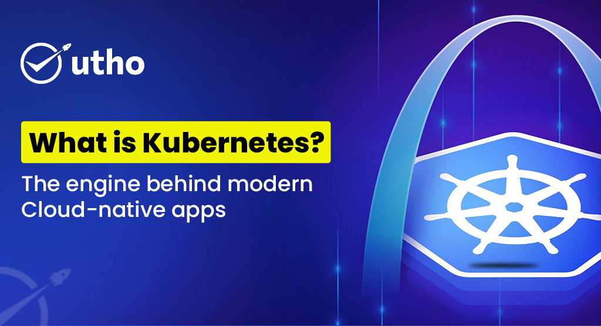

# What is Kubernetes?

## Introduction

Kubernetes, or K8s, is an open-source platform that automates the deployment, scaling, and management of containerized applications. Originally developed by Google, it is now maintained by the Cloud Native Computing Foundation (CNCF). Kubernetes simplifies application deployment and manages orchestration, load balancing, service discovery, and scaling. It allows developers and operations teams to focus more on development rather than infrastructure.

Kubernetes automates many infrastructure challenges, ensuring high availability, scalability, and consistency across development, staging, and production environments.

## Why Do Businesses Choose Kubernetes?

Kubernetes is more than just a container orchestration tool—it’s a strategic enabler for digital transformation.

### 1. Application Portability

- Works across multiple cloud providers.
- Simplifies migration and reduces vendor lock-in.
- Enables consistent deployment across environments.

**Use Case:** A fintech startup can move from a public to a private cloud while maintaining its application structure.

### 2. Operational Efficiency

- Automates deployments with YAML files.
- Manages autoscaling and load balancing.
- Supports rolling updates and rollbacks.

### 3. Self-Healing Capabilities

- Monitors container health.
- Restarts or reschedules failing containers.
- Maintains application uptime without manual intervention.

### 4. Dynamic Scalability

- Adjusts resources automatically based on real-time demand.
- Supports Horizontal Pod Autoscalers (HPA).

**Use Case:** An eCommerce platform can handle traffic spikes during sales without over-provisioning.

### 5. Faster Deployment Cycles

- Enables zero-downtime deployments.
- Integrates with CI/CD pipelines.

### 6. Better Resource Utilization

- Efficient scheduling to maximize resource usage.
- Reduces infrastructure costs.

### 7. Ecosystem and Community Support

- Backed by a strong open-source community.
- Rich plugin ecosystem.
- Ongoing innovation and updates.

## Utho Kubernetes Engine Advantage

Utho enhances Kubernetes by focusing on simplicity, security, and cost-efficiency.

### Key Benefits:

- **Performance:** Optimized for cloud-native workloads.
- **Pricing:** Tailored for the Indian market.
- **Managed Kubernetes:** Automated scaling, monitoring, and support.
- **Security:** Built-in firewall controls and container isolation.
- **24/7 Support:** Access to real cloud engineers.

## Summary: Why Businesses Prefer Kubernetes

| Benefit                 | What It Means                       |
| ----------------------- | ----------------------------------- |
| Application Portability | Deploy anywhere easily              |
| Operational Efficiency  | Automate deployment and scaling     |
| Self-Healing            | Auto-recovery from failures         |
| Scalability             | Adjust with traffic needs           |
| Faster Deployments      | Release faster with zero downtime   |
| Resource Utilization    | Optimize cloud costs                |
| Ecosystem Support       | Leverage community and integrations |
| Utho Advantage          | Simplified usage + Indian pricing   |

## Understanding Utho Kubernetes Engine (UKE)

### Highlights:

- **One-Click Cluster Provisioning**
- **Full Kubernetes API Access**
- **Built-in Observability & Automation**
- **CI/CD Integration**
- **Indian Cloud Infrastructure**
- **Flexible Workload Support**

## Top Use Cases for Utho Kubernetes Engine

| Use Case              | Description                                                |
| --------------------- | ---------------------------------------------------------- |
| Web Applications      | High-traffic websites with scaling and availability needs  |
| Microservices         | Loosely coupled services with auto-discovery and scaling   |
| API Hosting           | Scalable and secure API exposure                           |
| Dev/Test Environments | Quick, cost-effective environments for testing             |
| ML & AI Workloads     | GPU-enabled nodes for training and inference               |
| Big Data Processing   | Run Spark/Hadoop jobs with batch orchestration             |
| CI/CD Pipelines       | Automated pipelines with ArgoCD, Jenkins, GitHub Actions   |
| Event-Driven Apps     | React to real-time events with Kafka, RabbitMQ, or Knative |

## Hosting Models

| Hosting Model | Best For             | Who Manages What                    |
| ------------- | -------------------- | ----------------------------------- |
| Fully Managed | Startups, SaaS teams | Utho manages everything             |
| Semi-Managed  | DevOps-capable teams | You manage apps, Utho manages infra |
| Self-Managed  | Enterprises/SREs     | You manage everything               |

## Performance, Reliability & Cost Benefits

### 1. Elastic Performance at Scale

Auto-scale pods/nodes based on usage.

### 2. 60% Lower Cloud Spend

Optimized pricing with INR billing.

### 3. 99.99% Uptime SLA

Tier 3 DCs, multi-zone failover, and backups.

### 4. Developer Productivity

Built-in support for Docker, Helm, GitOps.

### 5. Real-Time Monitoring & Logging

Console-based observability tools included.

## Built-In Security Features

- **RBAC**
- **Network Policies & Firewalls**
- **Secrets Management**
- **TLS Encryption**
- **Encrypted Storage**
- **IAM Integration**
- **DDoS Protection**
- **GDPR, SOC 2, ISO Compliance**

## Customization & Cluster Configuration

- Instance types (CPU/GPU, RAM)
- Traffic routing policies
- Encrypted persistent storage
- Multi-zone deployment
- GPU support

## Why Utho Kubernetes Engine Stands Out

### 1. Built for India

- Hosted in Indian data centers
- INR-based transparent pricing

### 2. Zero Lock-In

- 100% Kubernetes API compatible

### 3. 24x7 Human Support

- Expert engineers on call

### 4. One-Click Simplicity

- Easy UI, fast provisioning

### 5. Enterprise Capabilities

- Pod/Node autoscaling
- Predictable pricing

## Migration Support

Migrate from EKS, GKE, or AKS with:

- Data replication
- DNS reconfiguration
- Pipeline updates

## When to Choose Utho Kubernetes

- Starting cloud-native journey
- Reducing DevOps overhead
- Need for scalability + cost control
- Avoiding cloud bill surprises

## The Future with Utho Kubernetes

- Serverless (Knative) support
- GPU-optimized clusters
- Observability enhancements
- Kubernetes Marketplace

## Get Started

Visit [utho.com](https://utho.com) to launch your cluster or book a free consultation with our engineers.
