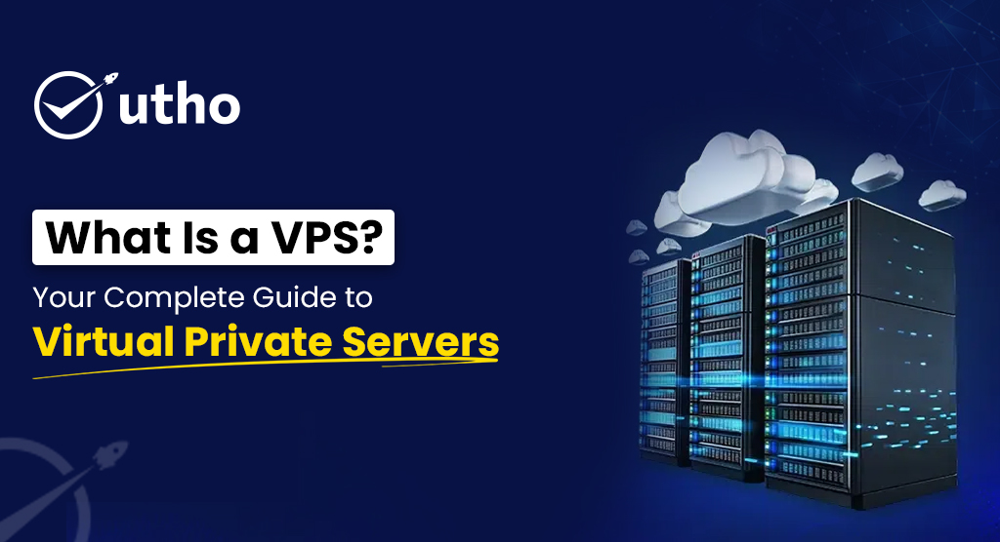

## 1. What Is a VPS?

A Virtual Private Server (VPS) is a virtualized environment on a larger, physical server. This type of server mimics a dedicated server within a shared server. It offers a specific allocation of CPU, RAM, and storage, for the VPS user only. A VPS is an independent unit. Users have dedicated resources and full control, like a dedicated server, but at a much lower cost.

## **How Does a VPS Work?**

A VPS uses virtualization to create many isolated servers on one physical machine. Virtualization software, called a hypervisor, divides the physical server into independent sections. Each section operates as a separate server with its own OS, apps, and resources.

* Hypervisor: The hypervisor software allocates resources across many VPS. It ensures each VPS has the CPU, memory, and storage for peak performance.
* Operating System Isolation: Each VPS has its own OS. Users can control and configure it, independent of other VPS instances. This isolation ensures that actions on one VPS do not affect others.
* Dedicated Resources: Unlike shared hosting, which pools resources, each VPS has its own. This allows for consistent performance, regardless of the activity on other virtual servers.

A VPS is a hybrid of shared and dedicated hosting. It is as cost-effective as shared hosting but has many benefits of a dedicated server.

## **Benefits of a VPS:**

* VPS users have full control. They have root access. This lets them install, configure, and secure software.
* Reliability and Performance: A VPS has isolated resources. Other users won't impact them. So, it provides stable, predictable performance.
* Scalability: You can adjust resources to meet rising traffic or app demands. This makes VPS a very flexible option.

# **2\. What is a VPS Used For?**

A VPS is a versatile environment suitable for a variety of purposes. Its power, flexibility, and control make it a top choice for many uses.

## **Hosting Websites and Web Applications**

A VPS hosts websites and web apps that need more resources than shared hosting can provide. A VPS can handle traffic surges on busy business websites. It won't slow down or become unstable. This makes VPS ideal for e-commerce sites, blogs, and service portals that need dedicated resources.

## **Running Multiple Websites**

VPS hosting allows users to host many websites on a single server. Each site can be allocated its own resources. This minimizes performance impact from one site to another. This is especially useful for digital agencies or those who manage multiple websites. They need a reliable solution that won't slow down under a larger workload.

## **Application Development and Testing**

VPS environments are highly customizable, making them ideal for development and testing. Developers can configure the server to mimic production conditions. They can install specific software and test apps without affecting live environments. This makes VPS safe for testing software, updates, and apps.

## **Custom Software and Specialized Configurations**

A VPS allows users to install custom software, frameworks, and libraries. Unlike shared hosting, VPS users can freely configure their environment. They can set up unique server configurations, databases, or custom scripts.

## **Game Server Hosting**

For gamers and game developers, VPS hosting is a popular choice for setting up game servers. A VPS provides dedicated resources and a stable, low-latency connection. This creates an ideal environment for hosting multiplayer games or developing game apps.

## **Data Storage and Backups**

VPS can also be a secure data storage solution. It provides an isolated space for storing sensitive data or backing up files. By scheduling backups and automating data storage, businesses can keep their data safe and accessible.

## **VPN and Proxy Servers**

A VPS can be a VPN or proxy server. It provides better privacy, secure connections, and access to restricted content. It lets users browse securely and protect data from threats.

A VPS is versatile. It lets businesses, developers, and individuals use it for many purposes. These include hosting, app development, security, and data management.

# **3\. What is VPS Hosting?**

VPS Hosting is a web hosting type. It provides a virtual server with dedicated resources on a shared physical server. VPS hosting gives users dedicated CPU, memory, and storage in a virtualized setup. It lets them manage their environment more freely. This is a popular choice for those who need more control than shared hosting offers. But, they do not need the full power and cost of a dedicated server.

## **How VPS Hosting Works**

VPS hosting divides a physical server into multiple virtual servers using a hypervisor. Each virtual server operates independently with dedicated resources like CPU, RAM, and storage. Each VPS has its own OS and is isolated from others, ensuring privacy and stable performance.

* Resource Allocation: Each VPS gets a fixed allocation of resources. Other users on the same physical server cannot exceed this. In shared hosting, resources are shared without strict limits.
* Customization: Users have root access to their VPS. They can install and configure software, set up security, and run custom scripts.
* Scalability: VPS hosting can be scaled easily. Users can increase resources as needed without migrating to a new server.

## **Key Features of VPS Hosting**

1. Dedicated Resources: Each VPS has its own CPU, memory, and storage. This ensures predictable performance. Users don’t have to worry about other users’ activities affecting their performance.
2. VPS users can install custom software and manage configurations. They can also adjust security settings with root access. This lets them meet their specific needs.
3. High Scalability: VPS hosting is easily scalable. Users can adjust resources as their needs grow, without the disruption of moving to a new server.
4. Isolation and Security: Each VPS is isolated from other virtual servers on the same physical machine. This reduces security risks and allows users to implement their own security measures.
5. Enhanced Performance: VPS hosting offers reliable performance. It can handle high traffic and demanding applications. It has dedicated resources and is independent from other users.

## **Benefits of VPS Hosting**

* Cost-Effectiveness: VPS hosting offers many benefits of dedicated hosting at a lower cost. This makes it a good middle ground for businesses that need more resources but aren’t ready for a dedicated server.
* Improved Performance: VPS hosting is faster and more reliable than shared hosting, even at peak times. This is especially valuable for websites and applications requiring stable performance.
* Technical Support: Many VPS providers offer managed services. Users get help with server management, maintenance, and troubleshooting. This makes it suitable for those without technical expertise.
* Versatility: VPS hosting can support multiple websites and apps. It can also run secure backups and private servers. So, it provides a range of solutions in one environment.

VPS hosting is a powerful, cost-effective solution. It offers flexibility, control, and scalability for websites, apps, and secure data storage. It is perfect for users who want more than shared hosting. But, they aren't ready to fully invest in a dedicated server.

# **Benefits of VPS Hosting**

VPS hosting has many benefits. It appeals to businesses, developers, and individuals. They want more control and resources than shared hosting provides. But, they aren't ready for the cost or capacity of a dedicated server. Here are some key benefits of VPS hosting:

1. Dedicated Resources: VPS hosting gives each user dedicated resources, like CPU, RAM, and storage. This is unlike shared hosting, where resources are pooled among users. This ensures each VPS can handle more demanding apps and traffic. It guarantees a consistent level of performance, unaffected by other users.
2. Improved Performance and Speed: VPS hosting offers significantly better performance than shared hosting. Each VPS has its own resources. So, users get faster load times, better responsiveness, and higher traffic capacity. This reliability is crucial for e-commerce sites and business apps. They need consistent uptime and speed.
3. VPS users have root access. This lets them install, configure, and customize software and apps as needed. This flexibility is ideal for businesses or developers. They may need to run specific software, configure security, or build custom environments.
4. Scalability: VPS hosting is highly scalable. Users can adjust resources as needed. This helps businesses with growth or seasonal traffic spikes. They can adjust resources easily, without downtime or moving to a new server.
5. Enhanced Security and Isolation: Each VPS runs independently on the physical server. This ensures a level of isolation similar to dedicated hosting. If one VPS has issues or a security breach, other VPSs on the same server remain unaffected. Users can also implement custom security measures tailored to their specific needs.
6. VPS hosting is a cost-effective solution. It balances the low cost of shared hosting with the power of dedicated hosting. It is a great option for businesses. They need strong hosting features, but not the high cost of a dedicated server.
7. Reliable Technical Support: Many VPS hosts offer managed services. They help with server management, software installation, security updates, and troubleshooting. This can be invaluable for users without much tech expertise. They need a reliable, secure hosting environment.

VPS hosting is a great option. It balances performance, customization, security, and cost. So, it's good for many apps and business needs.

# **How Does a VPS Work?**

A Virtual Private Server (VPS) uses virtualization to split a physical server into many, isolated environments. Each one works as an independent server. This virtualized setup lets users enjoy dedicated resources. They have full control over their environment without sharing it with others.

Here’s how a VPS works:

1. Virtualization Technology: VPS hosting uses a hypervisor, like KVM or VMware. It creates and manages virtual environments on a physical server. The hypervisor divides the server's hardware, like CPU, RAM, and storage. It creates separate virtual servers, each accessible only to a user.
2. Independent Operating System: Each VPS runs its own OS. It is independent of others on the same physical server. Users can choose their preferred OS (e.g., Linux or Windows) and manage it like a standalone server. This OS isolation lets users customize settings and install software. They can manage configurations without affecting other virtual servers.
3. Dedicated Resources: In a VPS, each virtual server gets a fixed amount of CPU, memory, and storage. The system dedicates these resources to that VPS, ensuring stable and predictable performance. VPS hosting is a flexible, efficient choice. Users control how to divide and use the resources.
4. Data Isolation and Security: Many VPS environments share the same physical server. But, each VPS isolates itself. This ensures data privacy and security. The hypervisor prevents users from accessing each other's data and configs. It adds security compared to shared hosting.
5. Scalability: Many VPS providers let users easily scale resources. They can increase CPU, memory, or storage as needed. This scalability is ideal for businesses with varying demand. Resources can be adjusted without downtime.

A VPS offers the benefits of a dedicated server, but at a lower cost. It's a great choice for growing businesses and developers. It suits anyone wanting more control over their hosting.

# **Virtual Private Server vs. Dedicated Server**

When choosing between a Virtual Private Server (VPS) and a Dedicated Server, it’s vital to know their differences in performance, control, cost, and use cases. Here’s a detailed comparison to help you determine which option is best suited to your needs:

1. ## **Resource Allocation**

   * VPS: In VPS hosting, a shared server allocates resources like CPU, RAM, and storage to each VPS. Each VPS has dedicated resources. But, they are part of a shared system. So, the overall server capacity is divided among multiple users.
   * **Dedicated Server**: A dedicated server provides all the resources of a physical server to a single user. This setup gives users full access to the server's CPU, memory, storage, and bandwidth. It's ideal for resource-intensive apps or high-traffic websites.
2. ## **Performance and Stability**

   * VPS: VPS hosting has stable performance. It gives each virtual environment dedicated resources. However, the shared physical server may have lower peak performance than a dedicated server.
   * Dedicated Server: A dedicated server gives users the best performance and stability. No other users share the server's resources. This is vital for apps needing high processing power or handling heavy traffic.
3. ## **Control and Customization**

   * VPS: VPS users have root access to their virtual environment. They can customize configurations, install software, and manage security settings. A VPS offers significant control. It may have some limits vs. a dedicated server, especially for resource-intensive setups.
   * Dedicated Server: A dedicated server gives full control of the hardware. Users can install any OS, software, or configurations they want. Dedicated servers are highly customizable due to their control. They suit complex applications needing specific hardware or software.
4. ## **Security and Isolation**

   * VPS: Each VPS runs in an isolated environment. Other users on the same physical server cannot access or interfere with the VPS’s data. VPS hosting is usually secure. But, it is a shared environment. A dedicated server may better meet extreme security needs.
   * A dedicated server is used by a single client. It offers the highest security and data isolation. This is ideal for businesses needing strict security, like finance, healthcare, or government.
5. ## **Cost**

   * VPS: VPS hosting is cheaper than a dedicated server. Its costs are shared among multiple users. It is an attractive option for businesses needing strong hosting at a lower price.
   * Dedicated Server: Dedicated servers are more expensive. Users pay for exclusive access to all the server's resources. The high performance, control, and security of dedicated servers justify the cost.
6. ## **Scalability**

   * VPS: VPS hosting is highly scalable. Users can adjust resources as needed. This flexibility suits businesses with fluctuating demands. They can scale without moving to a new server.
   * Dedicated Server: Dedicated servers perform well. But, scaling them can be slow and costly. Upgrading to a more powerful server is usually needed. It's easier and cheaper to scale a VPS.

In summary:

* Choose a VPS if you want a balance of cost, control, and performance and are okay sharing hardware with other users.
* Choose a Dedicated Server for greatest control, performance, and security. Do this if you're willing to pay for a premium hosting solution.

VPS and dedicated servers each have their benefits. VPS hosting is a cost-effective, scalable option for growing businesses. Dedicated servers offer unmatched power and exclusivity for high-demand apps.

# **How Does VPS Hosting Compare to Other Types of Hosting?**

When choosing a hosting solution, know how VPS hosting compares to other types, like shared and dedicated hosting. Each type has pros and cons. So, choose the right one based on your needs and budget.

## **VPS Hosting vs. Shared Hosting**

* Resource Allocation: In shared hosting, multiple users share a server's resources (CPU, RAM, and storage). This can cause inconsistent performance. High traffic on one site can impact others. In VPS hosting, each virtual server has dedicated resources. This gives it more stability and better performance.
* Control and Customization: Shared hosting has limited control over server settings and software. So, it is less suitable for custom apps or configurations. VPS hosting gives users root access. They can install software, configure settings, and manage their virtual environment.
* Performance and Reliability: Shared hosting is best for small, low-traffic sites. VPS hosting is faster and more reliable. VPS hosting is ideal for websites and apps that need speed and uptime. It has dedicated resources and is isolated from other users.

## **VPS Hosting vs. Dedicated Hosting**

* Resource Allocation: In dedicated hosting, users access the whole server. This gives them the best resources and performance. VPS hosting is a shared environment. It provides dedicated resources within a shared physical server. This means dedicated hosting has more resources. It's best for very high-demand apps.
* Cost: VPS hosting is cheaper than dedicated hosting. Multiple users share the cost of the physical server. Dedicated hosting costs much more. Users pay for exclusive access to all resources.
* Scalability: VPS hosting is usually more scalable. Users can increase their resources without moving to a new server. Dedicated hosting may need an upgrade to a more powerful server if it needs more resources.

## **VPS Hosting vs. Cloud Hosting**

* Scalability and Flexibility: Cloud hosting is often more scalable than VPS hosting. It uses multiple servers in a networked environment. This allows for nearly unlimited resource scaling and flexibility. VPS hosting is limited to the resources of a single physical server.
* Cost Structure: Cloud hosting is usually pay-as-you-go. Users pay only for the resources they use. VPS hosting usually has fixed plans. They are more predictable but less flexible than cloud hosting.
* Reliability: Cloud hosting has better uptime. Data is on multiple servers, so it is more redundant. If one server fails, another can take over. In VPS hosting, a failure in the physical server could impact all VPS instances on that server.

Each hosting type serves specific needs. VPS hosting is affordable and gives control and dedicated resources. So, it's a good choice for growing businesses and moderate-traffic websites.

# **When Should You Switch to VPS Hosting?**

VPS hosting can be a game-changer for businesses and individuals. It offers more control, better performance, and enhanced security. Here are some signs that indicate it may be time to consider upgrading to a VPS:

1. High Traffic: If your website gets a lot of visitors and shared hosting can't keep up, use VPS hosting. It can handle traffic spikes with its dedicated resources. It won't hurt performance.
2. Frequent Downtime or Slow Performance: If limits on shared hosting slow the site, a VPS may be needed. VPS hosting is more stable and responsive. It makes your website load faster and work reliably.
3. Need for Customization: If you need to install custom software, use VPS hosting. It allows root access for that. Shared hosting often restricts server configurations, limiting what users can do. A VPS gives you full control over your server. It's a good fit for projects that need custom solutions.
4. Enhanced Security Requirements: For businesses handling sensitive data or transactions, security is paramount. VPS hosting provides isolated environments. This reduces the risk of breaches from neighboring users. It also lets you implement custom security protocols.
5. Running Resource-Intensive Applications: Apps like e-commerce sites and custom databases often need more than shared hosting provides. VPS hosting offers dedicated resources that support resource-heavy applications effectively.
6. Growing Business Needs: As your business grows, you may need better hosting to meet higher demands. VPS hosting is scalable. You can add resources as your business grows, without migrating to a new server.

VPS hosting can ensure your website and apps perform well, stay secure, and scale with your growth. It will provide a seamless experience for you and your users.

# **Types of VPS Hosting: Managed, Unmanaged, and Semi-Managed**

When choosing a VPS hosting solution, users can select from managed, unmanaged, and semi-managed VPS hosting. Each type offers a different level of support and control. It depends on the user's technical skills and needs.

## **Managed VPS Hosting**

**Managed VPS hosting** is ideal for users who prefer not to handle server management tasks. In this setup, the hosting provider handles most technical tasks. This includes server setup, software updates, security patches, monitoring, and troubleshooting.

## **Key Benefits of Managed VPS Hosting**:

* Technical Support: Managed VPS hosting includes a dedicated support team. They handle issues and optimize server performance. This makes it accessible to users without deep technical knowledge.
* Security and Maintenance: The hosting provider has security protocols. They do routine maintenance and apply patches. This ensures a secure, reliable environment.
* Time Savings: Outsourcing server management lets businesses focus on their work, not tech tasks.

Managed VPS hosting is perfect for those who need a VPS but lack the time or expertise to manage it.

## **Unmanaged VPS Hosting**

Unmanaged VPS hosting is for users who can manage their own server. They must have the technical skills and resources to do so. In this setup, the hosting provider only provides the VPS. Users must manage the server. This includes installing, configuring, and maintaining it.

## **Key Benefits of Unmanaged VPS Hosting**:

* Full Control and Customization: Users can fully control server configurations. They can install custom software, optimize settings, and implement security measures to meet their needs.
* Cost-Effective: Unmanaged VPS hosting is usually cheaper than managed hosting. Users handle all management tasks themselves.
* Advanced Configuration Options: With root access, users can configure the VPS to their needs. This makes it suitable for complex apps or custom dev environments.

Unmanaged VPS hosting is ideal for developers and IT pros. It suits businesses with in-house tech experts. They want maximum control and customization of their server.

## **Semi-Managed VPS Hosting**

Semi-managed VPS hosting is a middle-ground option. It offers basic management services while letting users control some server management aspects. In this arrangement, the hosting provider handles core tasks. These include hardware management, security patches, and basic server monitoring. Users control application-level settings and specific software management.

## **Key Benefits of Semi-Managed VPS Hosting**:

* Shared Responsibility: Users can rely on the host for security updates and maintenance. They control application configs and software installs.
* Flexibility and Control: Semi-managed hosting gives users some control. It does not require full responsibility for server upkeep.
* Cost-Benefit Balance: This type of hosting is typically less expensive than fully managed VPS hosting while still providing support for essential server tasks.

Semi-managed VPS hosting suits businesses and developers. It offers some support and lets them customize their environment.

In summary:

* Managed VPS is ideal for users who want a hands-off approach. It relies on the provider to handle server maintenance and support.
* Unmanaged VPS suits users with technical skills who want full control over their server.
* Semi-managed VPS is a balanced option. It allows the provider some control while giving users control over apps and software.

Choosing the right VPS hosting depends on your expertise, project needs, and budget. It must match your requirements for control, support, and flexibility.

# **Is VPS Hosting Secure?**

Yes, VPS hosting is more secure than shared hosting. It offers better data privacy and protection. VPS hosting provides an isolated environment. Each virtual server runs independently of others on the same physical server. This isolation greatly reduces the risk of vulnerabilities spreading. Each VPS has its own dedicated resources and operating system.

Here’s how VPS hosting enhances security:

1. **Data Isolation**: In VPS hosting, each user’s environment is isolated from others. This separation ensures that one user’s actions, such as security breaches or malware infections, do not affect other users on the same server.
2. **Custom Security Configurations:** VPS hosting provides root access. Users can install custom security software, firewalls, and protocols. This helps businesses with specific security needs. They can implement and manage custom security solutions.
3. **Regular Security Updates:** Many VPS providers offer managed services. These include regular updates and patches to protect the server from vulnerabilities. Managed VPS users benefit from proactive security monitoring. It helps to guard against potential threats.
4. **DDoS Protection and Firewalls:** VPS hosting providers often include DDoS protection. It reduces the risk of attacks that could disrupt server functionality. Users can also configure advanced firewalls to protect their data further.
5. **Backup Options:** Many VPS hosts offer automated backups. They let users restore their data after a breach or other event.

VPS hosting is secure. Users must add their own measures for maximum protection. They should use strong passwords, update regularly, and configure firewalls.

# **Is VPS Hosting Fast and Reliable?**

Yes, VPS hosting is fast and reliable. It performs better than shared hosting. VPS hosting offers dedicated resources and a stable environment. This boosts the speed and reliability of websites and apps.

Key factors that contribute to the speed and reliability of VPS hosting include:

1. **Dedicated Resources:** In VPS hosting, each user has dedicated CPU, RAM, and storage. This ensures that resources are always available. VPS hosting prevents performance issues caused by other users. Unlike shared hosting, it divides resources among all users.
2. **Customizable Performance Settings:** VPS hosting gives users full control. They can optimize settings, configure caching, and choose software to boost performance. This flexibility enables users to tailor their server setup for the best speed and efficiency.
3. **High Uptime:** VPS hosting typically offers high uptime rates, often guaranteed by Service Level Agreements (SLAs). Providers often monitor and maintain VPS servers to ensure minimal downtime. This makes it a reliable option for businesses with critical apps or high-traffic websites.
4. **Scalability for Demand Spikes:** VPS hosting is scalable. Users can quickly add resources, like more RAM or CPU, as needed. This scalability is crucial for handling sudden traffic spikes without compromising website performance.
5. **Efficient Resource Utilization:** Each VPS is isolated. It can use resources more efficiently without interference from other users. This stability ensures that applications perform consistently, even during peak usage times.

In summary, VPS hosting is better than shared hosting. It's faster and more reliable. So, it's ideal for websites or apps that need high-performance, stable hosting. Its resources and customisation options provide the speed and reliability many businesses need.

# **Why Should You Choose VPS?**

VPS hosting is a mix of low cost, control, and dedicated resources. It's ideal for those needing more than shared hosting but not a full dedicated server. This includes businesses, developers, and individuals. Here are key reasons to choose VPS:

1. **More Control and Customization:** VPS hosting gives root access. Users can install software, manage security settings, and configure the server. This control helps users who need custom solutions. They may want specific software stacks, unique configurations, or better security.
2. **Improved Performance:** VPS hosting has a dedicated CPU, RAM, and storage. It ensures consistent performance, making it ideal for moderate to high-traffic sites and apps. VPS hosting is better than shared hosting. In shared hosting, resources are pooled. VPS hosting guarantees a stable environment. No other users can affect its performance.
3. **Enhanced Security:** VPS hosting is more secure than shared hosting. Each VPS is isolated, and users control the security settings. VPS hosting lets businesses with sensitive data set custom security. It can meet specific regulatory requirements.
4. **Scalability for Growing Needs:** VPS hosting is highly scalable. Users can adjust resources like CPU, memory, and storage as needed. This makes it easy to handle growth or seasonal traffic spikes. You won't need to migrate to a new server. So, VPS is a flexible solution as your needs evolve.
5. **Cost-Effective Balance:** VPS hosting is cheaper than dedicated hosting. It's more powerful than shared hosting. It strikes a balance between the two. It's a cheap option for users who need reliable, customizable performance. It avoids the high costs of dedicated servers.
6. **Ideal for Resource-Intensive Applications:** VPS hosting is best for apps that need more resources. This includes e-commerce sites, content-heavy sites, and gaming servers. The apps can run smoothly and efficiently. This is due to the dedicated resources and customizable environment.

Choosing VPS hosting is a strategic decision. It suits those wanting a powerful, secure, and scalable solution. Its dedicated resources, security, and control make it ideal for many apps. It gives businesses and developers a reliable foundation to support their growth.

Utho offers a range of VPS hosting services. They are for businesses and individuals. The services are scalable, reliable, and cost-effective. Their VPS hosting uses virtualization to split a server into multiple virtual servers. Each has dedicated resources and full admin control. This setup ensures enhanced performance, security, and flexibility compared to traditional shared hosting.

## **Key Features of Utho's VPS Hosting Services:**

* **Dedicated Resources:** Each VPS is allocated specific CPU, RAM, and storage. This ensures consistent performance and prevents resource contention with other users.
* **Full Root Access:** Users fully control their virtual server. They can customize settings, install software, and configure security to meet their needs.
* **Scalability:** Utho's VPS solutions are designed to grow with your business. Resources can be easily scaled to meet changing demands. This can be done with little downtime or migration hassle.
* **Enhanced Security:** VPS hosting is isolated. It reduces the risk of vulnerabilities affecting other users on the same physical server. Utho also offers additional security features to safeguard your data and applications.
* **24/7 Support:** Utho offers 24/7 support for any issues. This ensures minimal disruption to your operations.

## **Virtual Private Server Pros and Cons**

## **Pros:**

* **Performance:** VPS hosting, with dedicated resources, is faster and more reliable than shared hosting.
* **Customization:** Full root access allows for extensive customization. It enables installing preferred operating systems, control panels, and apps.
* **Scalability:** Adjust resources easily to meet your website's or app's growing needs. Do it with little downtime.
* **Cost-Effective:** VPS hosting is cheap. It combines cheap shared hosting with the control of dedicated hosting. So, it's a cost-effective solution for many users.

## **Cons:**

* **Technical Expertise Required:** Managing a VPS needs advanced skills, especially for unmanaged plans.
* **Cost Compared to Shared Hosting:** VPS hosting is cheaper than dedicated hosting. But, it is usually more expensive than shared hosting.
* **Resource Limitations:** VPS provides dedicated but limited resources. They may not match a dedicated server for very resource-intensive applications.

## **When to Use and How to Decide It Is Time to Upgrade**

## **When to Use VPS Hosting:**

* **Increased Traffic:** If your site gets too much traffic for shared hosting, upgrade to VPS hosting. It will provide the needed resources.
* **Need for Customization:** When your apps need software not supported by shared hosting.
* **Enhanced Security Requirements:** For businesses with sensitive data, VPS hosting is more secure. It has customizable security settings.

## **Signs It's Time to Upgrade:**

* **Performance Issues:** Slowdowns or downtime on your hosting plan show a need for better resources.
* **Resource Limitations:** If you often hit your hosting limits, upgrade. (CPU, RAM, storage)
* **Business Growth:** As your business grows, you need a better, scalable hosting solution. It must support increased operations and user engagement.

Upgrading to VPS hosting with Utho can boost your online growth. It provides better performance, control, and scalability. Their VPS solutions meet diverse needs. They ensure a smooth transition and a better user experience.
