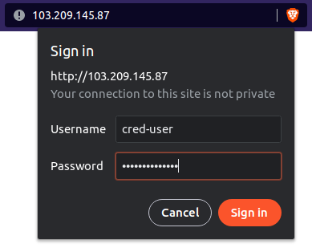

This article is about to Protect your Web Sites by using Username and password in Apache on [Ubuntu server](http://Ubuntu.com). When you're in charge of online projects, you often have to limit who can see them to keep them safe from the outside world. There could be a number of reasons for this, such as the fact that you don't want search engine crawlers to see your site while it's still being built.

In this tutorial, I'll show you how to make Apache web server protect different web [site directories](https://utho.com/docs/tutorial/how-to-reset-debian-root-password/) with passwords.

## Requirements:

- yum repository configured Centos server
- A super user( root) or any normal user with SUDO privileges.

## Configuration to protect default site.

To protect the main web root directory `/var/www/html`, open your Apache’s configuration file and change to the highlighted content from the following code.

```
vi /etc/apache2/apache2.conf
```
## For On Apache 2.2 Version:

```
<Directory /var/www/html> 
Options Indexes Includes FollowSymLinks MultiViews 
AllowOverride All
Order allow,deny
Allow from all 
</Directory>
```

## On Apache 2.4 Version:

```
<Directory /var/www/html> 
Options Indexes Includes FollowSymLinks MultiViews 
AllowOverride All 
Require all granted 
</Directory>
```

And now after saving the file, restart the apache2 service.

```
systemctl restart httpd
```
Now, we'll use the htpasswd command to make a username and password for our protected directory. This command is used to handle basic authentication user files.

Example and syntax of the htpasswd command is as follow.

```
htpasswd -c /path/filename username
```
Here, -c is used to create a file in which the username and password will be saved. Note that, the password will be hashed format.

Now we will create the credential file in /etc/apache2 directory for the user- cred-user

```
htpasswd -c /etc/apache2/cred_file cred-user
```
```
vi /var/www/html/.htaccess
```
Now in this file add the following content.

```
AuthType Basic
AuthName "Restricted Access"
AuthUserFile /etc/apache2/cred_file
require user cred-user
```

Now you can save the file and test your setup. Open your web browser and type in your IP address or domain name, such as:

```
http://server-ip 
```

<figure>


<figcaption>

Prompt you will get after browsing server-ip

</figcaption>

</figure>

<figure>



<figcaption>

Enter the credentials created by htpasswd command

</figcaption>

</figure>
