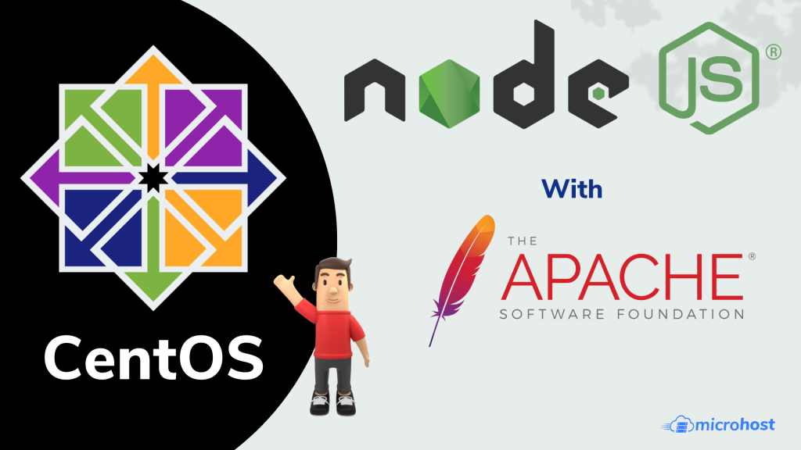

Node.js is an open source Javascript programming environment to make server-side and networking applications simple to create.

## Installing Node.js

First of all, You need to enable node.js yum repository in your system provided by the Node.js official website. You also need development tools to build native add-ons to be installed on your system.

```
yum install -y gcc-c++ make
```

```
curl -sL https://rpm.nodesource.com/setup_14.x | sudo -E bash -
```

After adding a yum repository in your system lets install Node.js package. NPM will also be installed with node.js. This command will also install many other dependent packages on your system.

```
sudo yum install nodejs
```

After installing node.js verify and check the installed version. You can find more details about current version on node.js [official website](https://nodejs.org/download/).

```
node -v
```

Also, check the version of npm.

```
npm -v
```

Afterward , we need to test the nodejs functionality by putting a test application.

We will create a test file myapp.js in current working directory and the content of file would be same as given below. You can use IP address or domain name as per your requirement.

```
vi myapps.js
```

```file {title="vi myapps.js" lang="aconf"}
var http = require('http'); http.createServer(function (req, res) { res.writeHead(200, {'Content-Type': 'text/plain'}); res.end('Hello World'); }).listen(3000, "APP_PRIVATE_IP_ADDRESS"); console.log('Server running at http://APP_PRIVATE_IP_ADDRESS:3000/');
```

Now we can test our application whether it is running or not.

```
node myapps.js
```

You will see the output when you execute the URL in browser.

http://APP\_PRIVATE\_IP\_ADDRESS:3000

## Setting Up an Apache Reverse Proxy Server

Now that your application is running, and listening to a private IP address, you need to set up a way to access it for your users. For this reason, we must set up an apache web server as a reverse proxy. When you already have an apache server installed, you can easily copy the location block to the server block of your choosing (ensure that the address does not interfere with any current information on your web server).

Now we have to define proxy and virtual-host in apache:

Please add these lines at the end of the file /etc/httpd/conf/httpd.conf

```
vi /etc/httpd/conf/httpd.conf 
```

**These below two lines for the proxy**\-

```
LoadModule proxy_module modules/mod_proxy.so
```

```
LoadModule proxy_http_module modules/mod_proxy_http.so
```

**These below given lines for the virtual host**\-

```
<VirtualHost *:80>
```

```
ServerName APP_PRIVATE_IP_ADDRESS/domain name
```

```
ProxyRequests On
```

```
ProxyPass / http://APP_PRIVATE_IP_ADDRESS:3000
```

```
ProxyPassReverse / http://APP_PRIVATE_IP_ADDRESS :3000
```

```
</VirtualHost>
```

## Installing and Using PM2

We will install PM2, which is a process manager for Node.js applications. PM2 offers a simple way to manage programs and daemonize them (run them as a service). It will start the nodejs application on boot time.

To install PM2 use this command:

```
npm install pm2@latest –g
```

We will use the `pm2 start` command to run the application, `myapps.js`, in the background:

```
pm2 start myapps.js
```

```
sudo pm2 startup systemd
```

To ensure PM2 knows which applications to start on boot, we need to save the current process list.

```
pm2 save
```

```
pm2 list
```

We have completed the installation and configuration of node js with apache web server.

Thank You
