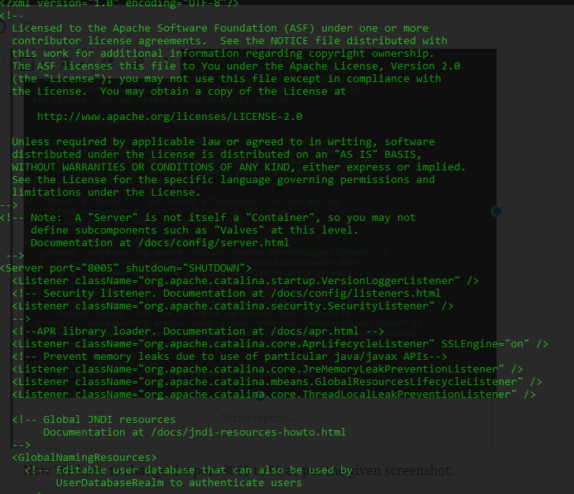
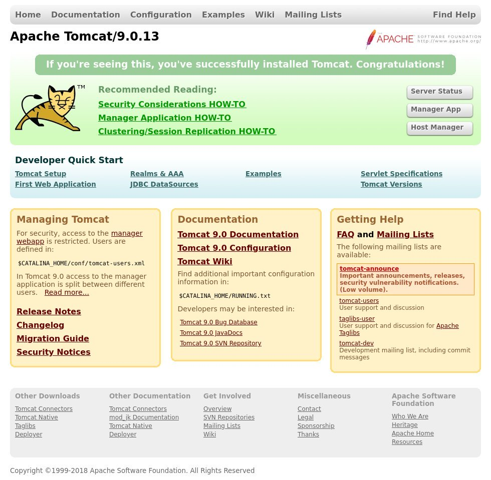

Apache Tomcat program is an open-source application of Java Servlet, JavaServer Pages, Java Expression Language and Java WebSocket technologies. Under the Java Community Process the Java Servlet, JavaServer Pages, Java Expression Language and Java WebSocket specifications are developing.  

The Apache Tomcat software is developed and released under the  Apache License version 2 in an open and participatory environment. The Apache Tomcat project is designed to collaborate with the world's best breed developers. We invite you to take part in this open project for development.  
  
Apache Tomcat Software provides power over a wide range of industries and organizations to numerous large-scale mission-critical Web applications.

## Prerequisites

- First, deploy the new server instance with Microhost.com
- Log in to the server with ssh(putty) with root privilege.
- Update the server using the command

```
`[root@Microhost ~]#`Yum update 
```

### Installation of open Jdk(java)

Tomcat 9 includes Java SE 8 or later. We must install OpenJDK, an open-source Java Platform implementation, which is the default Java creation and runtime for CentOS 7.

Install Java by typing the command given below

```
`[root@Microhost ~]#`yum install java-1.8.0-openjdk-devel 
```

## Create Tomcat system user

To run Tomcat as the root user is a security risk and does not take best practice into account

We will create a new system user and group that will run the Tomcat service with a home directory /opt/tomcat:

```
`[root@Microhost ~]#`useradd -m -U -d /opt/tomcat -s /bin/false tomcat 
```

## Download Tomcat through wget

We will download the version of Tomcat 9.0.33 from the Tomcat official downloads page. You should check the Tomcat 9 download page before proceeding with the next stage to see whether a new release is available. Download Tomcat zipper with the following wget command and navigate into /tmp directory:

```
`[root@Microhost ~]#` wget [https://mirrors.estointernet.in/apache/tomcat/tomcat-9/v9.0.33/bin/apache-tomcat-9.0.33.tar.gz](https://mirrors.estointernet.in/apache/tomcat/tomcat-9/v9.0.33/bin/apache-tomcat-9.0.33.tar.gz) 
```

After completion of tomcat download extract the tar file as given below:

```
`[root@Microhost ~]#` tar -xf apache-tomcat-9.0.33.tar.gz 
```

Move the Tomcat source files to it to the /opt/tomcat directory:

```
[root@Microhost ~]# mv apache-tomcat-9.0.33 /opt/tomcat/ 
```

Run the following command to alter the user and group property of directory tomcat

```
[root@Microhost ~]# chown -R tomcat: /opt/tomcat 
```

Make the scripts executable in the bin directory with the following chmod command:

```
[root@Microhost ~]# sh -c 'chmod +x /opt/tomcat/latest/bin/*.sh' 
```

## Create a systemd unit file

create a tomcat.service unit file in the /etc/systemd/system/ folder to make Tomcat run as a service

```
[root@Microhost ~]# touch /etc/systemd/system/tomcat.service 
```

Now open your text editor and edit the file tomcat.service

```
[root@Microhost ~]# vi /etc/systemd/system/tomcat.service 
```

Paste the following content:

```
[Unit]
Description=Tomcat 9 servlet container
After=network.target

[Service]
Type=forking

User=tomcat
Group=tomcat

Environment="JAVA_HOME=/usr/lib/jvm/jre"
Environment="JAVA_OPTS=-Djava.security.egd=file:///dev/urandom"

Environment="CATALINA_BASE=/opt/tomcat/latest"
Environment="CATALINA_HOME=/opt/tomcat/latest"
Environment="CATALINA_PID=/opt/tomcat/latest/temp/tomcat.pid"
Environment="CATALINA_OPTS=-Xms512M -Xmx1024M -server -XX:+UseParallelGC"

ExecStart=/opt/tomcat/latest/bin/startup.sh
ExecStop=/opt/tomcat/latest/bin/shutdown.sh

[Install]
WantedBy=multi-user.target
```

Save the File with :wq and exit.

Instruct Systemd that a new unit file has been created by typing:

```
[root@Microhost ~]# systemctl daemon-reload 
```

Now start and enable the Tomcat service by typing:

```
[root@Microhost ~]# systemctl start tomcat
```

```
[root@Microhost ~]# systemctl enable tomcat
```

We can also start and stop the Tomcat service from the /bin directory:

```
[root@Microhost ~]# cd /opt/tomcat/bin/ 
```

To start the Tomcat service use following command:

```
[root@Microhost ~]#./startup.sh
```

To stop the Tomcat service use following command:

```
[root@Microhost ~]#./shutdown.sh
```

\[ht\_message mstyle="alert" title="Note" " show\_icon="true" id="" class="" style="" \]We suggest you to always start or stop Tomcat service from the bin directory after making any chages in cofiguration of Tomcat.\[/ht\_message\]

## Opening of port 8080 in server firewall

If you want to access the tomcat interface from outside your local network and your server is protected through a firewall, you must open port 8080.

To open the required port, use the following commands:

```
[root@Microhost ~]#firewall-cmd --zone=public --permanent --add-port=8080/tcp
```

```
[root@Microhost ~]#firewall-cmd --reload 
```

## Changing the Tomcat port from 8080 to 80

You can change the port of Tomcat in the configuration file server.xml by using the following command:

```
[root@Microhost ~]#vi /opt/tomcat/conf/server.xml
```

You will see the output like the screenshot given below:



Now we have to change the port 8080 to 80 as per the given screenshot:


Save the server.xml file using :wq and redirect to bin directory:

```
[root@Microhost ~]# cd /opt/tomcat/bin/ 
```

First shutdown the Tomcat and start it again by using below command:

```
[root@Microhost ~]#./shutdown.sh
```

```
[root@Microhost ~]#./startup.sh
```

## Configure Tomcat Web Management Interface

At this time, Tomcat is set up and we can access it with a web browser on port 8080 or 80, but because we haven't already created a user, we can never access the web management interface.

In the tomcat-users.xml file, Tomcat users and their roles are defined.

When you open the file, you will notice that it contains comments and examples of how to configure the file. You can open the file by typing the following commnd:

```
[root@Microhost ~]#vi /opt/tomcat/latest/conf/tomcat-users.xml
```

After executing the above command the output will be shown like :

```
<tomcat-users>

<!--
    Comments
-->

<role rolename="admin-gui"/>
<role rolename="manager-gui"/>
<user username="admin" password="admin_password" roles="admin-gui,manager-gui"/>
</tomcat-users>
```

In order to add a new user, you need to define the user in the tomcat-users.xml (manager-gui and admin-gui) file, as shown below. Make sure the username and password are changed to something safer:

The web management interface of Tomcat is configured by default to allow localhost access only. You can open the following files and make the following changes if you want to access the website interface from a remote IP or from anywhere. However, public access is not recommended as it is a security risk.

If you need to access the web interface from anywhere, open the following files and comment or delete the lines that are in yellow:

```
[root@Microhost ~]#vi /opt/tomcat/latest/webapps/manager/META-INF/context.xml
```

After executing the above command the output will be shown like :

```
<Context antiResourceLocking="false" privileged="true" >
<!--
  <Valve className="org.apache.catalina.valves.RemoteAddrValve"
         allow="127\.\d+\.\d+\.\d+|::1|0:0:0:0:0:0:0:1" />
-->
</Context>
```

Now we have make the changes for host-manager :

```
[root@Microhost ~]#vi /opt/tomcat/latest/webapps/host-manager/META-INF/context.xml
```

After executing the above command the output will be shown like :

```
<Context antiResourceLocking="false" privileged="true" >
<!--
  <Valve className="org.apache.catalina.valves.RemoteAddrValve"
         allow="127\.\d+\.\d+\.\d+|::1|0:0:0:0:0:0:0:1" />
-->
</Context>
```

If you only have to access the web interface from a specific IP, add your public IP to the list instead of commenting on the blocks. Let's say your public IP is 192.168.24.45, and just from that IP you want access:

```
[root@Microhost ~]#vi /opt/tomcat/latest/webapps/manager/META-INF/context.xml
```

```
<Context antiResourceLocking="false" privileged="true" >
<!--
  <Valve className="org.apache.catalina.valves.RemoteAddrValve"
         allow="127\.\d+\.\d+\.\d+|::1|0:0:0:0:0:0:0:1 | 192.168.24.45" />
-->
</Context>
```

Now we have make the changes for host-manager :

```
[root@Microhost ~]#vi /opt/tomcat/latest/webapps/host-manager/META-INF/context.xml
```

```
<Context antiResourceLocking="false" privileged="true" >
<!--
  <Valve className="org.apache.catalina.valves.RemoteAddrValve"
         allow="127\.\d+\.\d+\.\d+|::1|0:0:0:0:0:0:0:1 | 192.168.24.45" />
-->
</Context>
```

The list of IP addresses permitted is a list separated by a vertical bar. You may add individual IP addresses or use a standard term.

To make changes successful, restart the Tomcat service:

```
[root@Microhost ~]#systemctl restart tomcat
```

## Access the Tomcat admin page

You can access the web admin page through

```
[root@Microhost ~]#http:// <your_domain_or_IP_address> :8080
```

After executing the above url you will get the below output:



Thank You :)
