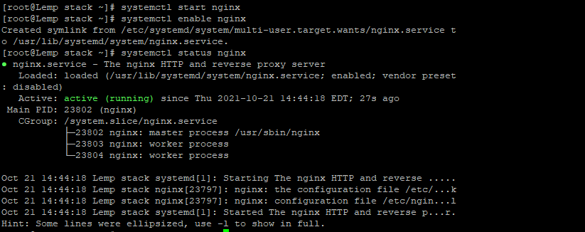
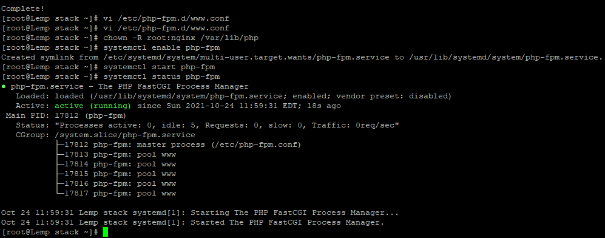

The term LEMP is an acronym of the names of its four open-source components:

- L - Linux operating system
- E - Nginx \[engine x\]
- M - MySQL or MariaDB relational database management system
- P - PHP programming language

Login into the server using root credentials on putty.


Step 1. Installing Nginx

Nginx is not available in the default CentOS 7 repository so we will use the EPEL repositories. To add the [EPEL repository](https://linuxize.com/post/how-to-enable-epel-repository-on-centos/) to your system, use the following command.

```
# yum install epel-release 
```

Now that the EPEL repository is enabled, install the Nginx package with below command.

```
# yum install nginx 
```

Once it is installed, start and enable the Nginx service by typing:

```
# systemctl start nginx 
```

```
# systemctl enable nginx 
```

```
# systemctl status nginx 
```



Step 2. Installing MariaDB

The next step is to install the MariaDB packages. To do so type:  
yum install mariadb-server

Once MariaDB server is installed, start and enable the service with

```
# systemctl start mariadb.service 
```

```
# systemctl enable mariadb.service 
```


Step 3. Installing PHP

CentOS 7 ships with PHP version 5.4 which is EOL-ed for quite some time so we’ll use the Remi repository to install PHP 7.2. 

Run the following command to add the Remi repository to your system.

```
#yum install http://rpms.remirepo.net/enterprise/remi-release-7.rpm 
```

Once it is added, install the `yum-utils` package and enable the `remi-php72` repository.

```
# yum install yum-utils 
```

```
# yum-config-manager --enable remi-php72 
```

Now that we have Remi repository enabled, we can install PHP FPM and several most common PHP modules with.

```
# yum install php-fpm php-opcache php-cli php-gd php-curl php-mysql 
```

By default PHP FPM will run as user `apache` on port 9000. We’ll change the user to `nginx` and switch from TCP socket to Unix socket. To do so edit the lines highlighted in yellow.

```
# vi /etc/php-fpm.d/[www.conf](http://www.conf/) 
```


Make sure the `/var/lib/php` directory has the correct permissions

```
# chown -R root:nginx /var/lib/php 
```

Save the file, enable and start the PHP FPM service with.

```
# systemctl enable php-fpm 
```

```
# systemctl start php-fpm 
```



Thank you!!
