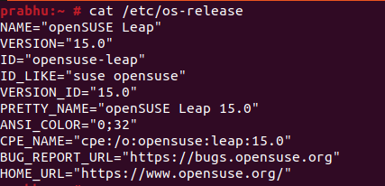

<figure>


<figcaption>

How to install Apache server on OpenSUSE

</figcaption>

</figure>

In this article, you will learn how to install Apache server on OpenSUSE server. Apache is a [well-known HTTP Server](https://www.google.com/url?sa=t&rct=j&q=&esrc=s&source=web&cd=&cad=rja&uact=8&ved=2ahUKEwjo9537rrj_AhWCT2wGHYMxAPsQFnoECC4QAQ&url=https%3A%2F%2Fen.wikipedia.org%2Fwiki%2FApache_HTTP_Server&usg=AOvVaw2aCELPCc3BiJsf7OKxZ-Uj) that is free, open source, and runs on Unix-like operating systems like Linux and Windows OS. Since it came out 20 years ago, it has been the most popular web server. Many sites on the Internet use it to run. It is easy to install and set up so that a Linux or Windows server can host one or more websites.

In this article, we'll show you how to use the command line to install, set up, and manage Apache HTTP web server on OpenSUSE server.

## Prerequisites

- Internet accessible on server

- Super user or any normal user with SUDO privileges

```
Install Apache Web Server
```
Step 1: Check your system release.

```
cat /etc/os-release
```
<figure>



<figcaption>

OpenSUSE 15.0

</figcaption>

</figure>

Step 2: Now, update the system software packages to the latest version.

```
zypper update -y
```
Step 3: Next, do the following with the zypper package manager to install Apache HTTP server from the default software repositories.

```
zypper install apache2 -y
```
<figure>


<figcaption>

Install apache on Opensuse server

</figcaption>

</figure>

## Start Apache Server on OpenSUSE

Step 4: After installing Apache web server, you can start it for the first time and set it to start automatically when the system starts up.

```
systemctl enable --now apache2
```
Step 5: You can confirm the status of Apache server by using following command

```
systemctl status apache2
```
<figure>


<figcaption>

Start and enable the Apache2 services

</figcaption>

</figure>

### Configure firewalld to Allow Apache Traffic

Step 6: The firewall that comes with CentOS 7 is set up to block Apache traffic by default. To let web traffic through on Apache, change the system [firewall rules to allow HTTP and HTTPS](https://utho.com/docs/tutorial/firewalld-with-centos-7/) packets to come in.

```
firewall-cmd --permanent --add-service http
firewall-cmd --permanent --add-service https
firewall-cmd --reload
```
<figure>


<figcaption>

Add http port in firewalld

</figcaption>

</figure>

### Test Apache HTTP Server on CentOS 7

Step 7: Now, edit or create you index page to test your installation.

```
echo "<h1> Greetings from Microhost Cloud </h1> >> /srv/www/htdocs/index.html
```

If you now go to the following URL, a default Apache page will be shown.

```
http://server_ip
```

<figure>


<figcaption>

Successfully installed apache2 on OpenSUSE

</figcaption>

</figure>

And this is how you have learnt how to install Apache server on OpenSUSE
