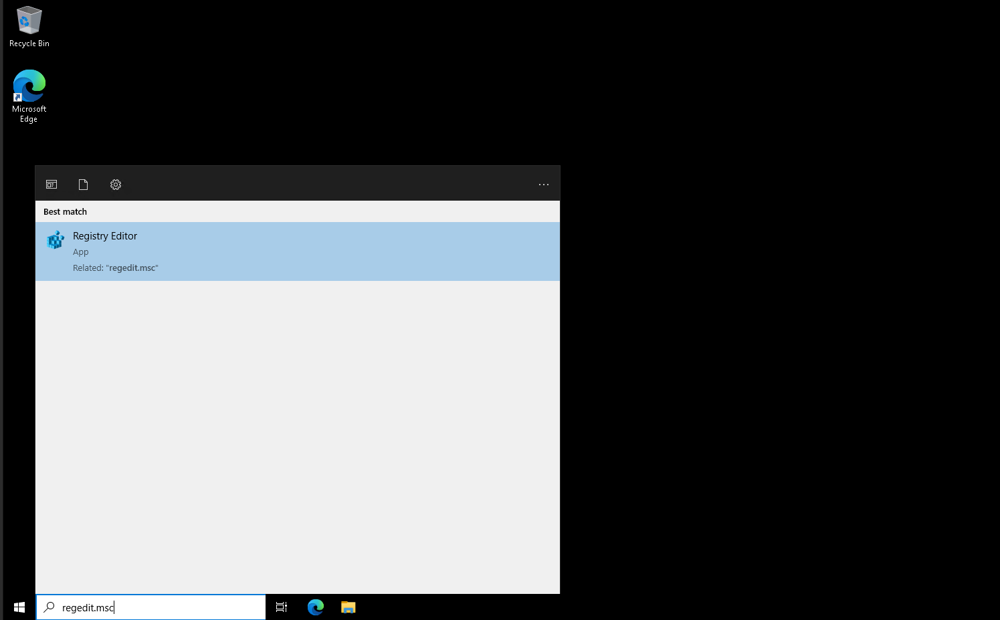
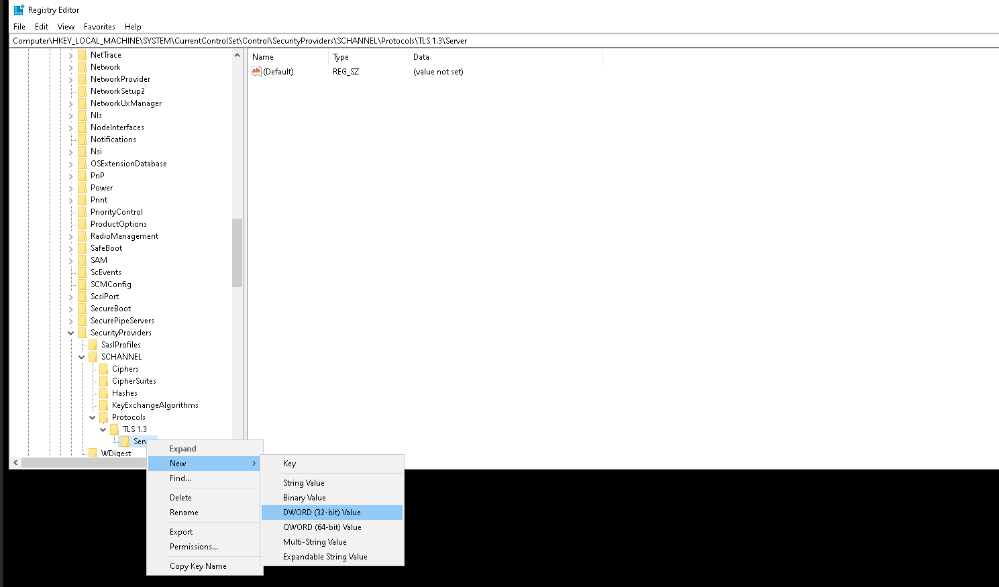

# HOW TO UPGRADE TLS VERSION TO 1.3 IN WINDOWS

## INTRODUCTION
In this article, we will walk through the steps taken to enable TLS 1.3 in Windows server.

## What is TLS?
**TLS (Transport Layer Security)** is a cryptographic protocol designed to provide secure communication over a computer network. It is widely used for encrypting data transmissions on the internet, including web browsing (HTTPS), email, and VoIP.

### Key Features of TLS:
1. **Encryption** – Protects data from being intercepted and read by unauthorized parties.
2. **Authentication** – Ensures that the communicating parties (such as a user and a website) are who they claim to be.
3. **Data Integrity** – Prevents data from being tampered with during transmission.

## HOW TO ENABLE TLS 1.3

### STEP-1
Connect to windows server with administrative privilege and Launch Registry Editor (regedit.exe).

### STEP-2
Search regedit » computer » HKEY_LOCAL_MACHINE » SYSTEM » current control set » control » security providers » SCHANNEL » protocols [right click on protocols] then NEW » key then rename the new folder with TLS 1.3
Right click on TLS 1.3 folder then NEW » key Rename the new folder with server

### STEP-3
Right click on server name folder » new » DWORD [32-bit] value after that in the right side of the page a new folder will be added and renamed it with Default
Then right click on Default folder go to modify » value data=1 » hexadecimal » ok

### STEP-4
After that you need to restart the Windows server so that changes are reflected.

## How do I know if the TLS version is enabled on Windows Server?
1. Click on: Start -> Control Panel -> Internet Options
2. Click on the Advanced tab
3. Scroll to the bottom and check the TLS version 
4. Select [use TLS 1.3] » ok