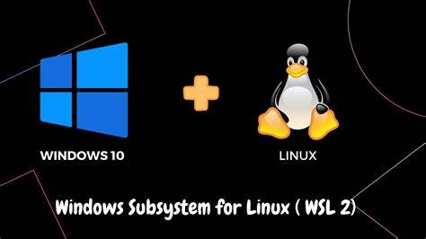
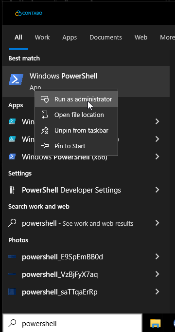
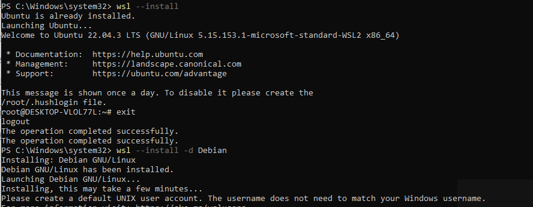
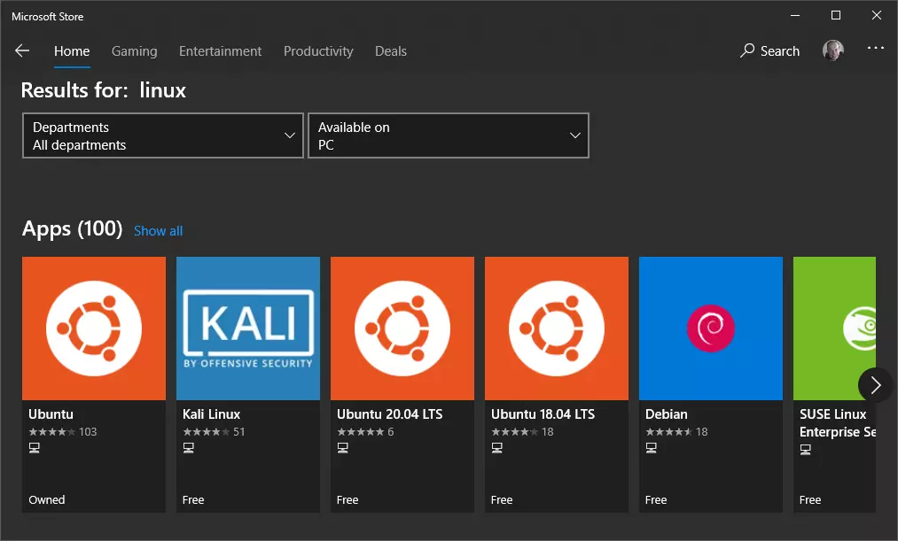

# **Installing Windows Subsystem for Linux 2 on Microsoft Windows 10**



## **What is the Windows Subsystem for Linux?**

The Windows Subsystem for Linux (WSL) lets developers run a Linux
environment directly on Windows. It's a full Linux OS running inside
Windows so you can use the same apps and files seamlessly. In 2021
Microsoft introduced Windows Subsystem for Linux (short: WSL). With that
you can run a Linux environment directly on your Windows machine without
the need for tools like VirtualBox or dual-boot setups. You can just
start a Linux session of your choice directly.

We will guide you through the process of installing and enabling wsl on
your local machine and installing ubuntu 22.04.

## **Prerequisites**

To follow this guide, make sure that your PC has Windows 10 Version 1903
(or later) with Build 18362 (or later).

### **Enabling WSL on Your Machine:**

Open the Start menu by pressing the Windows-Key and search for
"PowerShell". Now right click on Windows PowerShell and click on "Run as
administrator".



execute the following commands in a Windows Powershell terminal run as
an Administrator:
```bash
dism.exe /online /enable-feature
/featurename:Microsoft-Windows-Subsystem-Linux /all /norestart
```

In order to run the latest version of WSL, which is WSL 2, you need to
enable "Windows Virtual Machine Platform"
```bash
dism.exe /online /enable-feature /featurename:VirtualMachinePlatform
/all /norestart
```

For all the new changes and enabled features to take effect you need to
restart your PC.

To install the default Ubuntu 20.04 distro, enter:
```bash
wsl --install
```
To install a specific distro by name, such as Debian, enter:
```bash
wsl --install -d Debian
```


Alternatively, you can install Linux distros from the Microsoft Store
accessed in the Start menu. Enter "Linux" in the search box (be wary
there could be software other than WSL distros).



After choosing a username you will be prompted to create a password for
this account.

Congrats! Now your Ubuntu instance is set up and fully configured.
