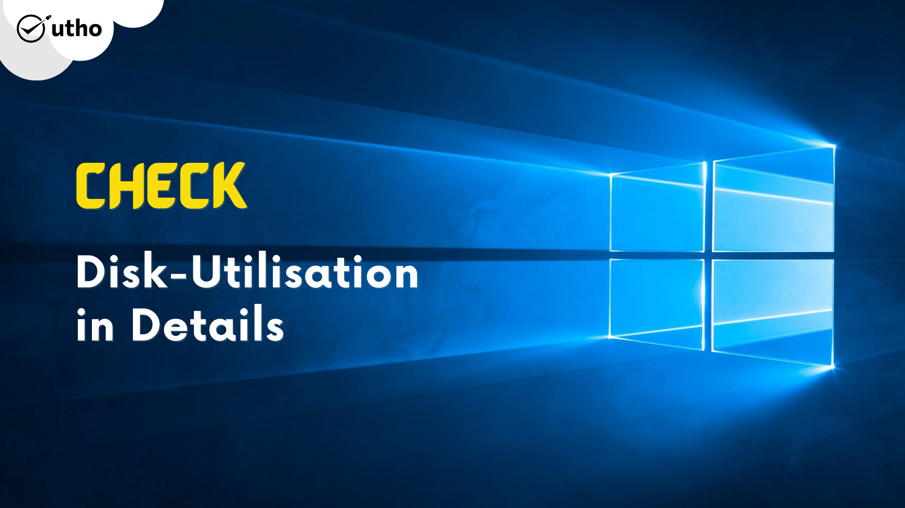
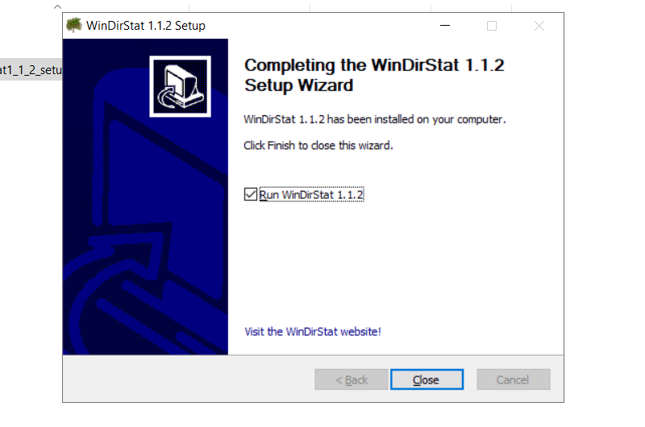
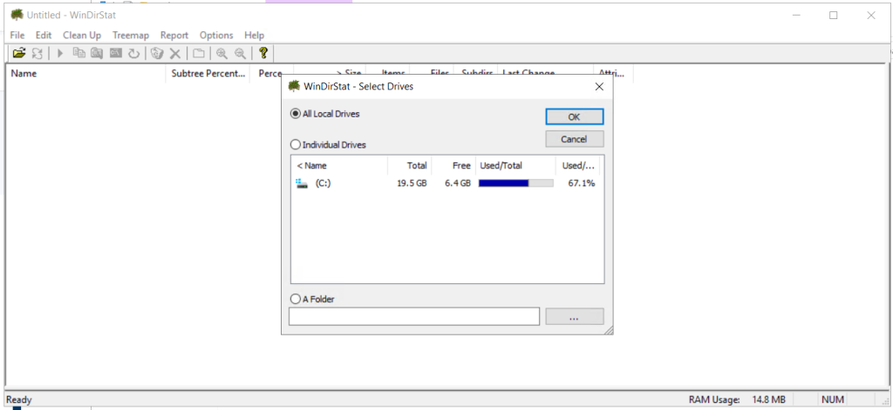

<figure>

<figcaption>

Check Disk-utilisation in details on Windows

</figcaption>

</figure>

In this article, you will learn how to check Disk Utilization in details in Windows. **WinDirStat** is a free and open-source graphical disk usage analyzer for [Microsoft Windows](https://en.wikipedia.org/wiki/Microsoft_Windows). It presents a sub-tree view with disk-use percentage alongside a usage-sorted list of file extensions that is interactively integrated with a colorful graphical display (a treemap). Created as an open-source project released under the GNU GPL, it was developed using Visual C++/MFC 7.0 and distributed using SourceForge. The project was inspired by SequoiaView, an application based on research done by the Visualization Section of the Faculty of Mathematics and Computer Science at the Technische Universiteit Eindhoven.

## Prerequisites

- Administrator level user to download and install new package

- Internet enabled on server to download the WINDIRSTAT. If you want to have a fully functional server at minimul cost, [check this out](http://utho.com).

## 1- Steps to install WinDirStat on Windows.

Step 1: Download the WInDirStat on your windows server. You can use [this link.](https://sourceforge.net/projects/windirstat/)

<figure>

<figcaption>

Download the WinDirStat page

</figcaption>

</figure>

Step 2: Once the application downloaded, go to your downloaded folder and click on the .exe to run the application.

S

Step 3 Once you opened the application, you will see the screen like below. Click on Next button.

Step 4: After clicking on Next button on above step, you will now see the screen as below.Click on Next Button.

Step 5: Now, the application should be installing on the path you have selected in the previous step. Click on Next Button.

Step 6: Now, you just need to click on Close button.

## 2- Step To check the disk utilisation on your machine

Step 2.1: Now, after opening, you will see the windows just like to below windows. Select the "All Local Drives" and then OK button

Step 2.2: After doing this, you will see the below windows.

Now, you have learnt check Disk Utilization in details in Windows
