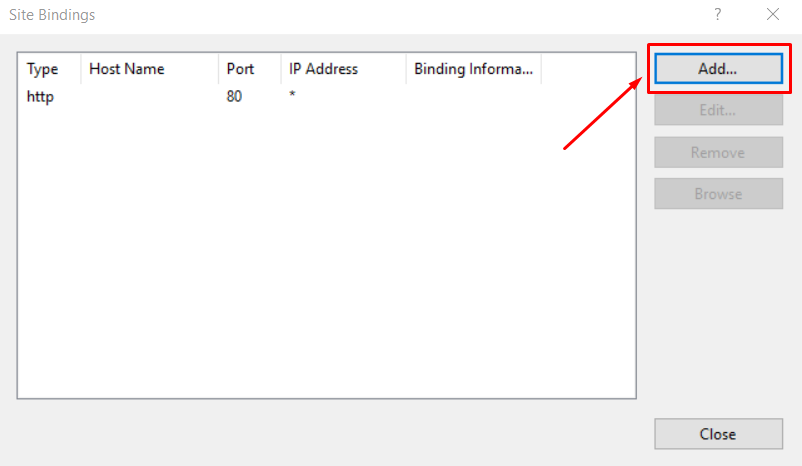
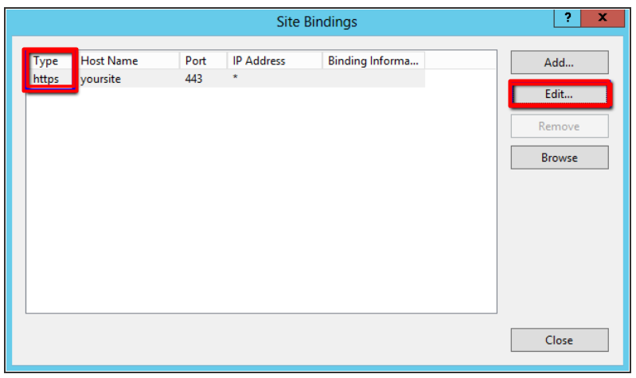

**Step 1. Bind the certificate.**

Open bindings options in default web sites. As shown in the below screenshot .

Click on "Bindings..."

**Step 2 : After opening the bindings , Click on add/edit option to add the domains for the SSL**

**Add** a new rule.

Or **edit** the existing rule. 

**Step 3: Choose the type, IP, port, and SSL certificate and then click on OK.**

SSL has been successfully installed on the domain , Please verify through URL .

Thank you.
