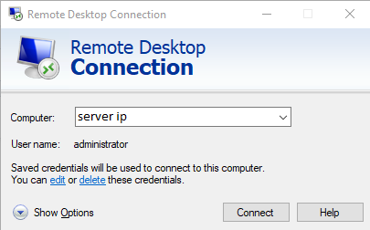

```
Introduction
```
Unallocated space, also referred to as “free space,” is the area on a hard drive where new files can be stored. Conversely, allocated space is the area on a hard drive where files already reside. Think of “allocated” storage space as already filled with data and not to be overwritten with other newer data, while “unallocated” space is available to store new data even though it may contain old data which would be overwritten by new data. In this blog, we will how to allocate unallocated disk space in Windows Server.

**Step 1.** Login to your [**Windows server**](https://en.wikipedia.org/wiki/Windows_Server)



**Step 2.** Open Command Prompt **(cmd)**


**Step 3.** run **diskpart**

```
C:UsersAdministrator>diskpart
```

**Step 4.** run **list volume**

```
DISKPART> list volume
```

**Step 5.** run **select volume 0**

```
DISKPART> select volume 0
```

**Step 6.** run **extend filesystem** allocate unallocated disk space

```
DISKPART> extend filesystem
```

**Disk Allocation: Successful**

[How to add additional storage to your server.](https://utho.com/docs/tutorial/how-to-add-additional-storage-in-the-cloud/)

Thank You!
