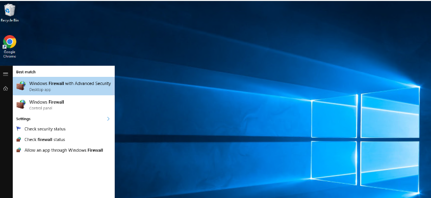
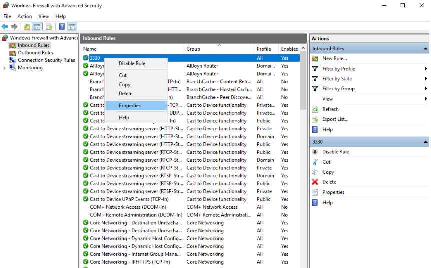
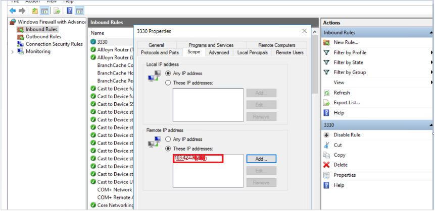

**Step.1** press windows button and open windows firewall with advance security.

**Step.2** > Next, go to the inbound rules section.

**Step 3**: Select the inbound rules.

**Step 4** \> Right-click on the rdp port 3330 and select properties from the context menu.

**Step 5**: Select the Scope option.And select these IP options and give the IP you want.

