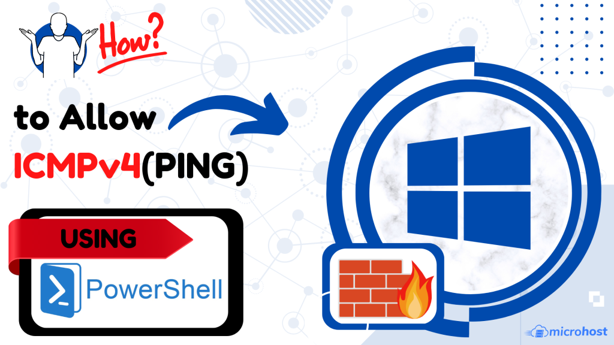
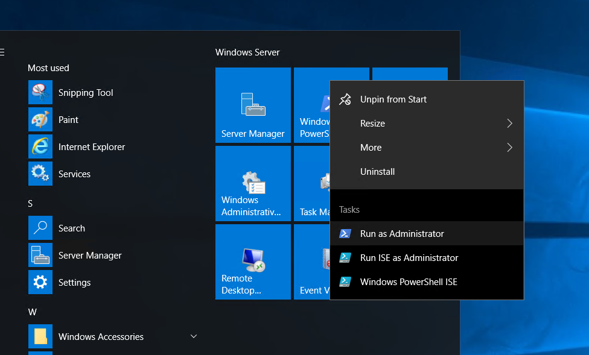
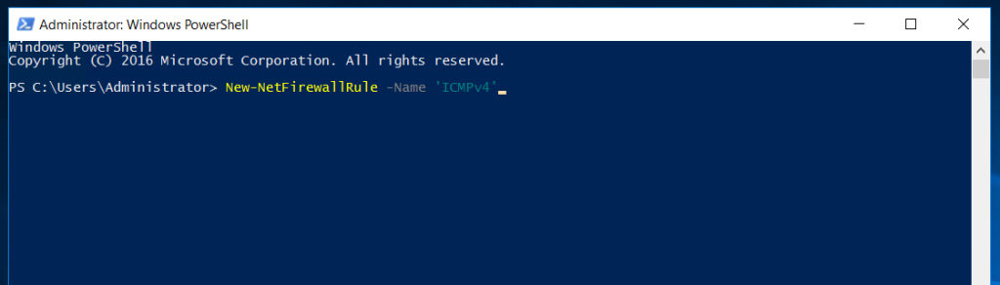
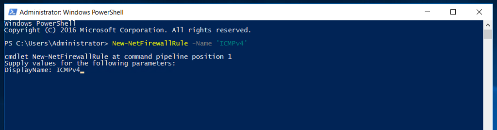

## INTRODUCTION

[ICMPv4](https://learn.microsoft.com/en-us/windows/security/threat-protection/windows-firewall/create-an-inbound-icmp-rule) **Internet Control Message Protocol** version 4 is definitely a Network layer protocol. And its job is to report the error to the source if any problem arises while delivering the datagram. The ICMPv4 is a message-oriented protocol. It’s a protocol of version 4 of the TCP/IP protocol suite. In this article we will learn How to allow ICMPv4(PING) in Windows [Firewall](https://utho.com/docs/tutorial/how-to-block-or-allow-tcp-ip-port-in-windows-firewall/) using Powershell.

### Step 1. Open PowerShell and an Administrator allow ICMPv4(PING) in Windows

###### Step 2. Run the command to add rule of ICMPv4

###### Step 3. Set a display Name open ICMPv4(PING) in Windows A

Step 4. Check if the rule is properly added.

Rule added successfully.

Thank You!
