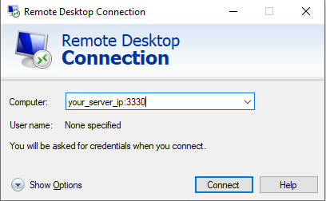
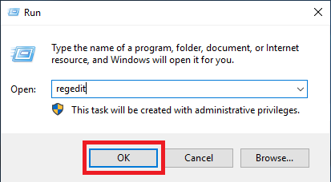
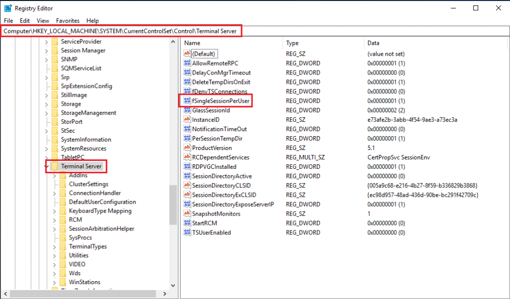
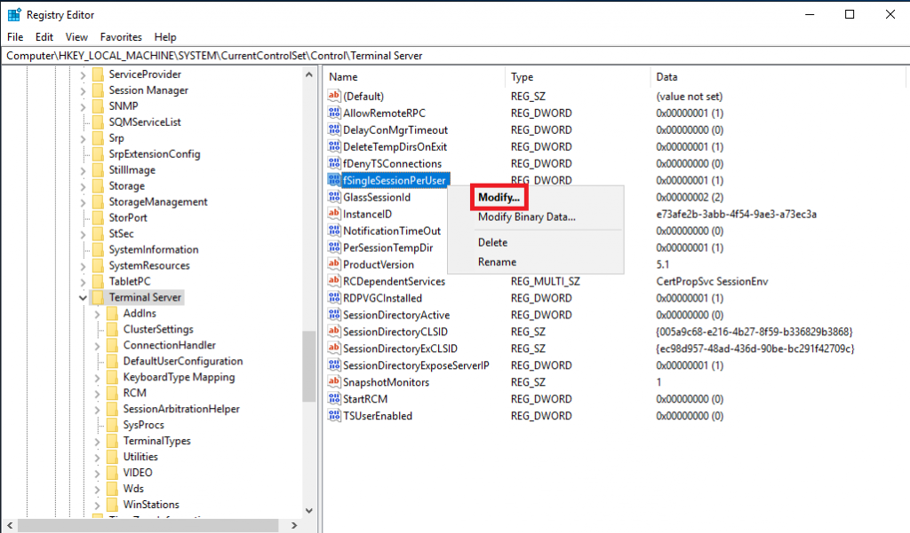

**Step 1.** Login to your windows server

**Step 2.** Launch the Registry Editor in Windows Server, go to **Start** and then **Run**. Type **regedit** in run menu and hit enter. To launch Registry Editor in Windows Server 2012 R2, press **Windows key + R**. Type regedit in run menu and hit enter.

**Step 3.** Once Registry Editor window is launched, navigate to **HKEY\_LOCAL\_MACHINE\\System\\CurrentControlSet\\Control\\TerminalServer**.

**Step 4.** By selecting the **Terminal Server** registry, you would see the registry key **fSingleSessionPerUser** on the right panel.

**Step 5.** Right-click on **fSingleSessionPerUser** key and then click on **Modify**_._ 

**Step 6**. Change the key value from 1 to 0 as shown in the screenshot below, and close the Registry Editor. The value 1 denotes single session for each remote desktop user, and 0 denotes multiple sessions for each user.

Multiple RDP sessions for the single user enabled.

**Note:**

If **fSingleSessionPerUser** key is not available then you will need to create it manually. To add a new key, click on **Terminal Server** \>> **New** \>> **New DWORD (32) Value**. Name this key as **fSingleSessionPerUser**, set its value to 0 and close the Registry Editor.

Thank You.
