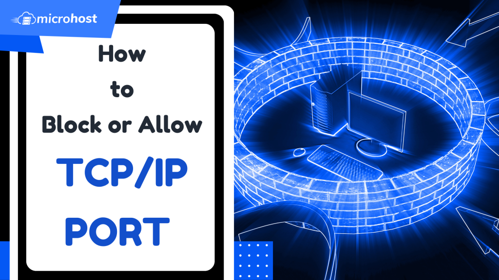
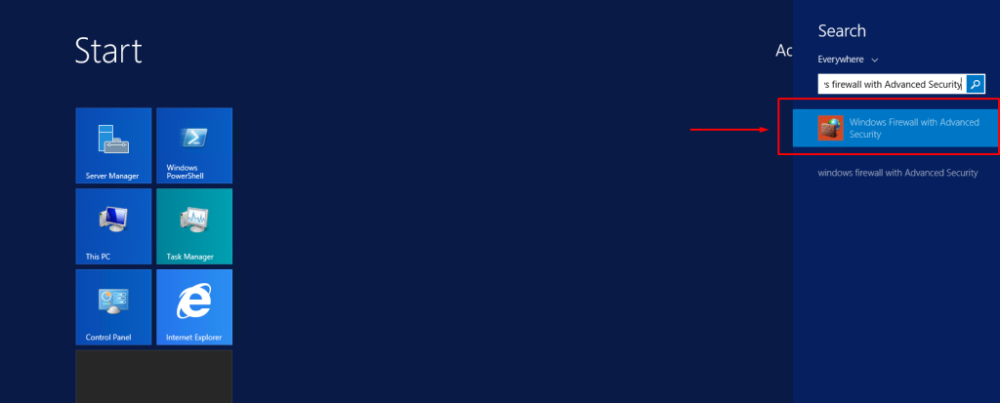
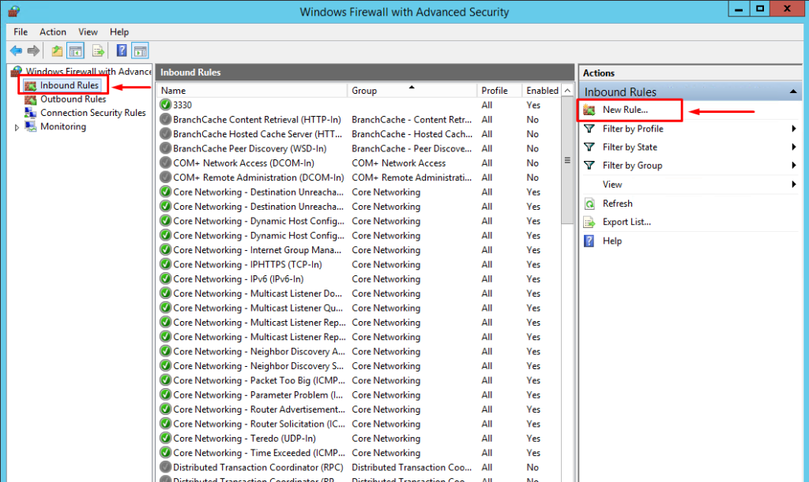
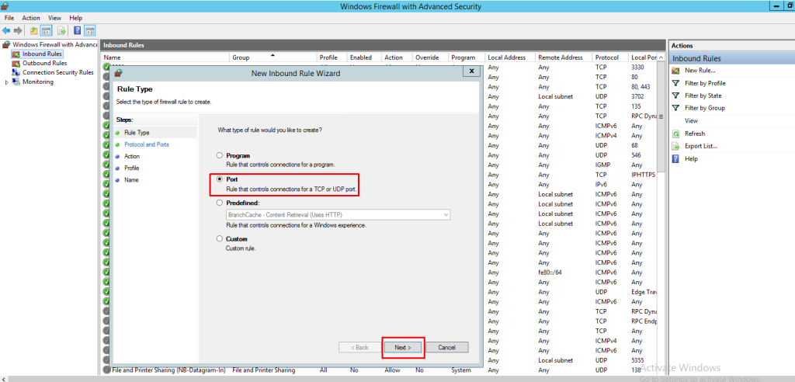
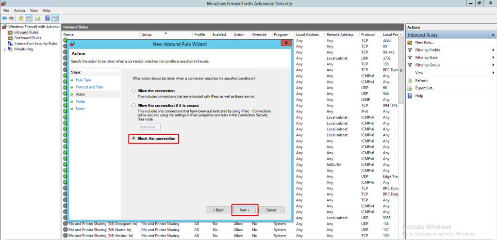
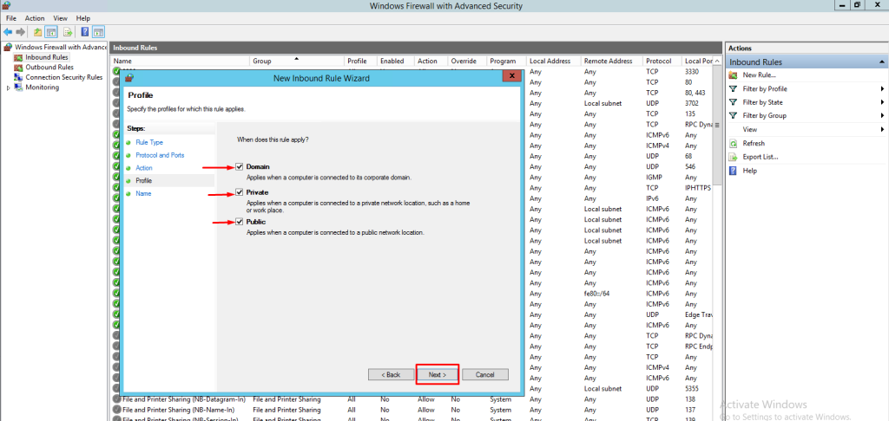
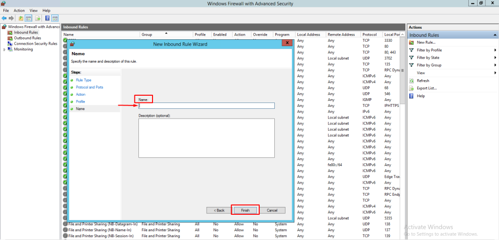
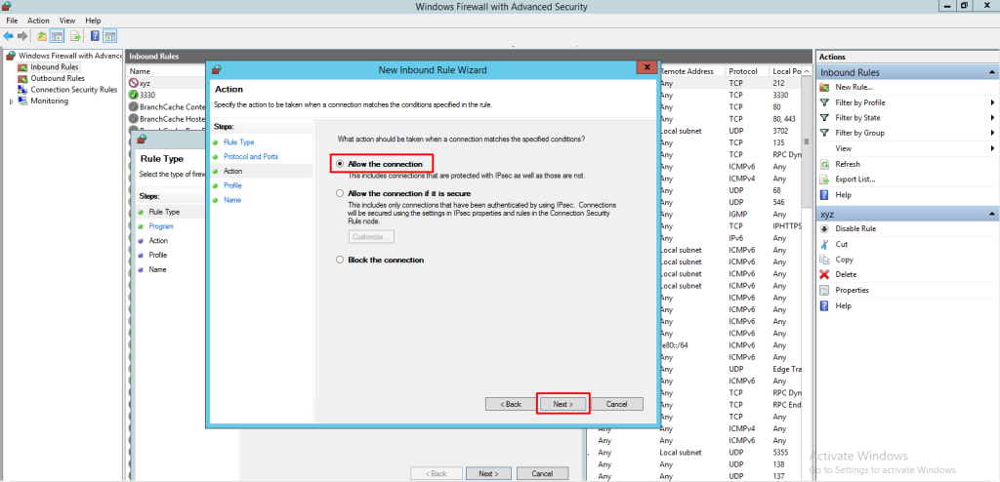

## Introduction

In this article, you will learn how to block or allow ports in windows firewall.

Your [Windows](https://utho.com/docs/tutorial/how-to-boot-windows-server-2012-into-safe-mode/) machine can be protected from any threats posed by the network by using the Windows [Firewall](https://en.wikipedia.org/wiki/Firewall_(computing)). You have the option of controlling who is granted to enter your system as well as the level of accessibility that is granted.

## Block port in Firewall

**Step 1. Navigate to the Windows Firewall and advanced settings.**

Step 2. To see the list of rules, select "Inbound Rules" from the menu that appears on the left side of the window. then click on the new rule.

Step 3. Select port and then press the next button. 

Step 4. Click on "Specific local ports" and choose a port number (e.g., 80). then click on "next."

Step 5. Choose Block the Connection and then click Next. 

Step 6. Apply Your New Rule to Each of the Different Types of Profiles. To apply your rule to each of the three kinds of profiles (domain, private, and public), under the Profile window, you must check the appropriate boxes. To proceed, click the "Next" button.

Step 7. Give your new rule a name. You can also add a description to your rule if you want to. Click "Finish" when you're done to set up the settings.

## Allow port in Firewall

Step 1. Navigate to the Windows Firewall and advanced settings.

Step 2. To see the list of rules, select "Inbound Rules" from the menu that appears on the left side of the window. then click on the new rule.

Step 3. Select port and then press the next button. 

Step 4. Click on "Specific local ports" and choose a port number (e.g., 80). then click on "next."

Step 5. Choose Allow the Connection and then click Next. 

Step 6. Apply Your New Rule to Each of the Different Types of Profiles. To apply your rule to each of the three kinds of profiles (domain, private, and public), under the Profile window, you must check the appropriate boxes. To proceed, click the "Next" button.

Step 7. Give your new rule a name. You can also add a description to your rule if you want to. Click "Finish" when you're done to set up the settings.

## Conclusion

Hopefully, you have learned how to block or allow ports in windows firewall.

Thank You 🙂
