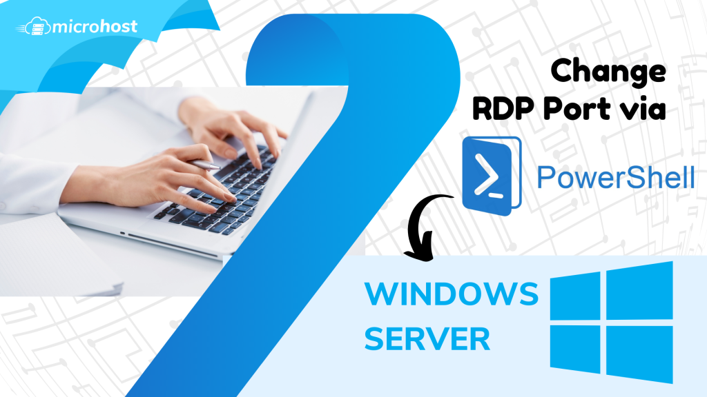
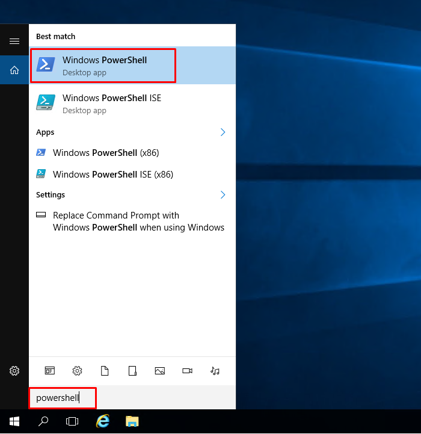
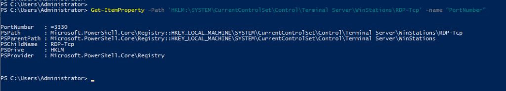

## Introduction

In this article, you will learn how to change RDP port via [PowerShell](https://en.wikipedia.org/wiki/PowerShell) in Windows server.

The Remote Desktop Protocol, also known as RDP, is a proprietary protocol developed by Microsoft that enables users to remotely connect to other computers, most commonly through TCP port 3389. A distant user can gain access to the network using its encrypted communication channel.

The Windows Remote Desktop (RDP) port 3389 is a popular target for hackers. So, it may make sense to alter the RDP port. This article describes how to change RDP port via PowerShell in Windows server 2012/2016/2019.

Step 1. In the search box, type PowerShell.



Step 2. Run PowerShell as an administrator.


Step 3. To determine the current RDP port, use the command below. 

```
# Get-ItemProperty -Path 'HKLM:\\SYSTEM\\CurrentControlSet\\Control\\Terminal Server\\WinStations\\RDP-Tcp' -name "PortNumber"

```


Step 4. To change the RDP port, run the below command and change the port as per your own.

```
# Set-ItemProperty -Path 'HKLM:\\SYSTEM\\CurrentControlSet\\Control\\Terminal Server\\WinStations\\RDP-Tcp' -name "PortNumber" -Value $portvalue=new\_port\_number

```


Step 5. Run the below command to check the newly set RDP port.

```
# Get-ItemProperty -Path 'HKLM:\\SYSTEM\\CurrentControlSet\\Control\\Terminal Server\\WinStations\\RDP-Tcp' -name "PortNumber"

```



Step 6. To reflect the changes, restart the RDP services from the Task Manager.


## Conclusion

Hopefully, now you have learned how to change RDP port via PowerShell in Windows server.

Also read: [How to Block or Allow TCP/IP Port in Windows Firewall](https://utho.com/docs/tutorial/how-to-block-or-allow-tcp-ip-port-in-windows-firewall/)

Thank You 🙂
