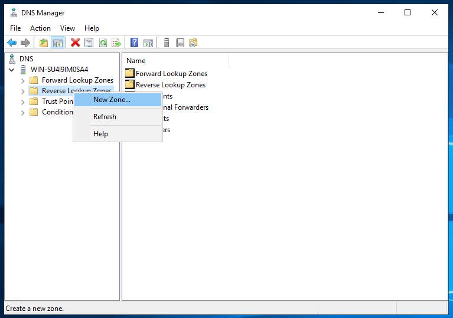
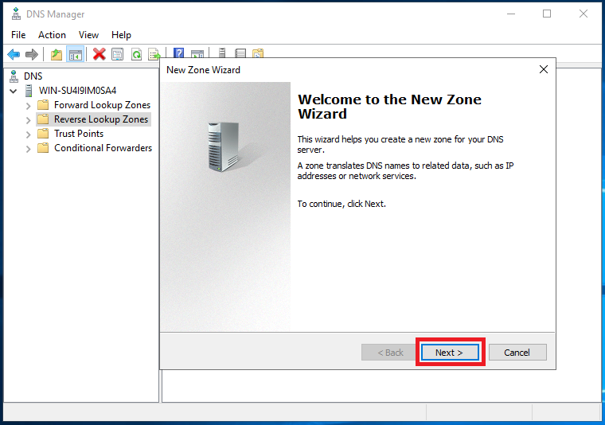
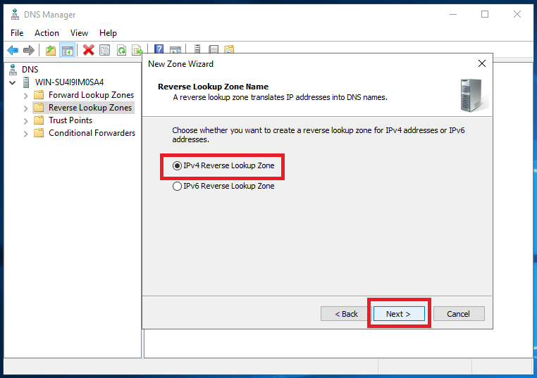
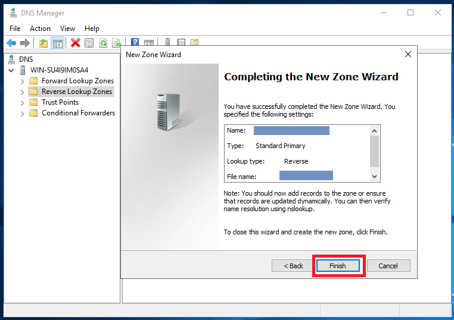
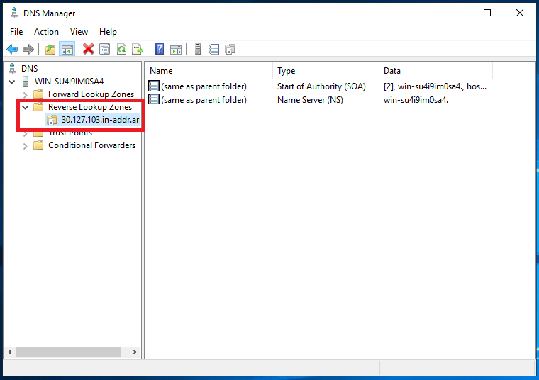
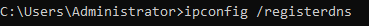

**Step 1. Login to your win server via RDP**


**Step 2. Open Server Manager**


**Step 3. Go to tools and open DNS** 


**Step 4. In the DNS Manager, under your server, right-click on Reverse Lookup zones, and click on New Zone...**



**Step 5. In NEW ZONE wizard, click next**



**Step 6. Select Primary Zone and click Next.**


**Step 7. Select IPv4 Reverse Lookup Zone and click Next.**



**Step 8. Select Network ID, input your server IP and click Next.**


**Step 9. Select Create a new file name. A file name should automatically be created. Click Next.**


**Step 10. Click Finish.**



**Step 11. Expand Reverse Lookup Zones and click on the zone you just added.**



**Step 12. Open cmd and input the command:**

```
 C:UsersAdminnistrator>**ipconfig /registerdns** 
```




**Step 13. Add the pointer. Go to DNS Manager, right click on the mid screen, and click on "New Pointer (PTR)...".**


**Step 14.Add Host IP Address and Hostname, then click OK.**


Pointer Added


**Step 15. Exit your server and go to your main desktop. Open cmd and type the command** 

```
 C:UsersAdministrator> **nslookup your_server_ip** 
```

Example:

```
 C:UsersDivyanshu>**nslookup 103.127.30.85**
```

```
Name: 1031273085.network.microhost.in  
Address: 103.127.30.85
```

Thank you!
