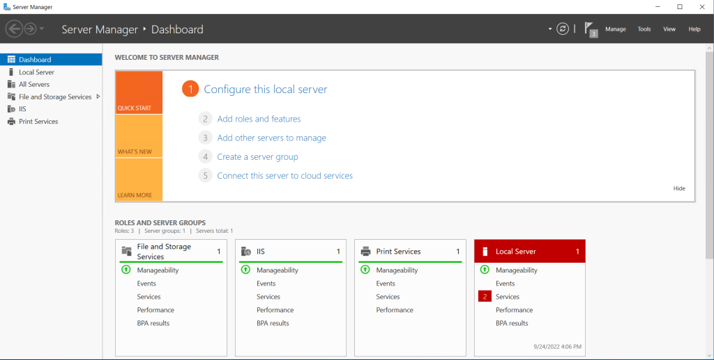
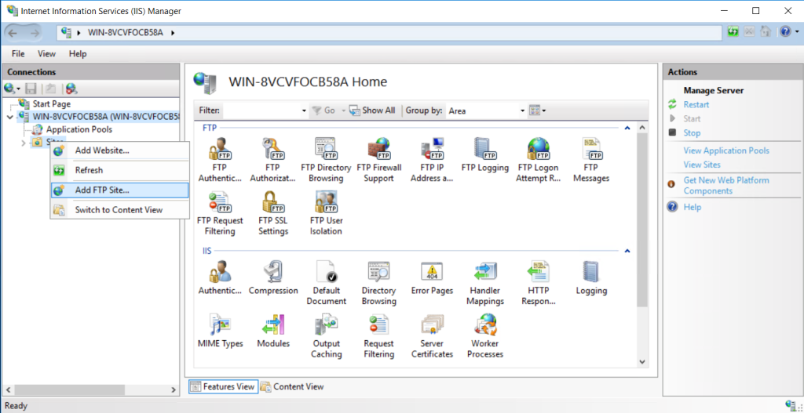
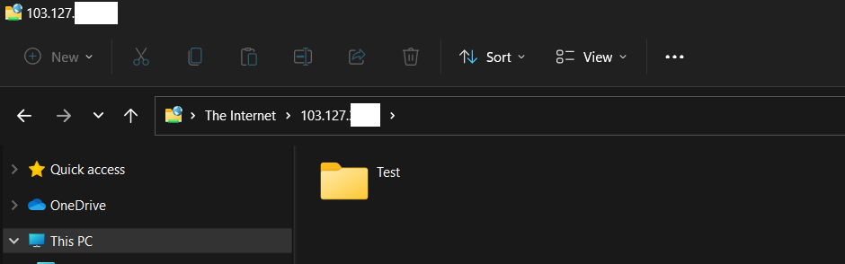

Step 1. Log into tyour [windows server](https://www.microsoft.com/en-in/windows-server).

Step 2. Open [Server Manager](https://utho.com/docs/tutorial/how-to-install-iis-via-powershell-in-windows-server/)

Step 3. Go to Add Roles and features Configure FTP Server on Windows

Select IIS and FTP server under IIS

Click Install. IIS and FTP server will be installed.

Step 4. Go to TOOLS and open IIS

Step 5. Right-click on **sites** and click on **Add FTP Site...**

Input Site name and it's physical path Configure FTP Server on Windows

Select the server's IP address in bindings, set authentication and read/write permissions and you are good to go.

FTP folder has been set in the server.

step 6. Go to File manager of your local desktop and hit **ftp://server\_ip/** to access the FTP location.

FTP folder accessed successfully.

Thank You!
