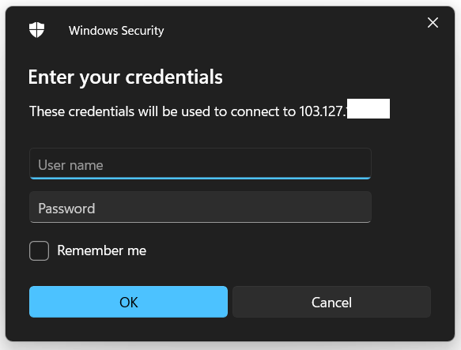
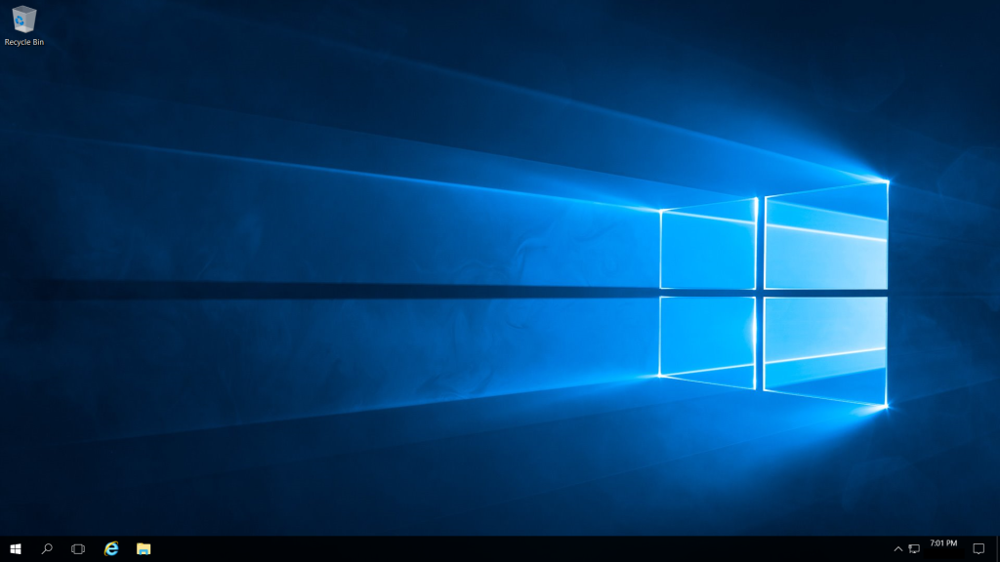

connect to a Windows server

Step 1. Open Run and type "[mstsc](https://learn.microsoft.com/en-us/windows-server/administration/windows-commands/mstsc)", click enter

Step 2. enter the server IP along with the RDP port

Step 3. Enter username and password of the server and you will be connected to your [Windows Server](https://utho.com/docs/tutorial/how-to-configure-ftp-server-on-windows-server-2019/)

Windows Server Connected.

Thank You!
