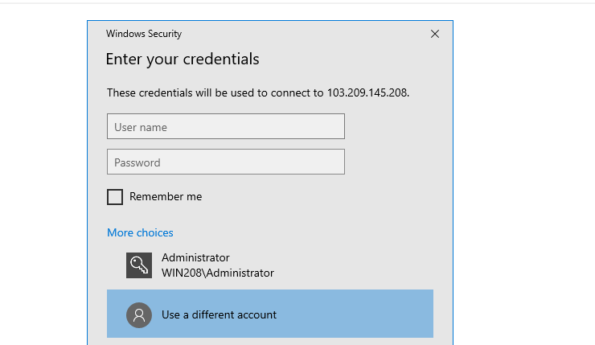

You can connect to other computers or devices connected to local network or on the Internet with a Public IP Address via Windows, **Remote Desktop Connection** application. For example, when you're using another computer or device, you can use the remote desktop connection app to connect to your computer desk's or work computer.

## Connect another computer remotely on the public network

Step 1: Go to the search bar of the taskbar as following :

Step 2: Type remote desktop connection in the search bar and click on the icon :

The output will be shown as following:

Step 3: First you need to enter the IP address in the white bar as shown in above image. If you are using RDP default port then enter only the IP address. However, if you are using any custom port for RDP connection then you have to enter the IP address including the port number.

In the above image IP Address is ( 51.89.143.218) and port is ( 4489 ). You can use only IP Address in case of default port.

Now you will get the prompt to enter the Username & Password as following:

Enter the password and sometime you will get the Warning of SSL Security. You need to enter **YES** as following:

Now you are connected with the remote PC and can use it as your local PC.

Thank You :)
