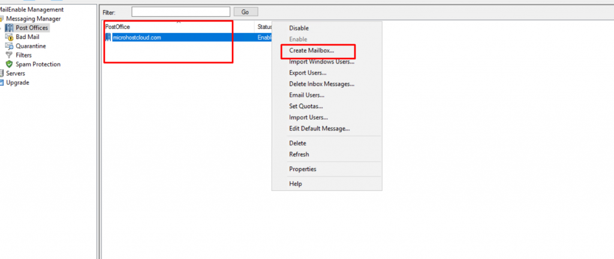

STEP 1: Firstly, login the server using RDP and then open Mailenable console while searching in the server. 

Step 2: Once the console is opened, select the "messaging manager" and then select "post office." Please have a look at the screenshot below:

Step 3: Now we have to click on the post office and there we will find the option to create a mailbox. Please have a look at the screenshot for reference.

Step 4: We can create any number of mailboxes, depending on the requirements.

Thank you :)
