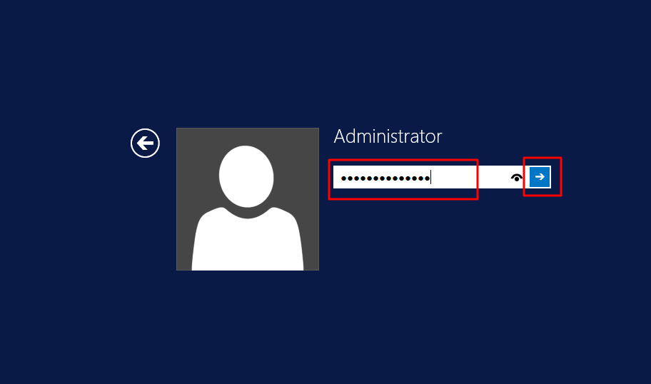
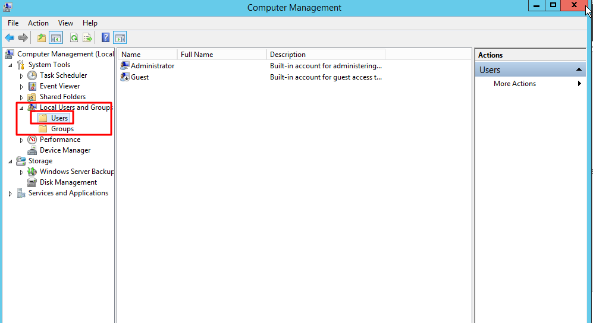
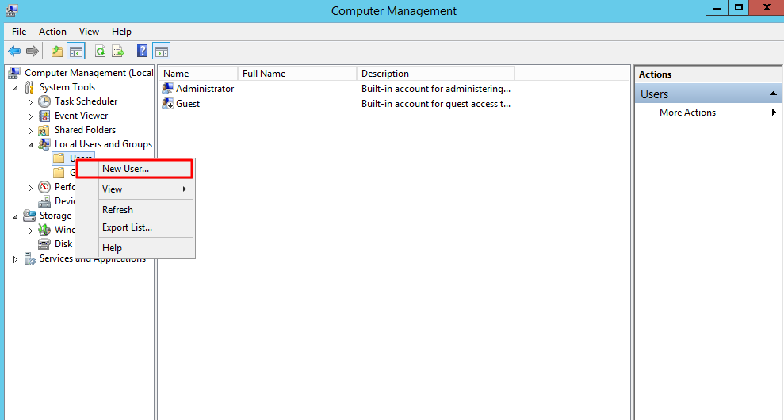
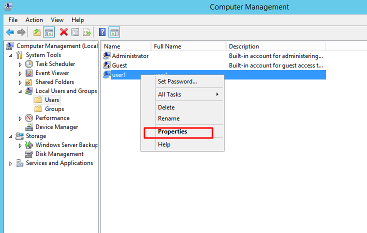
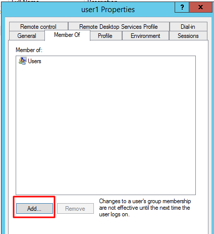
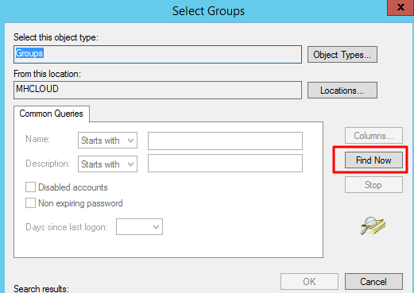
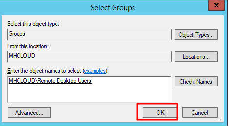

Follow the steps below to create additional RDP users to connect to your Windows Microhost cloud server.

1\. Access your server using RDP with administrator.

2\. Click on **Server Manager** and open.

3\. In server Manager click on **Tools** and expand tools and open **Computer Management**.

4\. Click On **users and groups**.

5\. Right Click on **Users and add new user**. Check option "**User must change password at next login**" if you want to change user password at first login.

6\. Enter user name ,Full name and password.

7\. Now you need to go in user **properties** for assigned RDP group for access RDP.

8\. Click on add button.

9\. Now click on **Advanced** tab for search group.

10\. Click on **find** button.

11\. Here you need to select group "**Remote Desktop Users**" and click ok.

12\. Now the search window will close and click on **ok.**

13\. Again you need to open **Server Manager** and click on **Services**.

14\. Click on **remote desktop Services** and restart the services using restart option.

Now try to access Remote Desktop with created new RDP user.

Thank You..
