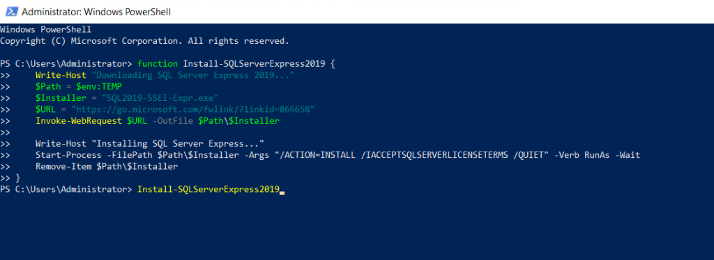
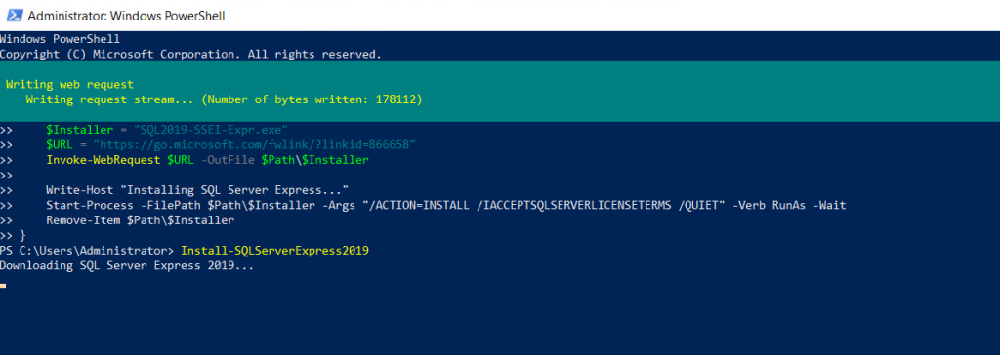
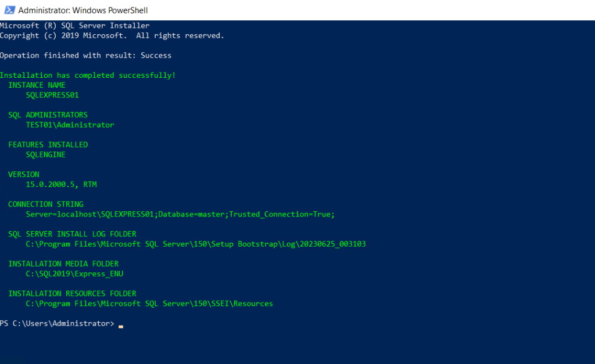

INTRODUCTION

[Microsoft SQL Server Express](https://www.microsoft.com/en-us/download/details.aspx?id=101064) is a version of Microsoft's SQL Server relational database management system that is free to download, distribute and use. It comprises a database specifically targeted for embedded and smaller-scale applications. In this tutorial, we will learn how to download MSSQL Server Express Edition via PowerShell.

Prerequisites download MSSQL Server Express

- [Windows Server](https://utho.com/docs/tutorial/how-to-install-active-directory-domain-service-on-windows-server/?preview_id=11159&preview_nonce=171803715d&preview=true)

- PowerShell with Administrator rights

- Internet connectivity

Step 1. Login to your Windows Server

Step 2. Open PowerShell as an Administrator


**Step 3. Write the following script to download SQL server Express Edition**

```
function Install-SQLServerExpress2019 
{
    Write-Host "Downloading SQL Server Express 2019..."
    $Path = $env:TEMP
    $Installer = "SQL2019-SSEI-Expr.exe"
    $URL = "https://go.microsoft.com/fwlink/?linkid=866658"
    Invoke-WebRequest $URL -OutFile $Path\$Installer

    Write-Host "Installing SQL Server Express..."
    Start-Process -FilePath $Path\$Installer -Args "/ACTION=INSTALL /IACCEPTSQLSERVERLICENSETERMS /QUIET" -Verb RunAs -Wait
    Remove-Item $Path\$Installer
}
```


**Step 4. After writing the script, type "Install-SQLServerExpress2019" and hit ENTER**







SQL Server Express Edition downloading and installation has started.

Thank You!
