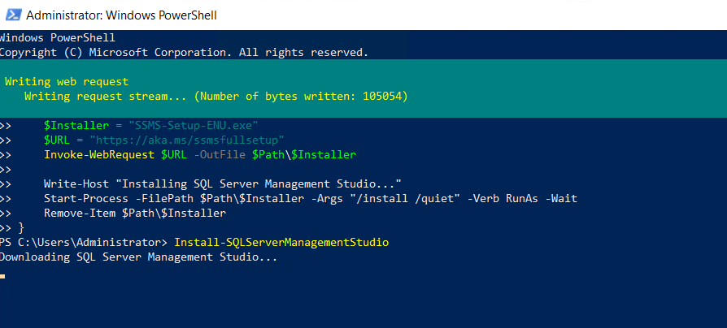

INTRODUCTION

[Microsoft SQL Server Management Studio](https://learn.microsoft.com/en-us/sql/ssms/sql-server-management-studio-ssms?view=sql-server-ver16) is a software application developed by Microsoft that is used for configuring, managing, and administering all components within Microsoft SQL Server. First launched with Microsoft SQL Server 2005, it is the successor to the Enterprise Manager in SQL 2000 or before. In this tutorial, we will learn how to download SSMS on Windows Server via PowerShell.

Prerequisites

- [Windows Server](https://utho.com/docs/tutorial/how-to-install-active-directory-domain-service-on-windows-server/?preview_id=11159&preview_nonce=171803715d&preview=true)

- PowerShell with Administrator rights

- Internet connectivity

Step 1. Login to your Windows Server

Step 2. Open PowerShell as an Administrator


**Step 3. Write the following script to download SSMS**

```
function Install-SQLServerManagementStudio {
    Write-Host "Downloading SQL Server Management Studio..."
    $Path = $env:TEMP
    $Installer = "SSMS-Setup-ENU.exe"
    $URL = "https://aka.ms/ssmsfullsetup"
    Invoke-WebRequest $URL -OutFile $Path\$Installer

    Write-Host "Installing SQL Server Management Studio..."
    Start-Process -FilePath $Path\$Installer -Args "/install /quiet" -Verb RunAs -Wait
    Remove-Item $Path\$Installer
}
```


**Step 4. After writing the script, type "Install-SQLServerManagementStudio" and hit ENTER** download SSMS via PowerShell




SSMS downloading and installation has started.


SSMS downloading and installation has completed.

Thank You!
