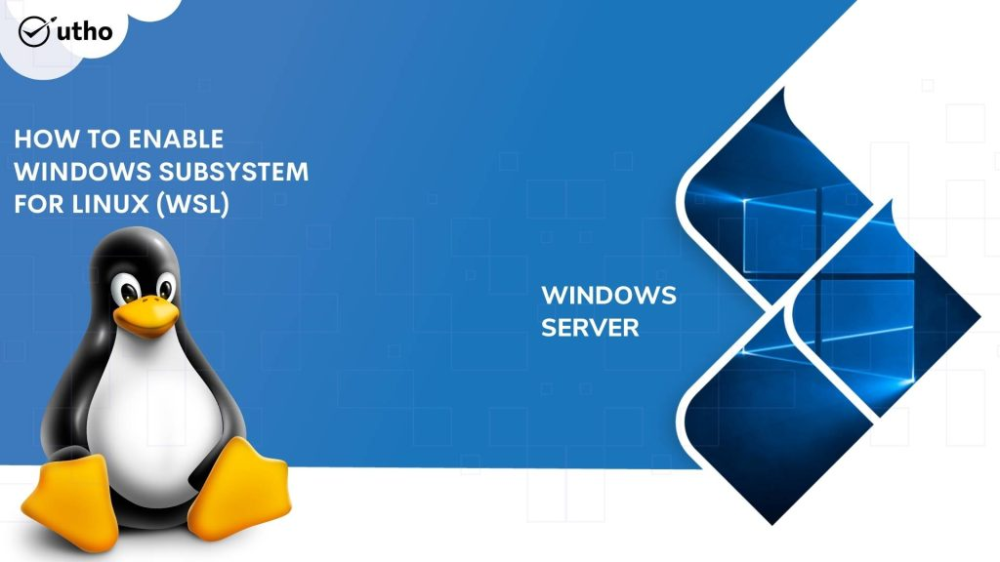
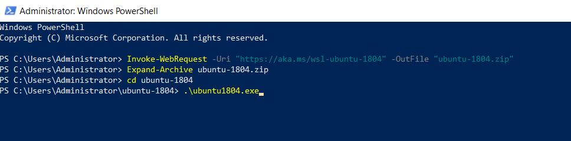
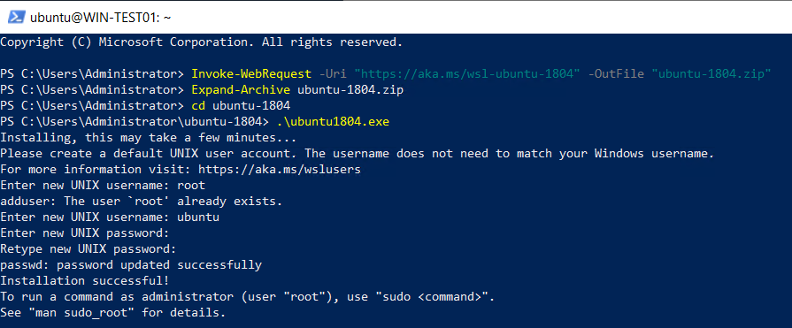
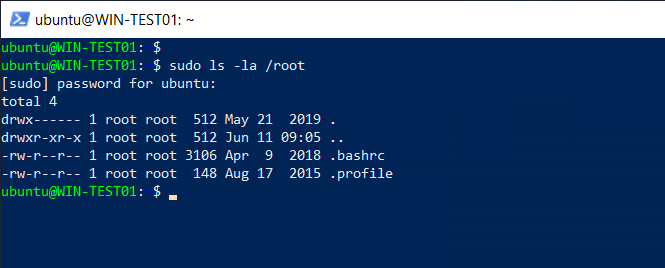

## INTRODUCTION

**Windows Subsystem for Linux** (**[WSL](https://learn.microsoft.com/en-us/windows/wsl/install)**) is a feature of Windows that allows developers to run a Linux environment without the need for a separate virtual machine or dual booting. There are two versions of WSL: WSL 1 and WSL 2. WSL 1 was first released on August 2, 2016, and acts as a compatibility layer for running Linux binary executables (in ELF format) by implementing Linux system calls on the Windows kernel. It is available on Windows Server 2016, 2019 and 2022. In this tutorial, we will learn how to enable Windows Subsystem for Linux (WSL) feature to use Linux on Windows Server 2016, 2019 and 2022.

### Prerequisites

- [Windows Server](https://utho.com/docs/tutorial/how-to-install-active-directory-domain-service-on-windows-server/?preview_id=11159&preview_nonce=171803715d&preview=true)

- PowerShell with Administrator rights

- Internet connectivity

Step 1. Login to your Windows Server

Step 2. Open PowerShell as an Administrator


Step 3. Run the following command to enable Windows Subsystem for Linux

```
Enable-WindowsOptionalFeature -Online -FeatureName Microsoft-Windows-Subsystem-Linux
```


Step 4. In this tutorial, we will be creating the subsystem for Ubuntu.

Run the following command to download Ubuntu 18.04

```
Invoke-WebRequest -Uri "https://aka.ms/wsl-ubuntu-1804" -OutFile "ubuntu-1804.zip"
Expand-Archive ubuntu-1804.zip
cd ubuntu-1804
.\ubuntu1804.exe
```





**Step 5. Enter new UNIX username: (to create a new user)**

Enter the password for the user.



Installation successful.

**Step 6. Windows resources are mounted on \[/mnt/c\] which can be accessed by**

```
df -h
```


```
ls -l /mnt/c
```


Step 7. To access Linux resources with root priviledge, us **sudo** command



Thank You!
