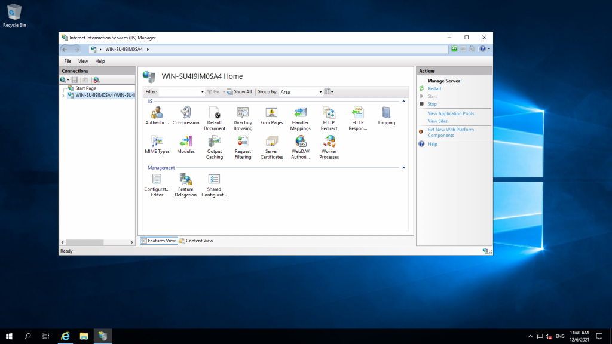
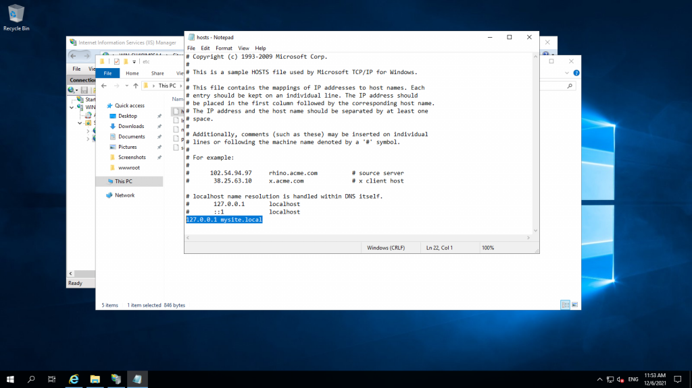

**Prerequisites**

1. Windows Server

2\. IIS

3\. Domain (html files)

**Step 1. Login into your server via RDP.**

**Step 2. Open IIS (Install IIS if you don’t have it on your system)**

Link on How to Install **IIS:**

[Install IIS via Powershell](https://utho.com/docs/tutorial/how-to-install-iis-via-powershell-in-windows-server/)

[Install IIS through GUI](https://utho.com/docs/tutorial/installation-and-configuration-of-iis-web-server-on-windows-server/)

Step 3. Paste your domain files in a folder in this location **C:\\inetpub\\wwwroot**

Naming the folder according to your domain name We will name it "**mysite**"

Step 4. Go to IIS > Sites and click on **Add Site.**

Input your site name, physical path, and hostname. Click OK.

**Step 5. Go to this location: C:\\Windows\\System32\\drivers\\etc  ....and edit the Hosts file.**

**Step 6. Go to IIS and click on "Browse mysite.local"**

Your domain will open in the browser.

Thank you!!
