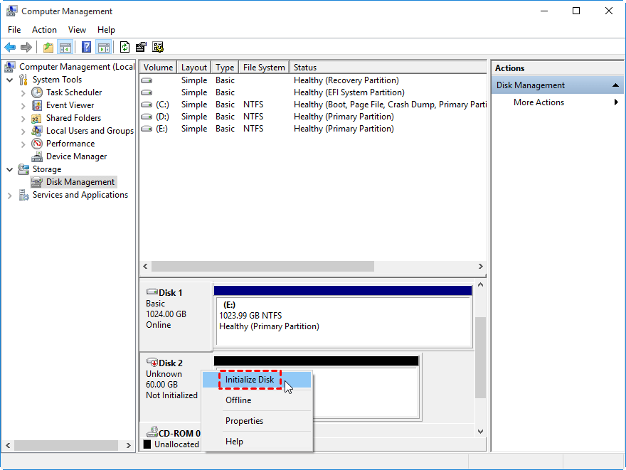
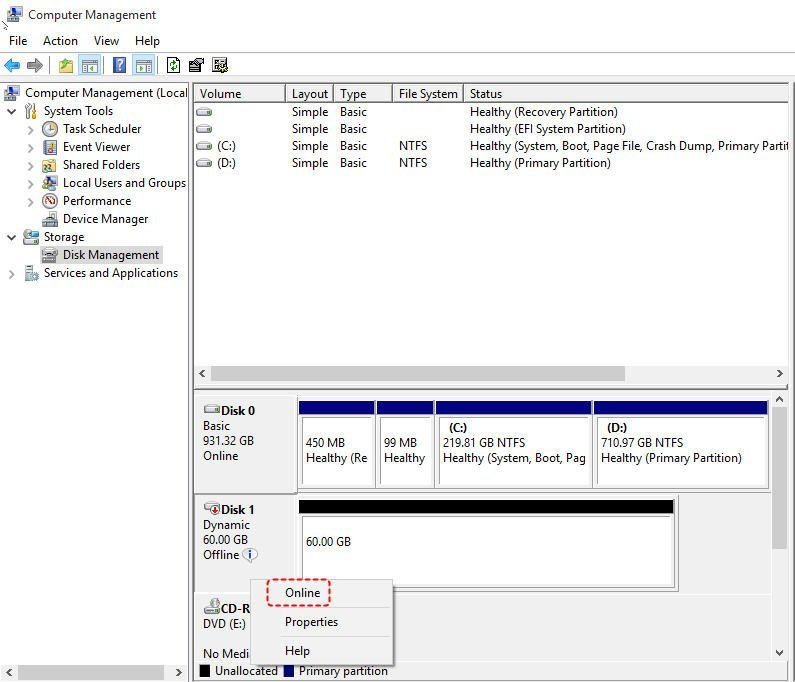

---

Step 1. Log into your Win server and open Computer Management

Step 2. Right click on the "Not initialized" and then click on 'Initialize Disk'

Then the Disk will show as "Offline"

Step 3. Right click on "Offline" and then click on "Online"

step 4. Open 'Run', type 'diskpart' and click OK

Step 5. Run diskpart according to the article below:

https://utho.com/docs/tutorial/how-to-allocate-unallocated-disk-space-in-windows/

Step 6. After completing diskpart, go to File Manager, and check your disk space.

Thank you!
