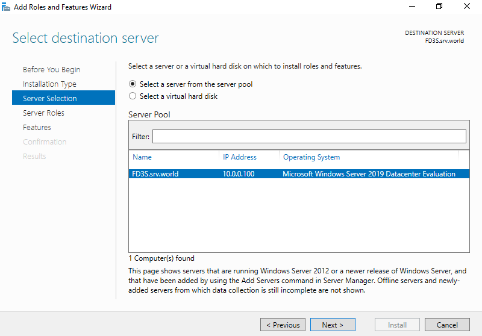
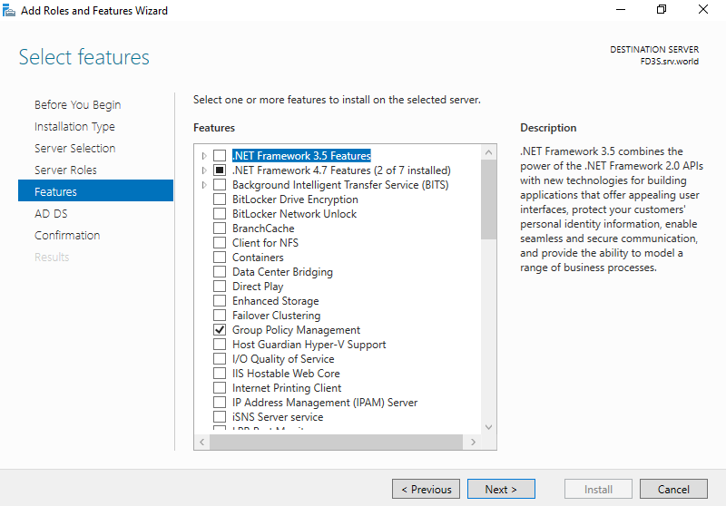
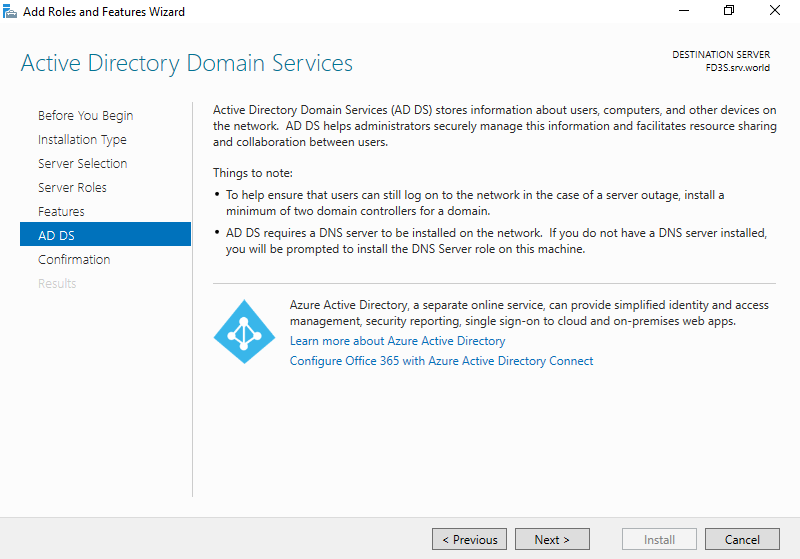
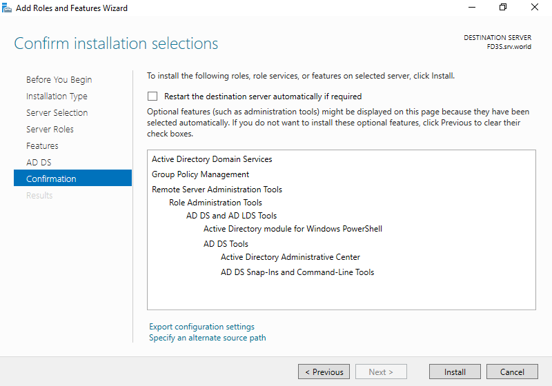
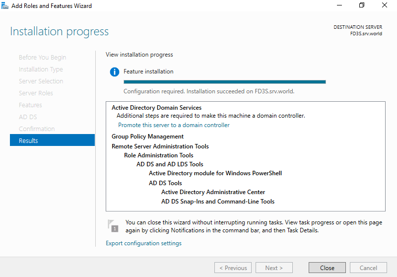

#### INTRODUCTION

[Active Directory Domain Services](https://learn.microsoft.com/en-us/windows-server/identity/ad-ds/get-started/virtual-dc/active-directory-domain-services-overview) (AD DS) is a server role in Active Directory that enables administrators to control and store data from applications as well as network resource information in a distributed database. Administrators can control network components, including people and computing devices, and reorder them into a certain hierarchical structure with the use of AD DS. Incorporating security further is AD DS by authenticating logons and restricting access to directory resources. In this tutorial, we will learn how to install Active Directory Domain Service on [Windows Servers](https://utho.com/docs/tutorial/how-to-connect-to-a-windows-server-using-remote-desktop-protocol-rdp/) 2012R2, 2016, 2019 and 2022.

To install Active Directory Domain Service via PowerShell, open PowerShell with Admin Privileges, and run the following command.

PS C:\\Users\\Administrator> Install-WindowsFeature -name AD-Domain-Services -IncludeManagementTools

Now, run the following command to restart the server to apply changes.

PS C:\\Users\\Administrator> Restart-Computer -Force

To install Active Directory Domain Service via Server Manager

**Step 1.** Open **Server Manager** and click **Add roles and features**.

**Step 2.** Click **Next**

**Step 3.** Select **Role-based or feature-based installation**.

**Step 4.** Select a Host which you'd like to add services.

**Step 5.** Check a box Active Directory Domain Services.

**Step 6.** Addtional features are required to add AD DS. Click **Add Features** button.

**Step 7.** Click **Next**.

**Step 8.** Click **Next**.

**Step 9.** Click **Install**.

**Step 10.** After finishing Installation, click **Close** button.

**Thank You!**

<table><tbody><tr><td></td></tr></tbody></table>
