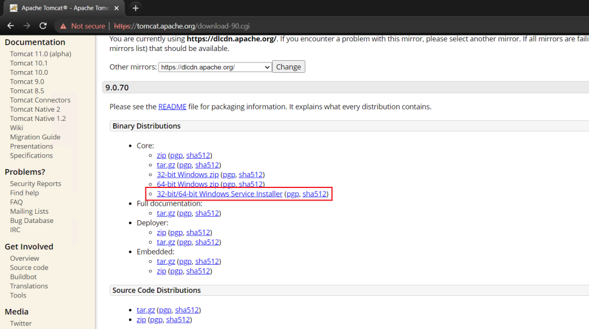
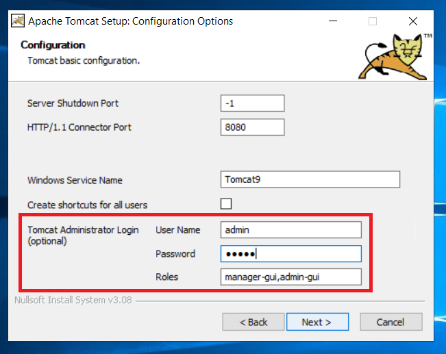
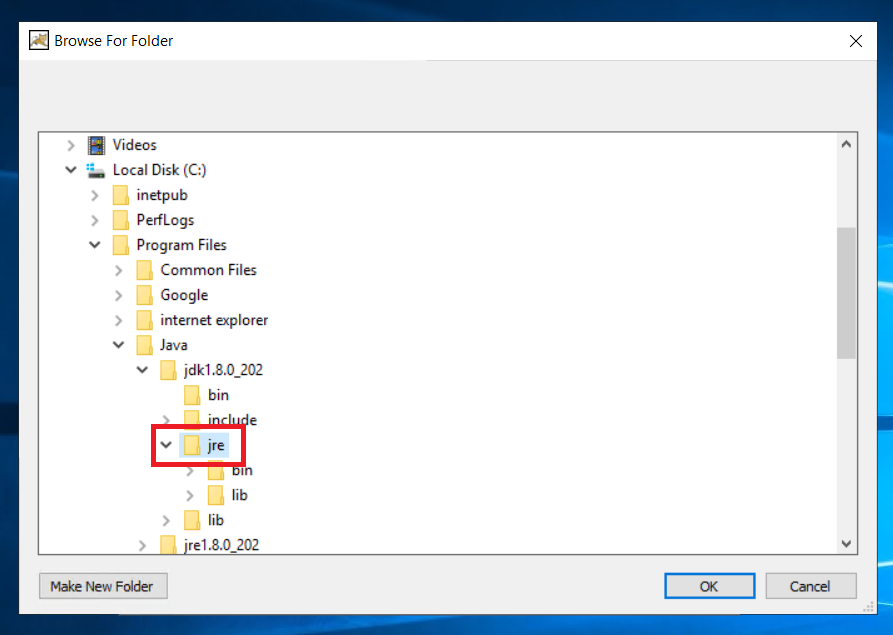
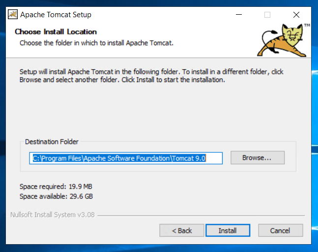
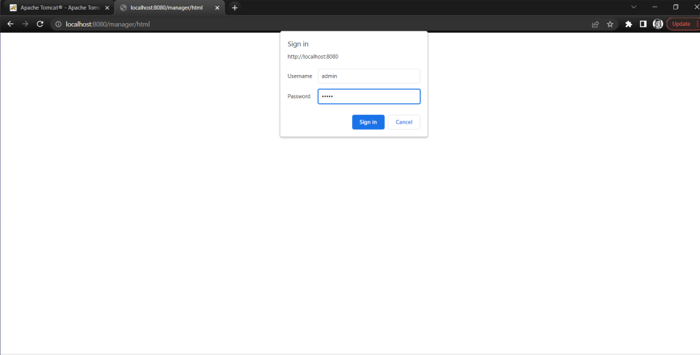
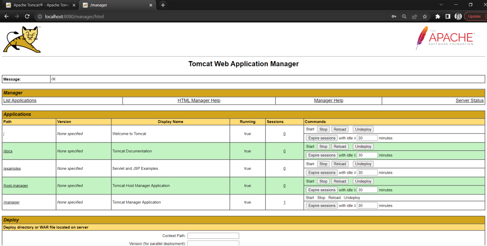

```
Introduction
```
[**Apache Tomcat version 9.0**](https://tomcat.apache.org/tomcat-9.0-doc/index.html) implements the Servlet 4.0 and JavaServer Pages 2.3 specifications from the Java Community Process, and includes many additional features that make it a useful platform for developing and deploying web applications and web services.

Firstly, we should have **[Java Development kit](https://en.wikipedia.org/wiki/Java_Development_Kit)** (JDK) isntalled on the machine. Please refer to the blog tagged below on **how to install JDK on Winodws Server**.

[How to install Java Development kit (JDK) on Windows Server.](https://utho.com/docs/tutorial/how-to-install-java-development-kit-on-windows-server/)

Now, We will download Apache Tomcat setup files.

[Download Apache Tomcat 9](https://tomcat.apache.org/download-90.cgi)



Step 1. Login to your winodws server

Step 2. Double click on the setup media of JDK to begin installation.


Step 3. Click **Next** to start installation.


Set password for your Tomcat Manager



Select the path as shown below:







Apache Tomcat 9 successfully installed.

Step 4. Launch Tomcat application


It will launch in cmd


Step 5. hit [http://localhost:8080/](http://localhost:8080/) to view tomcat


Step 6. hit [http://localhost:8080/manager/](http://localhost:8080/manager/) to go to tomcat manager page.

Use username and password that we setup during installation.





Step 7. Open Tomcat 9 manager


Set the Apache service to start automatically. so that you don't have to start the service manually everytime.


Apache Tomcat 9 installation completed on Windows Server.

Thank You.
