#### **Prerequisites:**

1. Windows Server
2. IIS
3. A printer

Step 1. Log into your Windows server via RDP.

Step 2. Open **Server Manager,** click **Add Roles & Features,** then click Next **3 times.** On the Select S**erver Roles interface**, click **Print and Document Services** and then click **Next.**

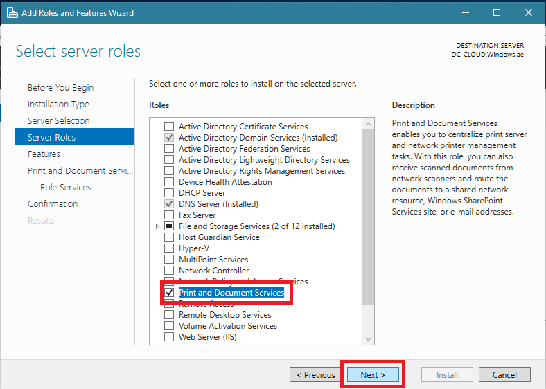

Step 3. On the Select Features interface, click **Next.**

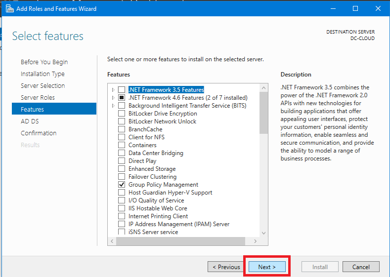

Step 4. On the Print and Document Services interface, click **Next.**

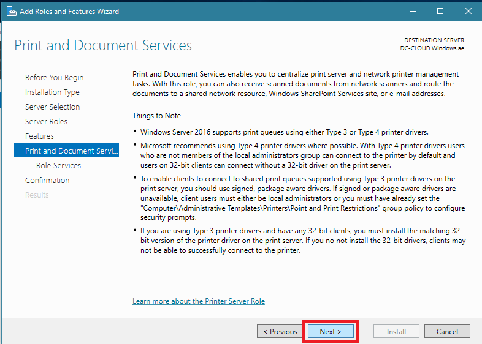

Step 5. On the Select Role Services interface, in the Role Services section, verify that the **Print Server** check box is selected and then click **Next.**

Step 6. In the Confirm Installation Selections interface, click **Install.**

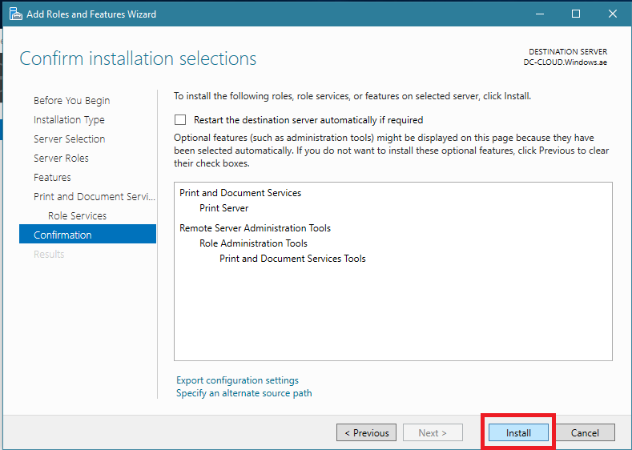

Step 7. On the installation progress interface, click **"Close."**

Step 8. On the DC-CLOUD.Windows.ae server, in the **Server** M**anager,** click **Tools**, and then click **Print Management.**

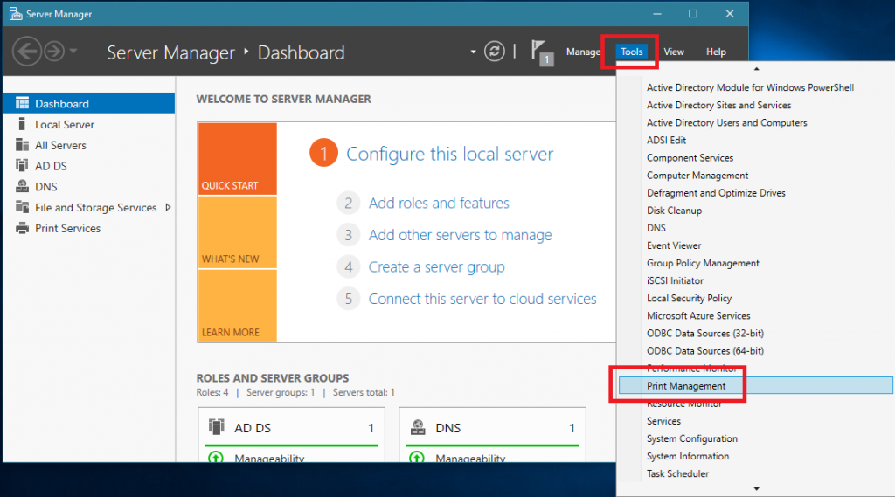

Step 9. Expand **Print Servers**, expand **DC-CLOUD (local)**, right-click **DC-CLOUD** and then click **Add Printer.**

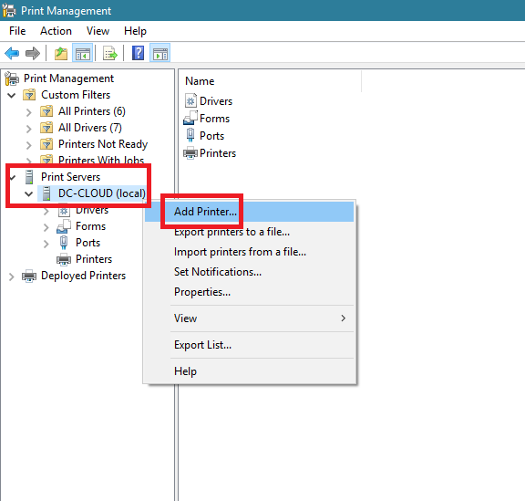

Step 10. On the Network Printer Installation Wizard interface, click **Add a TCP/IP or Web Services Printer by IP address or hostname**, and then click **Next.**

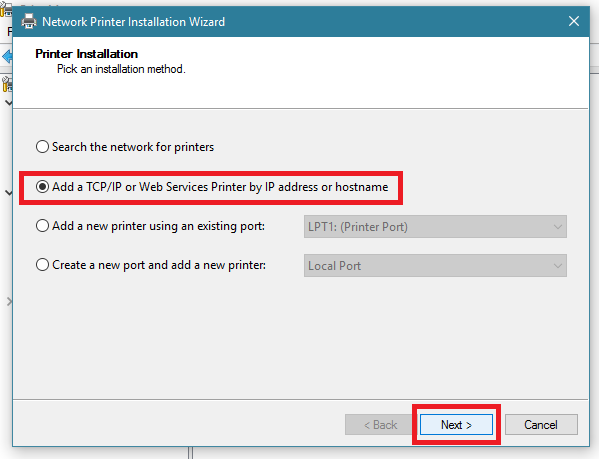

Step 11. On the Printer Address interface, change the **Type of Device to TCP/IP Device.** Next, in Host name or IP address, type **172.16.1.254** (this will be your printer's network IP). **Clear Auto detect the printer driver to use**, and then click **Next.**

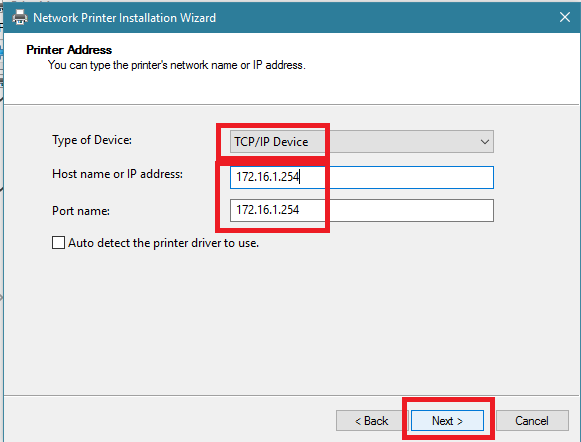

Step 12. Under Device Type, click **Generic Network Card**, and then click Next.

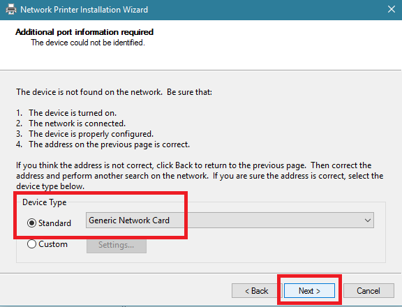

Step 13. On the Printer Driver interface, click **Install a new driver**, and then click **Next.**

Step 14. On the Printer Installation interface, under **Manufacturer**, click **Microsoft. Under** **Printers**, click **Microsoft XPS Class Driver**, and then click Next.

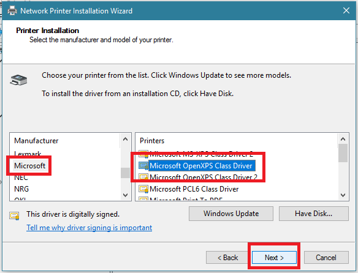

Step 15. On the **Printer Name and Sharing Settings** interface, change the Printer Name to **Windows Sales Printer**, and then click **Next.**

Step 16. Click **Next** 2 times to accept the default printer name and share name and to install the printer.

Step 17. Click **Finish** to close the Network Printer Installation Wizard.

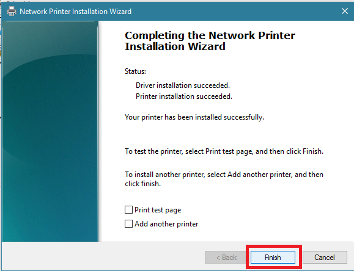

Step 18. In the Print Management console, **right-click the Windows Sales Printer**, and then click **Enable Branch Office Direct Printing.**

Step 19. Right-click the Windows Sales Printer, and then select **Properties.**

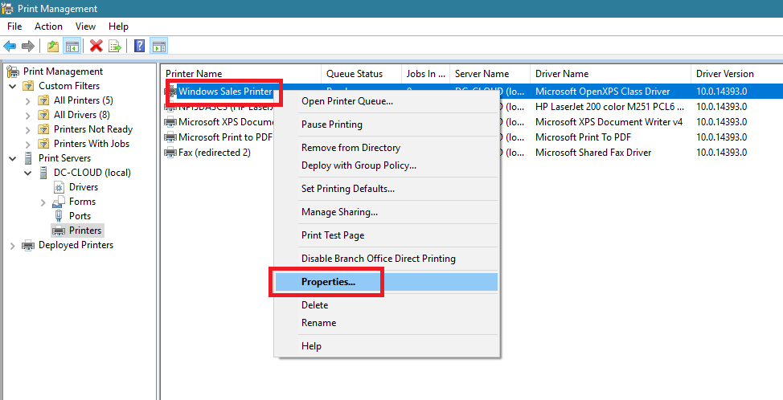

Step 20. On the **Windows Sales Printer** properties, click the **Sharing** tab, select **List in the directory**, and then click **OK.**

Step 21. Next, let's configure printer pooling in the Print Management console. Under SUB-01 Server, **right-click Ports**, and then click **Add Port.**

Step 22. In the Printer Ports dialog box, click **Standard TCP/IP Port**, and then click **New Port.**

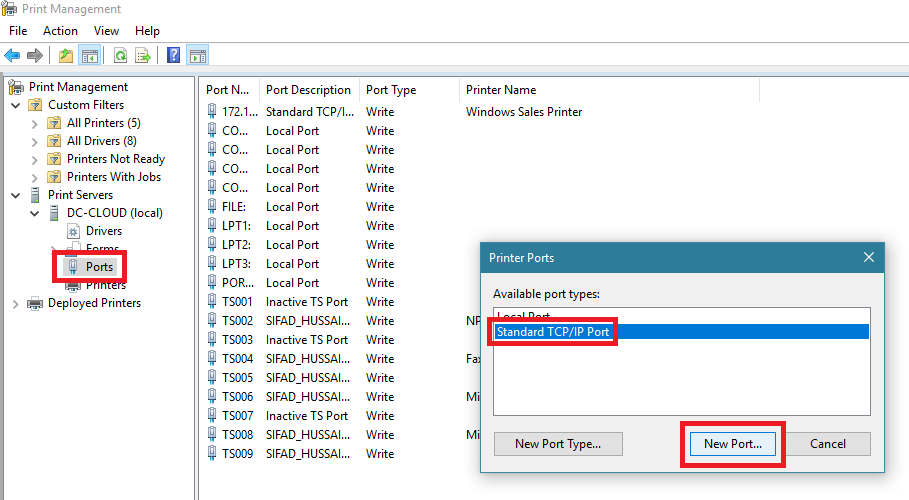

Step 23. In the Add Standard TCP/IP Printer Port Wizard, click **Next.**

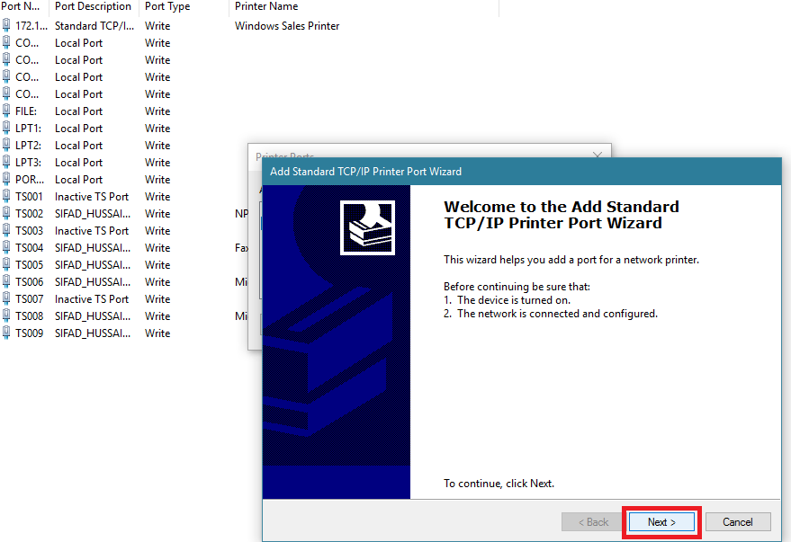

Step 24. On the Add Port Interface, in **Printer Name or IP Address**, type **172.16.1.200**, and then click **Next.**

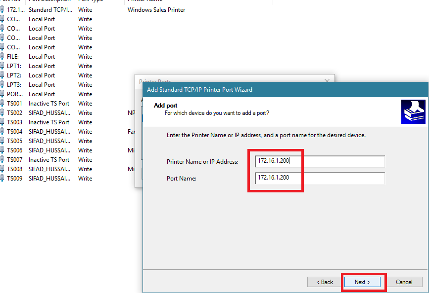

Step 25. In the Additional port information required dialog box, click **Next.**

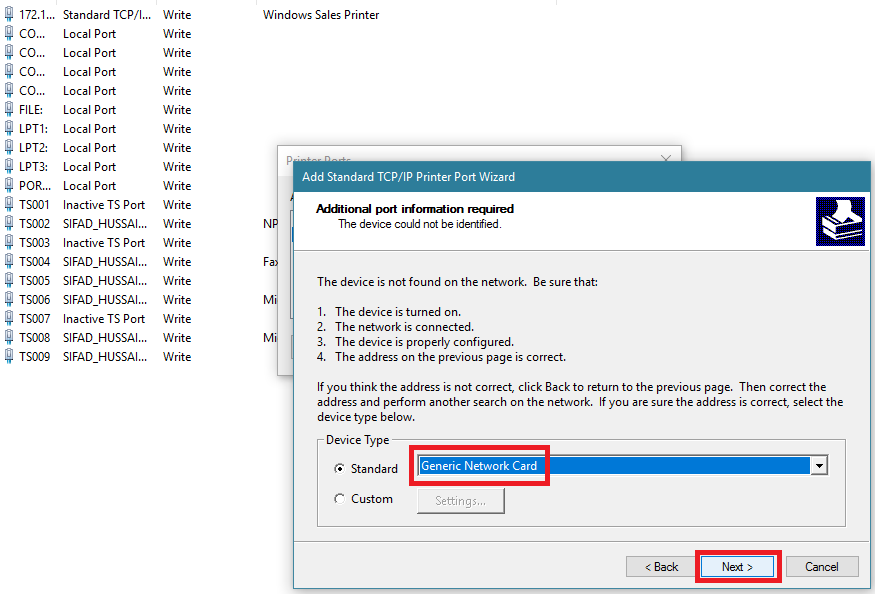

Step 26.Click **Finish** to close the Add Standard TCP/IP Printer Port Wizard.

Step 27. Click **Close** to close the Printer Ports dialog box.

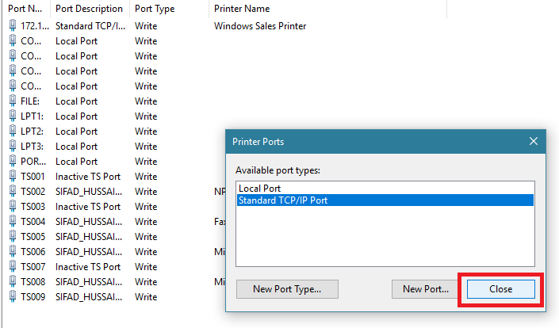

Step 28. In the Print Management console, right-click **Windows Sales Printer**, and then click **Properties.**

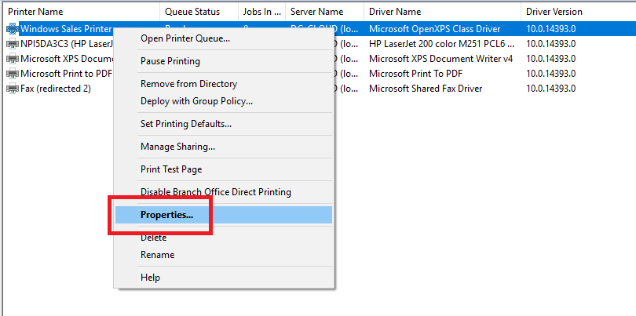

Step 29. In the **Windows Sales Printer** Properties dialog box, click the **Ports** tab, select **Enable printer pooling**, and then click the **172.16.1.200 port** to select it as the second port.

Step 30. Switch to your **client PC,** open the **Control Panel**, then click **Devices and Printers**.

Step 31. In the Devices and Printers console, click **Add a printer.**

Step 32. On the Add Printer interface, under Search for Available Printers, click **your** **existing printer name** and then click **Next.** Then **the wizard will install the printer driver from the DC-CLOUD. Windows server**

Step 33. On the Add Printer interface (it will state that “**You’ve successfully added a Windows Sales Printer** **on** **172.16.1.254**”), click **Next.**

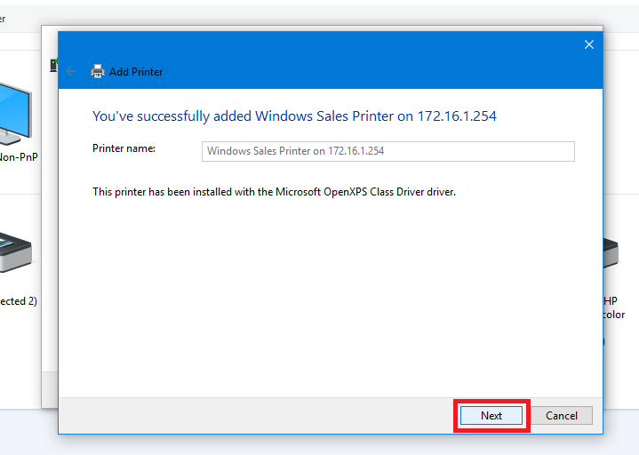

Step 34. Click **Finish.**

Step 35. Verify that you have a **Windows Sales Printer** at **172.16.1.254 that** is listed in your **Devices and Printers control panel.**

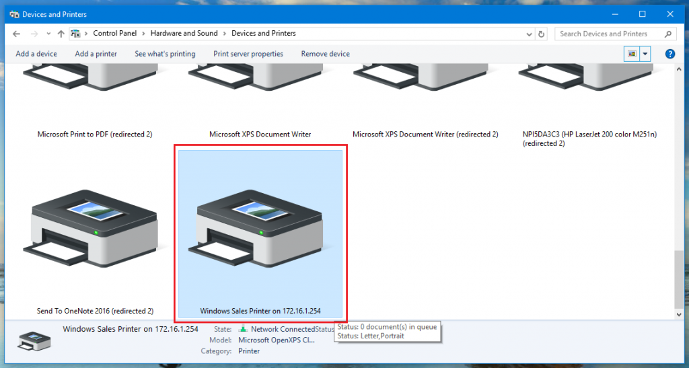

Step 36. Installation was completed successfully.

Thank You!
