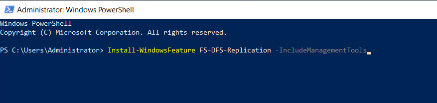
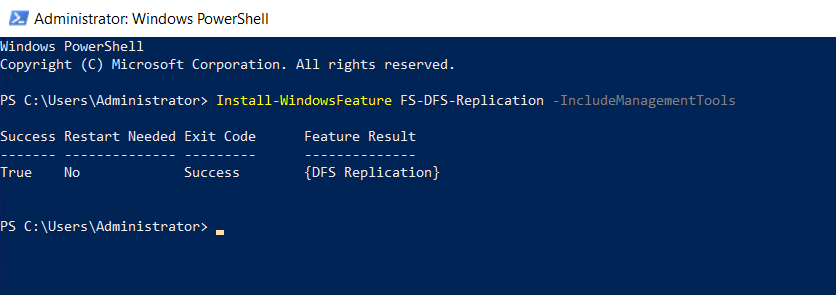

INTRODUCTION

[Distributed File System Replication](https://learn.microsoft.com/en-us/windows-server/storage/dfs-replication/dfsr-overview), or DFS Replication, is a role service in Windows Server that enables you to efficiently replicate folders across multiple servers and sites. You can replicate all types of folders, including folders referred to by a DFS namespace path. DFS Replication is an efficient, multiple-master replication engine that you can use to keep folders synchronized between servers across limited bandwidth network connections. The service replaces the File Replication Service (FRS) as the replication engine for DFS namespaces. In this tutorial, we will learn how to install DFS Replication via PowerShell.

Prerequisites

- [Windows Server](https://utho.com/docs/tutorial/how-to-install-active-directory-domain-service-on-windows-server/?preview_id=11159&preview_nonce=171803715d&preview=true)

- PowerShell with Administrator rights

- Internet connectivity

**Step 1. Login to your Windows Server**

**Step 2. Open PowerShell as an Administrator**


**Step 3. Run the following command to**

```
Install-WindowsFeature FS-DFS-Replication -IncludeManagementTools
```



install DFS Replication




Thank You!
