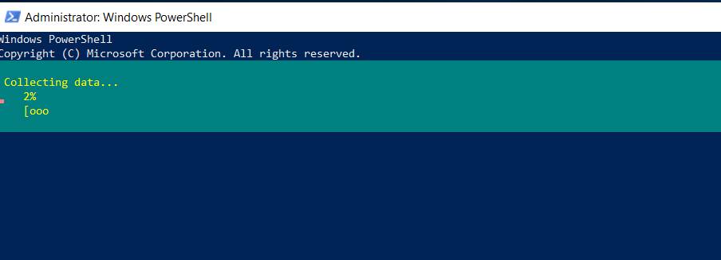

INTRODUCTION

[DFS](https://en.wikipedia.org/wiki/Distributed_File_System_(Microsoft)) is a set of client and server services that allow an organization using Microsoft Windows servers to organize many scattered SMB file shares into a distributed file system. DFS has two components to its service: Location transparency and Redundancy. Basically a distributed file system (DFS) is **a file system that spans across multiple file servers or multiple locations**, such as file servers that are situated in different physical places. Files are accessible just as if they were stored locally, from any device and from anywhere on the network. In this tutorial, we will learn how to install Distributed File System NameSpace feature via PowerShell.

Prerequisites

- [Windows Server](https://utho.com/docs/tutorial/how-to-install-active-directory-domain-service-on-windows-server/?preview_id=11159&preview_nonce=171803715d&preview=true)

- PowerShell with Administrator rights

- Internet connectivity

Step 1. Login to your Windows Server

Step 2. Open PowerShell as an Administrator


Step 3. Run the following command to install DFS NameSpace with Admin tools

```
Install-WindowsFeature FS-DFS-Namespace -IncludeManagementTools
```


install Distributed File System



\------------------------------------------


DFS installed.
