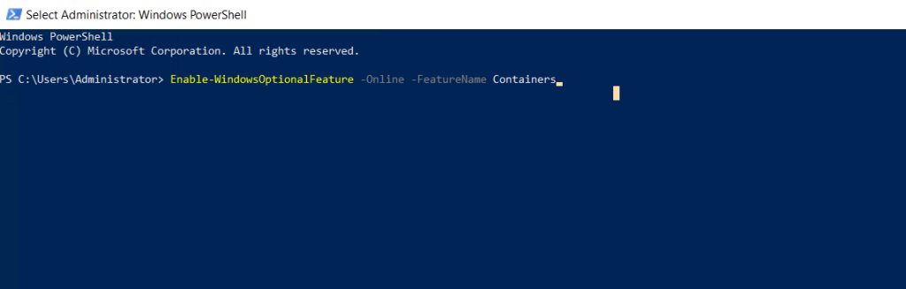
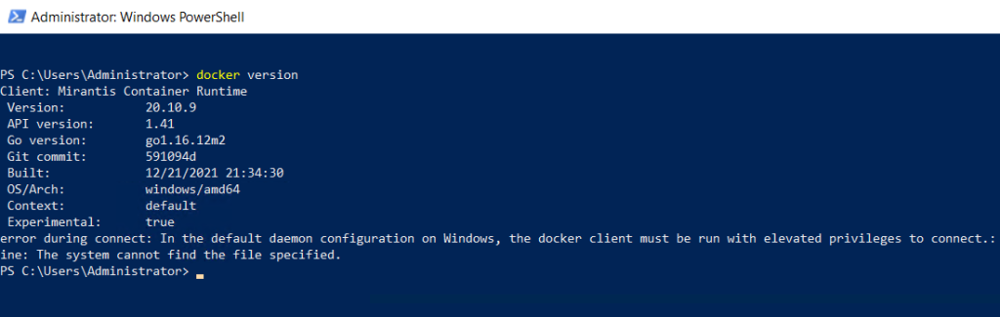

### INTRODUCTION induct Docker on Windows Server

[Docker](https://www.docker.com/) is a set of platform as a service products that use OS-level virtualization to deliver software in packages called containers. The service has both free and premium tiers. The software that hosts the containers is called Docker Engine. It was first started in 2013 and is developed by Docker, Inc. In this tutorial, we will learn how to install Docker in a Windows Server via PowerShell.

#### Prerequisites install Docker on Windows Server

- [Windows Server](https://utho.com/docs/tutorial/how-to-install-active-directory-domain-service-on-windows-server/?preview_id=11159&preview_nonce=171803715d&preview=true)

- PowerShell with Administrator rights

- Internet connectivity

Step 1. Login to your Windows Server

Step 2. Open PowerShell as an Administrator


Step 3. Run the following command to install Containers feature

```
Enable-WindowsOptionalFeature -Online -FeatureName Containers
```




**Step 4. Run the following command to restart the server after installing Containers**

```
Restart-Computer -Force
```


**Step 5. Run the following command to install Docker Repo**

```
Install-Module -Name DockerMsftProvider -Repository PSGallery -Force
```


**Step 6. Run the following command to install Docker**

```
Install-Package -Name docker -ProviderName DockerMsftProvider
```


**Step 7. Run the following command to restart the server after installing Docker**

```
Restart-Computer -Force
```


**Step 8. Run the following command to check Docker version**

```
docker version
```



Thank You!
