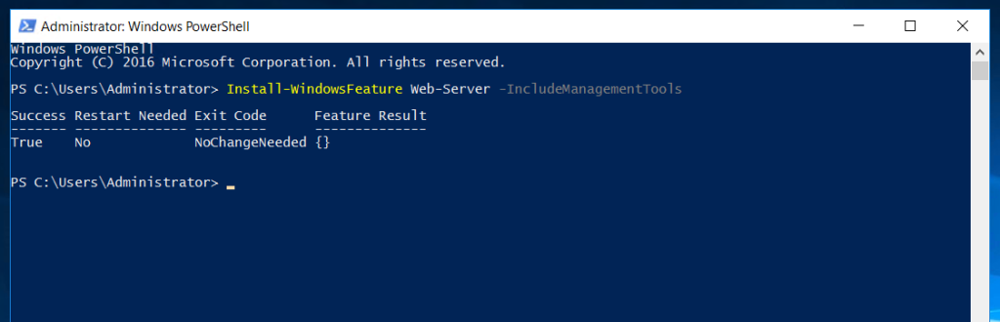

## INTRODUCTION

[Internet Information Services](https://utho.com/docs/tutorial/installation-and-configuration-of-iis-web-server-on-windows-server/)(IIS) is an extensible web server software created by Microsoft for use with the Windows NT family. IIS supports HTTP, HTTP/2, HTTPS, FTP, FTPS, SMTP and NNTP. It has been an integral part of the Windows NT family since [Windows NT 4.0](https://en.wikipedia.org/wiki/Windows_NT_4.0), though it may be absent from some editions (e.g. Windows XP Home edition), and is not active by default. In this tutorial, we will learn How to install IIS via Powershell in Windows Server 2012R2, 2016, 2019, 2022.

### Prerequisites \- install IIS via Powershell in Windows

- A server with Microsoft Windows Server operating system installed on it.

- You are logged on to the Windows Server as an Administrator.

- [Microsoft Powershell](https://learn.microsoft.com/en-us/powershell/) in Administrator mode.

Step 1. Open Powershell as Administrator


Run the following command:


```
Install-WindowsFeature Web-Server -IncludeManagementTools
```



Open Server Manager and check that IIS is installed in ONE click.


Thank You!
