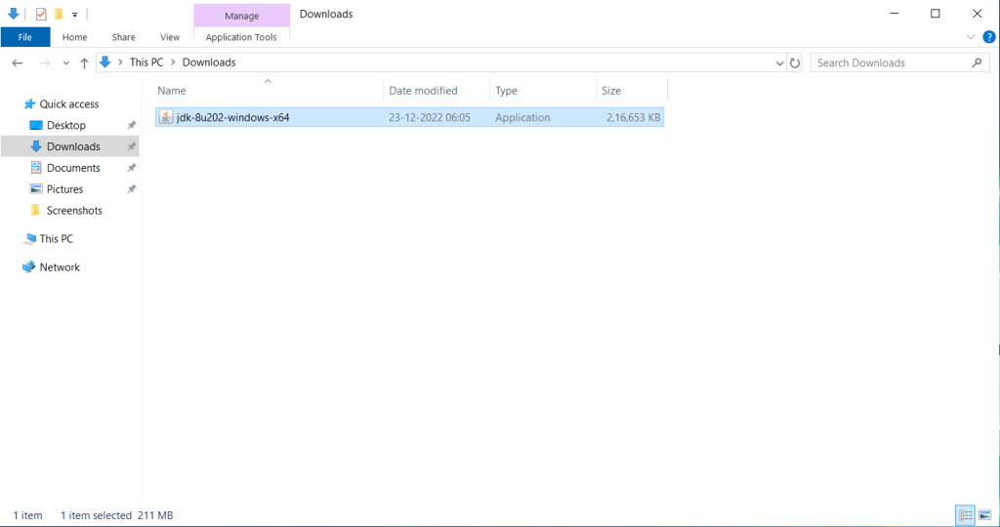
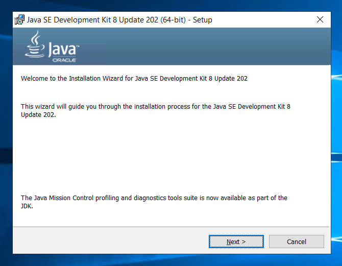
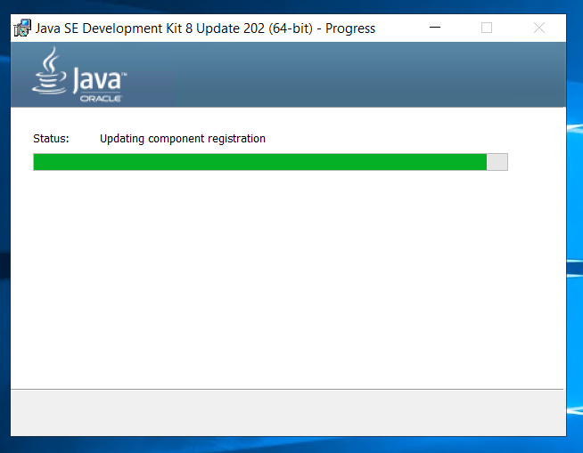
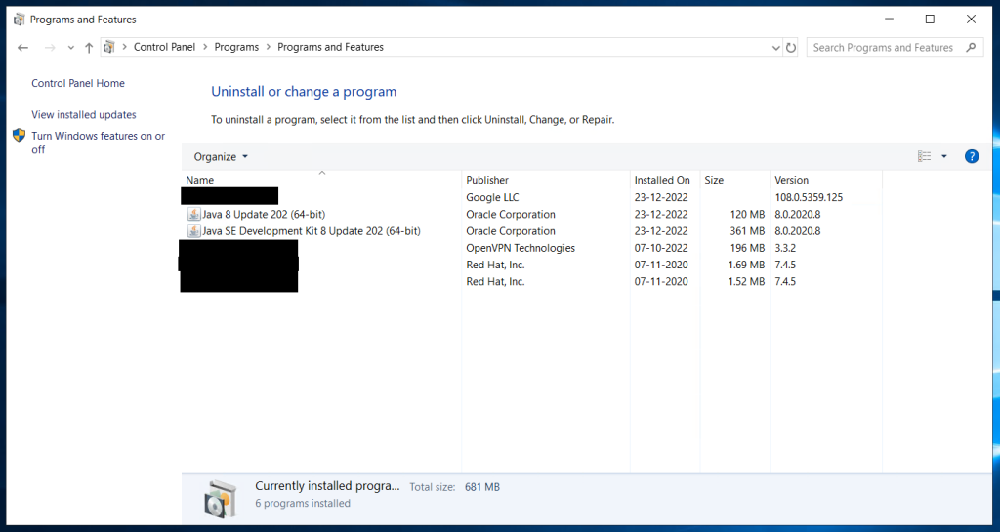

```
Introduction
```
The Java Development Kit is a distribution of Java Technology by Oracle Corporation. It implements the Java Language Specification and the Java Virtual Machine Specification and provides the Standard Edition of the Java Application Programming Interface.

Firstly, we need to download JDK from the Oracle website. Use the link attached below to download JDK 8

[Download JDK 8](https://www.oracle.com/in/java/technologies/javase/javase8-archive-downloads.html)

Step 1. Login to your winodws server

Step 2. Double click on the setup media of JDK to begin installation.



Step 3. Click **Next** to start installation.







JDK isntalled successfully.

Step 4. Check JDK installation.



Thank You.
