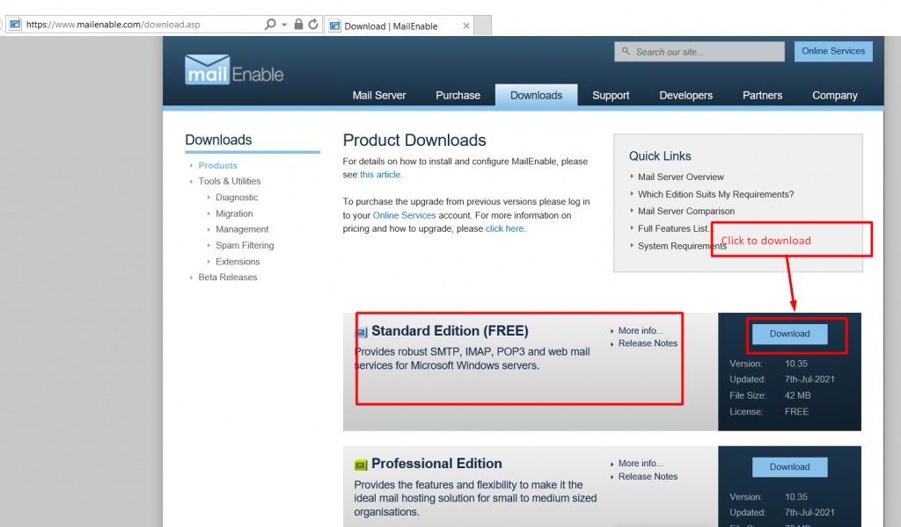
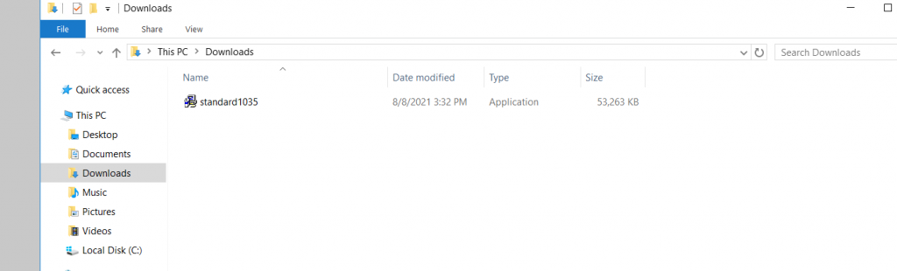
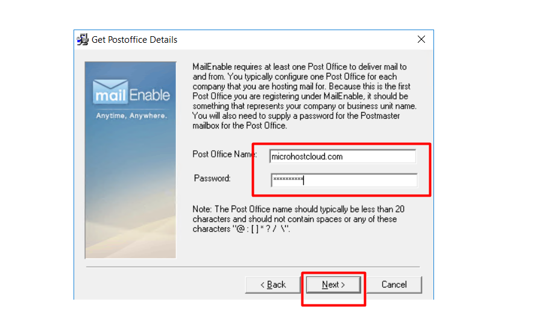

**Introduction :**  
MailEnable is an e-mail server distributed by MailEnable Pty based on Windows. The features of MailEnable include support for IMAP, POP3 and SMTP email protocols, with the support of SSL / TLS and the list server. The management functionality can be used by the Microsoft Management Console or the browser. The functionality of MailEnables can be implemented by using MMAP.

  
**Before we begin**

1. The user should have admin access to the server.

3. The server should be connected to the internet.

5. IIS Manager should be installed on the server.

**Step 1:** Firstly, login to the server using RDP and download the Mailenable setup file using the link. Mailenable usually offers two products: one is open source and the other is license-based. Please have a look at the screenshot for your reference.

**STEP 2:** After successfully downloading the setup file, We have to initiate the installation process. We have to execute the downloaded setup file as given in the screenshot below.

**Step 3:** While executing the setup file, we will get the prompt as below. We need to click on "OK.”

**Step 4:** While clicking on the “ok” button, a new window of installation will appear like below. We have to click on "next.”

**Step 5:** While clicking on "next," will move to the next part. Where we have to enter the company name as given below in the screenshot,

**STEP 6:** In the next window, we can see the terms and conditions for the email server. We need to click on “next” as per the screenshot.

**Step 7:** Afterward, we will move to the next window, where we can see the description of the disk space requirement for the Mailenable application. Please see the screenshot for your reference.

**Step 8:** In the next window, we can change the installation folder if we want, otherwise simply click on “next” as per the screenshot.

**Step 9:** In the next window, we can change the data directory of Mailenable if we want to store email data at a different location. Please see the screenshot for your reference.

**Step 10:** In the next window, we have to enter the post office name. You can give any name as your post office name. However, I’ll recommend you use the domain name as your post office name. Please have a look at the below screenshot for your reference.

**Step 11:** In the next window, we have to enter the domain name from which we want to use the email service. Rather than the domain name, everything will be the same as per the screenshot.

**Step 12:** In the next window, we will see the message that everything is ready to be installed. It will ask about the configuration of the IIS site configuration for Mailenable. Please see the screenshot for your reference.

**Step 13:** While clicking next, another window will ask for another IIS site configuration for Mailenable. We have to simply click on ”next” as per the screenshot.

**Step 14:** While clicking next, the installation will automatically start and, in a while, it will be completed. We have to finish the installation process by clicking “finish” as per the screenshot.

We have successfully installed Mailenable.

Thank you :)
