**SQL Server 2019** Express is a free edition of SQL Server, ideal for development and production for desktop, web and small server applications.

Asp.net 3.5 version should be installed on server before install SQL server and you have access administrator RDP user login details.

1\. Install Asp.net 3.5 version using server manager.

(i) Open server manager click on server manager button.

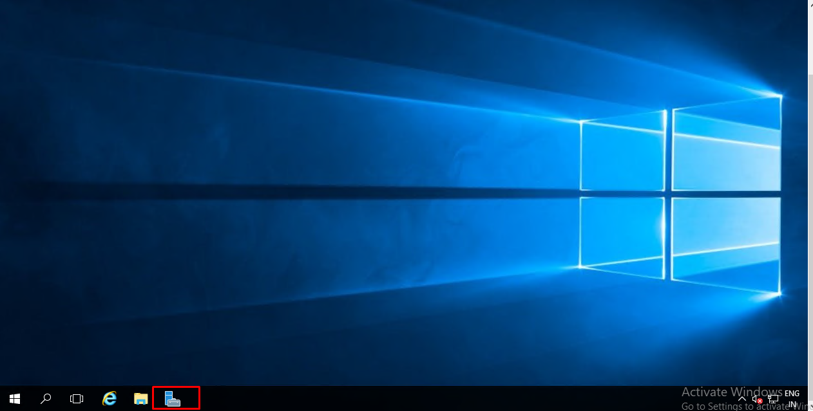

(ii) Click on Add roles and features.

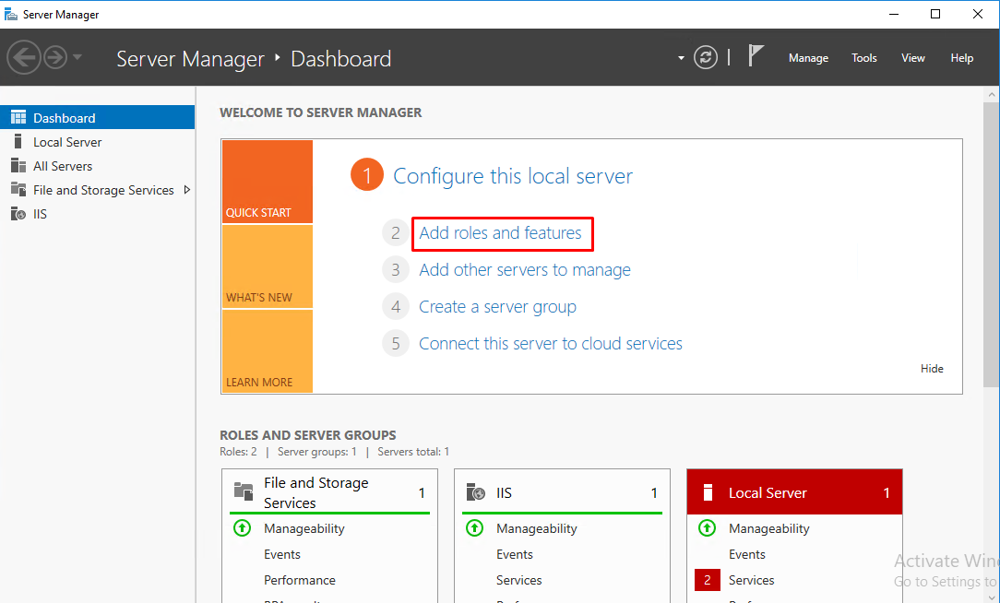

(iii) Select .NET framework 3.5 Features and install.

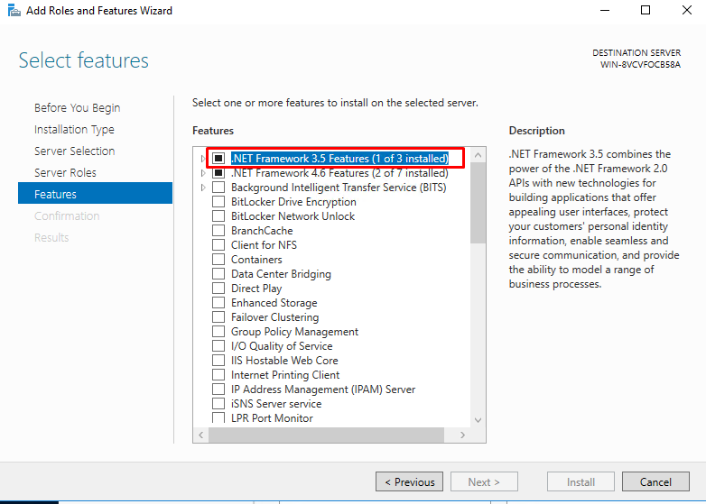

(iv) Click on next.

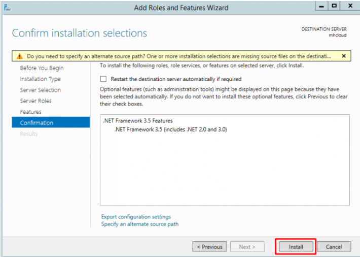

(v) When you will get below message in screenshot close and exit the server manager installation wizard.

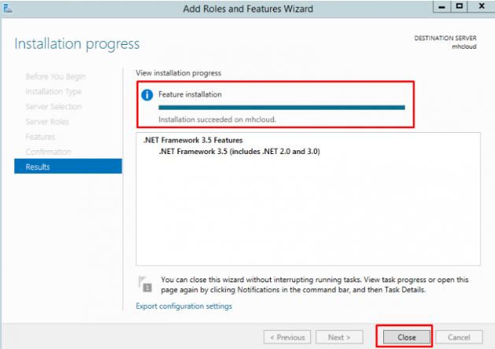

Now, download a SQL Server Express offline installer from the Microsoft SQL Server downloads page. On the page, click Download now for the Express edition. Then, open the folder that keeps downloaded files and run the SQL2019-SSEI-Expr.exe file.

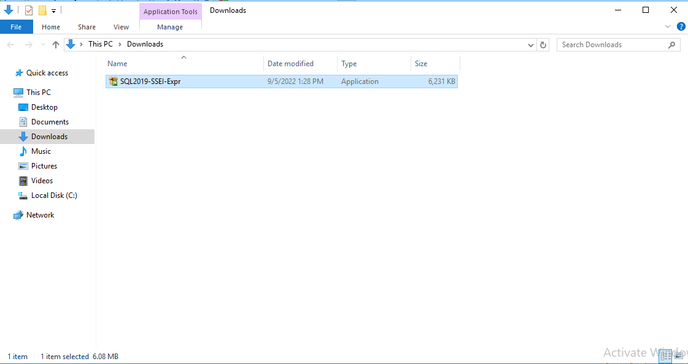

After starting the installation, we have to choose the installation type of the SQL Express edition

Then, accept the license agreement and privacy policy terms. After that, specify the location for the install package and click Install.

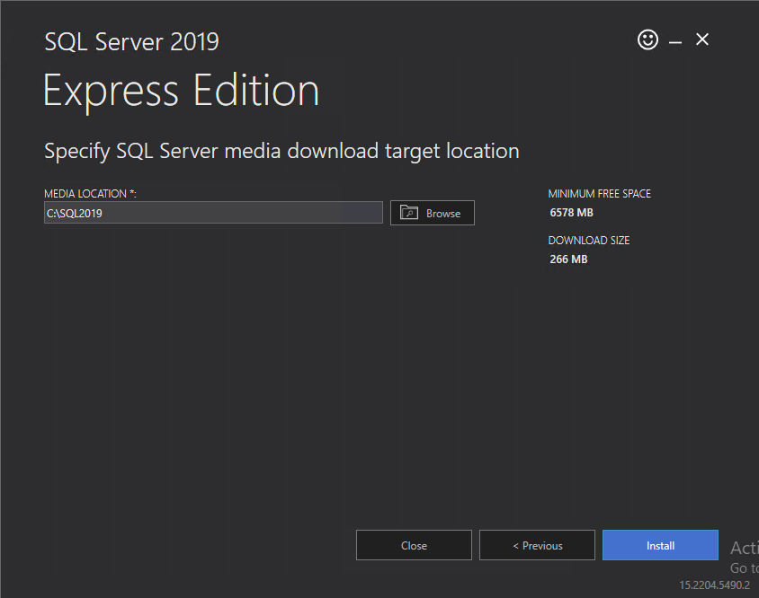

After launching the installation process, you will see a progress bar informing that the install package is being downloaded and that SQL Server Express is being installed. During the installation, you can either pause or cancel the installation.

Now, we will select the New SQL Server stand-alone installation or add features to an existing installation option to start the installation:

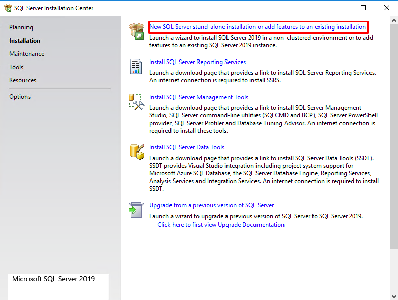

We will accept the license terms and other details on the **Licence Terms** screen and click\*\* Next\*\*:

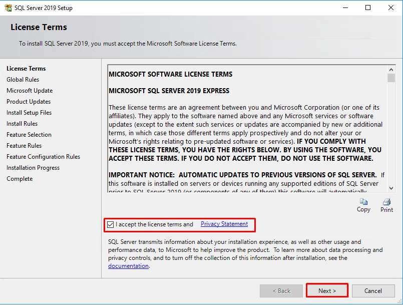

The\*\* Global Rules\*\* screen will be launched and, the SQL Server Setup will be checked the computer configurations:

The **Product Update** screen checks the latest updates of the SQL Server Setup and if we don’t have an internet connection, we can disable the **Include SQL Server product updates** option:

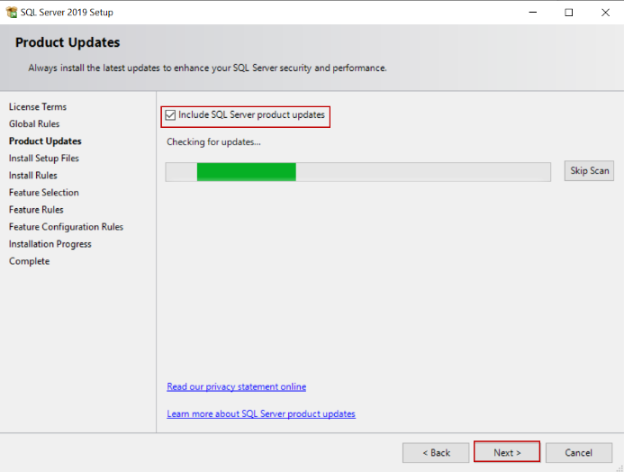

In the **Install Rules** screen, the potential issues will be checked by SQL Setup that might be occurred during the installation. We will click the **Next** button and skip the next step:

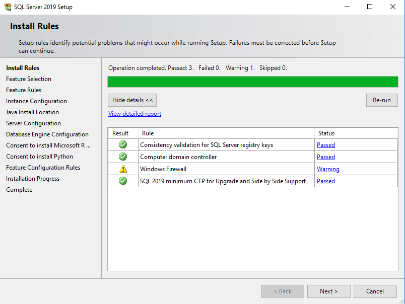

In the \*_Feature Selection \*_screen, we can select the features which we want to install. For this installation, we will disable the following features:

Machine Learning Services and Language Extensions  
Full-Text and Semantic Extractions For Search  
PolyBase Query Service for External Data  
LocalDB  
At the same time, we can specify the installation path of the SQL Server through the Instance root directory option:

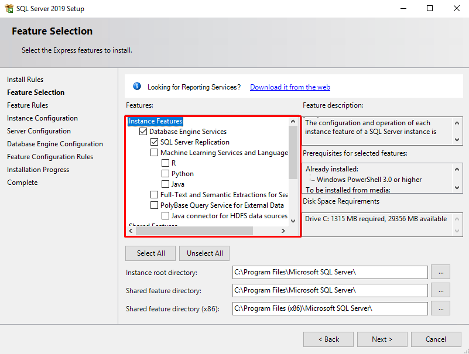

In the **Instance Configuration** screen, we will give a name to the SQL instance but we will not change the default name of the installation. Click the **Next** button:

In the **Server Configuration** screen, we can determine the startup type of the SQL Server Database Engine and SQL Server Browser services. We will not change the default options:

In the\*\* Database Engine Configuration\*\* screen, we will specify the authentication mode of the SQL Server. We have two options on this screen.

In the \*_Windows authentication \*_mode, the SQL logins are controlled by the Windows operating systems and it is best practice to use this mode.

In the **Mixed Mode**, the SQL Server can be accessed with both Windows authentication and SQL Server authentication. For this installation, we will select the Mixed Mode option, so we will set the password of the sa login of the SQL Server and we will also add a windows login. We can directly add the current windows user to the windows through the Add Current User button:

In the Installation Progress screen, we can follow the progress of the installation:

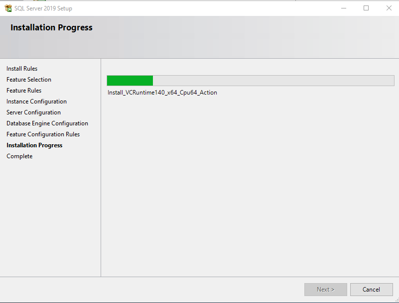

In the final step, the Complete screen meets us and it gives information about the result of the installation:

**Test connection to SQL Server Express**  
After installing the SQL Express, we are able to connect to the SQL Server Database Engine over the SQL Server Management Studio.

So then click on Install SQL Server Management tool and download the SQL server management Studio(SSMS)

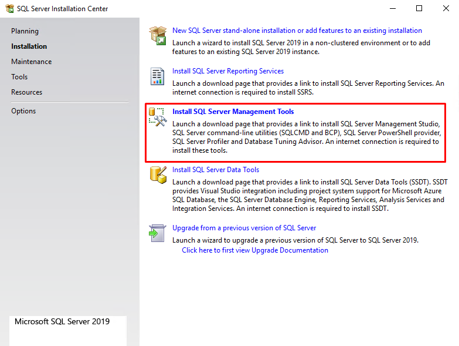

To connect to the SQL Server using the Microsoft SQL Server Management Studio, you use these steps:

First, launch the Microsoft SQL Server Management Studio from the Start menu:

Next, from the **Connect** menu under the **Object Explorer**, choose the **Database Engine**er…

Then, enter the information for the Server name (localhost), Authentication (SQL Server Authentication), and password for the sa user and click the Connect button to connect to the SQL Server. Note that you should use the sa user and password that you entered during the installation.

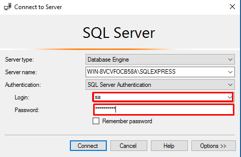

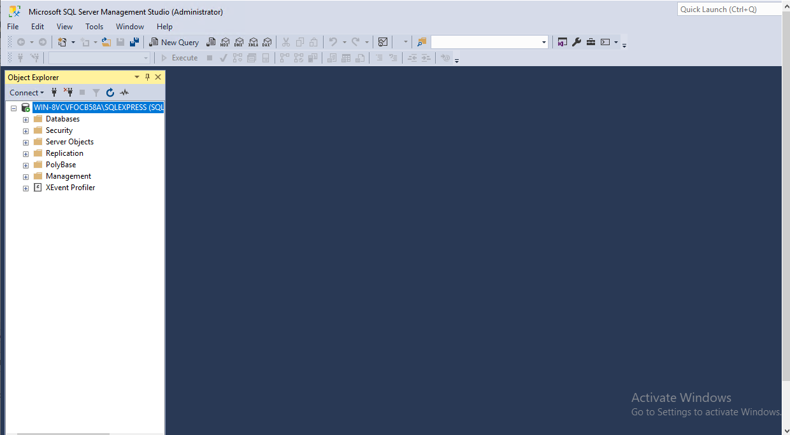

The installation is completed.

Thankyou
