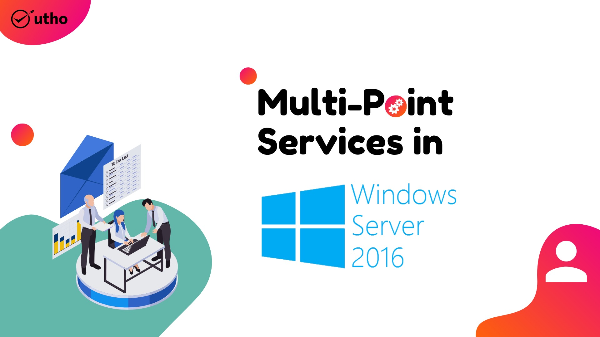

The MultiPoint Services (MPS) role replaces the well-known Windows MultiPoint Server 2012. This role enables multiple users to share simultaneously one single computer. In turn, each user has its own independent Windows experience..

Let get started.

**Step 1** – Open server manager dashboard, **“Add roles and features”** **Click Next,** Choose **“Role-based or feature-based installation”** radio button and **click Next, Scroll down and choose** select **MultiPoint Services.** You may notice there are some additional features are required for MPS such as **File And Storage Services, Print and Document Services and etc. Just click on “Add features”** and **click Next. (refer picture).**

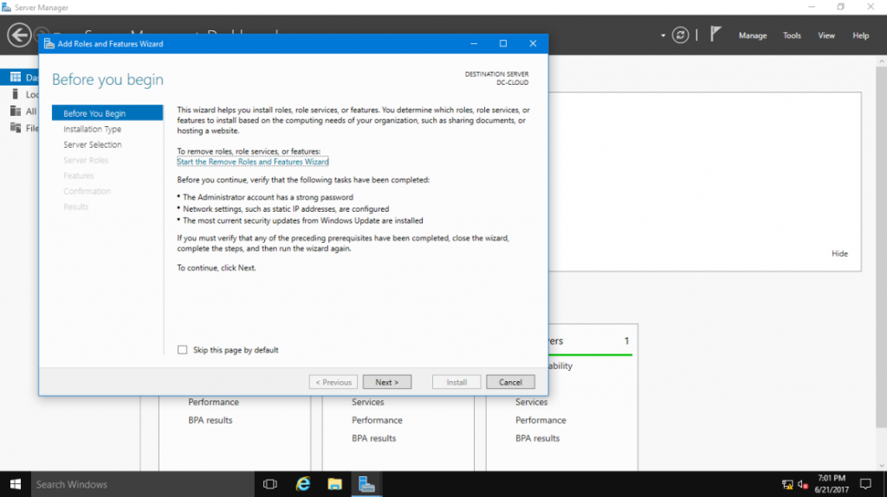

**Step** **2** – Read a great explanation from Microsoft **“what is MPS?”**.

Remote Desktop Licensing **needs to be activated or use trial period** (120 days).

**Step** **3** – I leave **default settings** and click Next. Read and **click next.**

- **Print Server** is needed to manage multiple printers

- **Distributed Scan Server** – enables you to manage and share networks scanners that support Distributed Scan Management

- **Internet Printing** creates a web site where users can manage printer jobs on the server .  
    If you have installed Internet Printing client on stations you can connect and print to shared printers using Web Browser and Internet Printing Protocol

- **LPD service** – Line Printer Daemon Service enables UNIX-based computers using the Line Printer Remote service to print to shared printers on MPS

**Step** **4** – I leave **default settings** and click Next. Read and **click next.**

- **RD Gateway** – to publish RDS (not suitable for MPS)

- **RD Connection Broker** – to distribute connections  (not suitable for MPS)

- **RD Virtualization Host** – for VDI

- **RD Web Access** – web access to RD session/vdi/remoteapp collections (not suitable for MPS)

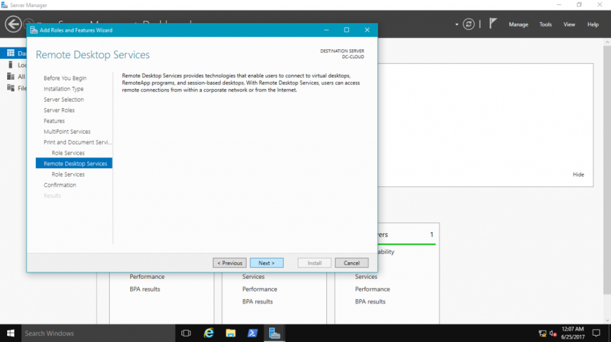

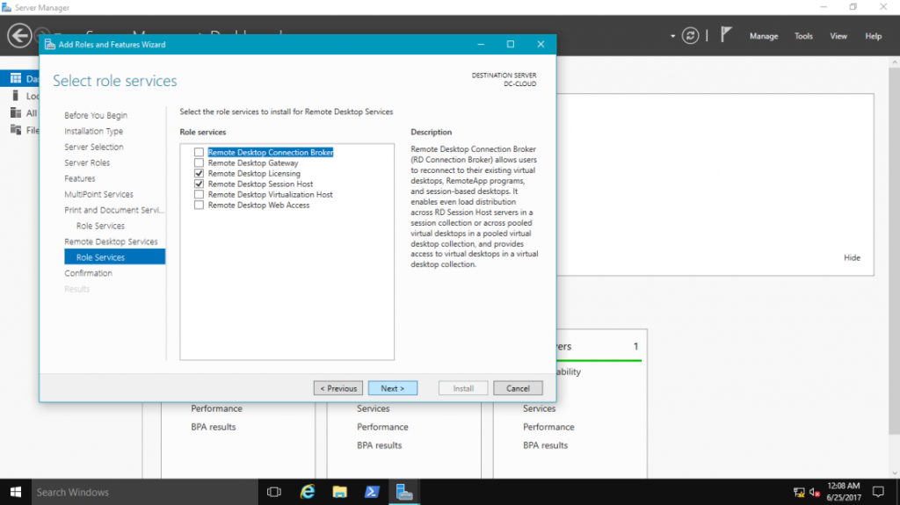

**Step** 5 – **Click at Restart** the destination server automatically if required checkbox to restart your server.

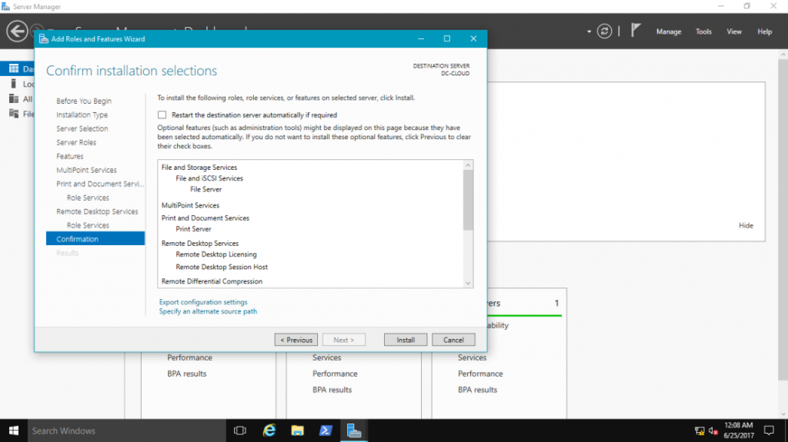

**Step** **6**: – When installation progress reaches the end click the **Close** button to close the Add Roles and Features Wizard. **The server restart is required.**

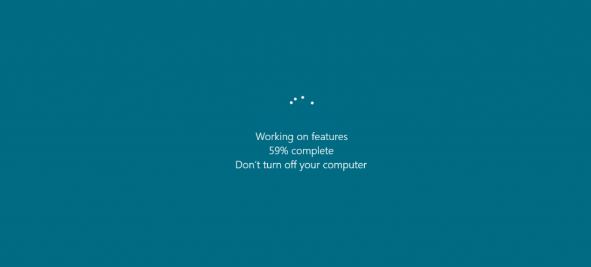

**Step** **7** – Press Start button and open **MultiPoint Manager.**

**Step** **8** – **Add MultiPoint Servers** or **personal computers** (optional)

**Step** **9** – Go to Users tab and click “**Add user account**”, click Next and select user type. **(refer picture).**

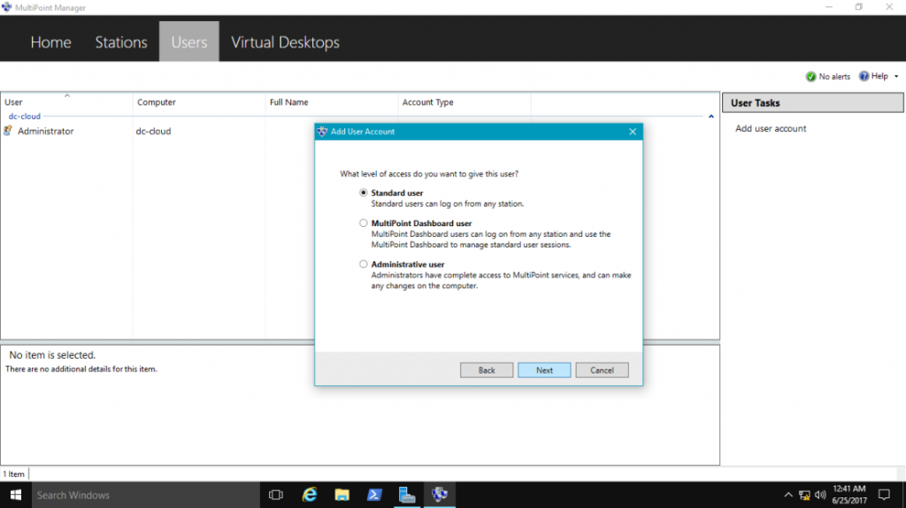

**Step** **10** – Testing, Connect to **MultiPoint** **Server** from the user connection using **RDP**.

When user firstly log on to **MultiPoint** **Services** he receives **privacy notification** “To assist you with your usage of this computer, your activities may be monitored by your system administrator”

Click on **“Accept and continue using this computer”** and **go back to MPS server. (refer picture).**

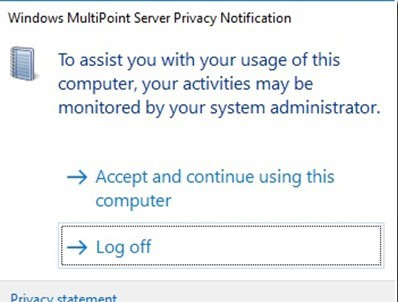

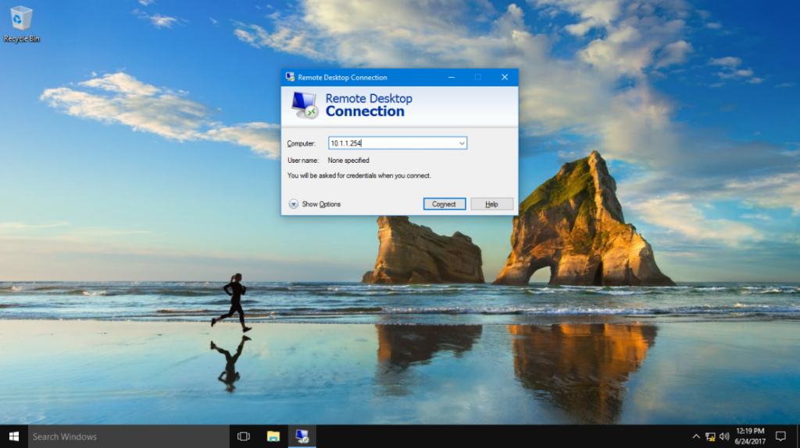

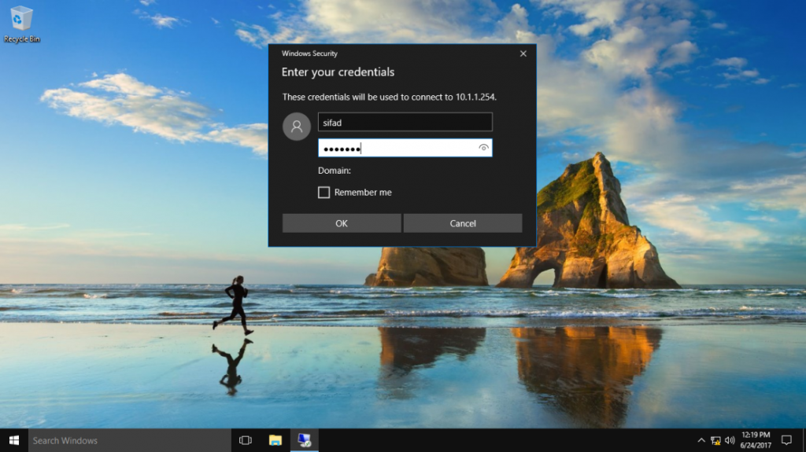

**Step** **11** – On MPS server run **MultiPoint Dashboard**. All screens from user stations are being added and updated to dashboard.

You can see what happens on user’s station, block this desktop, set message for blocked users, take control, write IM to user, block USB storage or limit web access on selected desktops.

**Step** **12** – You can also **project your desktop to all or selected user desktops**.

It’s really needed when trainer or teacher does not have projector so he or she shares screen to all user’s station.

If you are familiar with **Lync / Skype** there is a similar feature called as **“desktop sharing” (refer picture).**

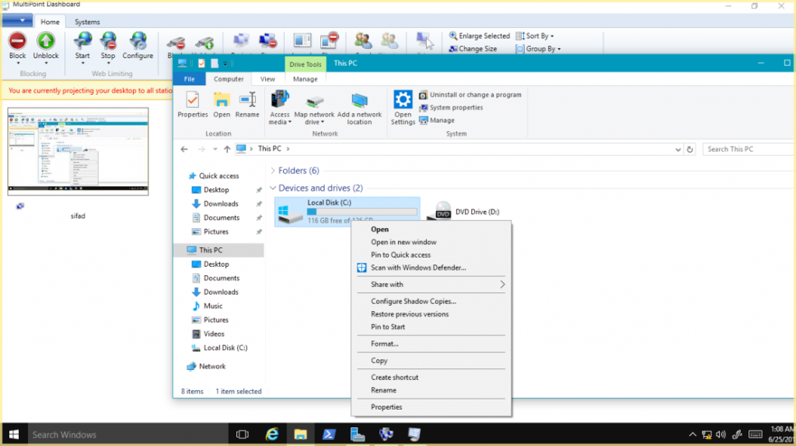

**Step** **13** – If you open MultiPoint Manager you can notice that list of stations has been updated with rlevchenko’s station.

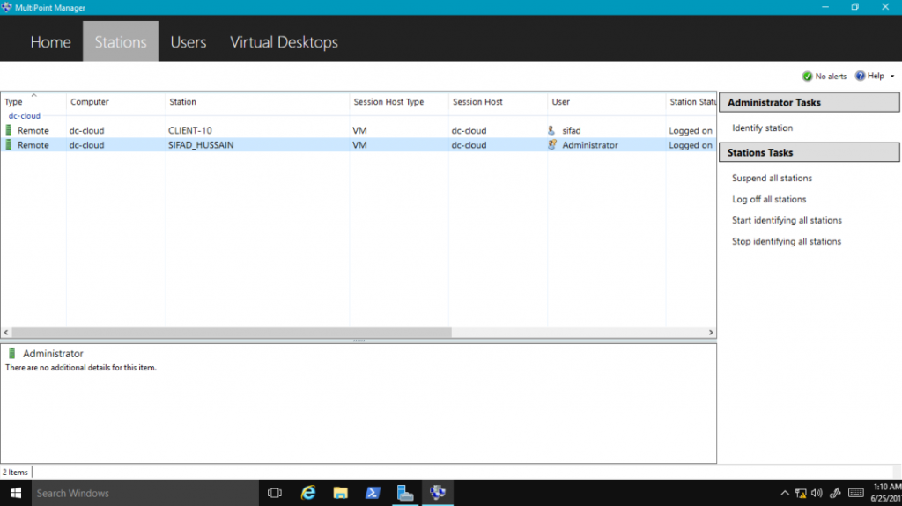

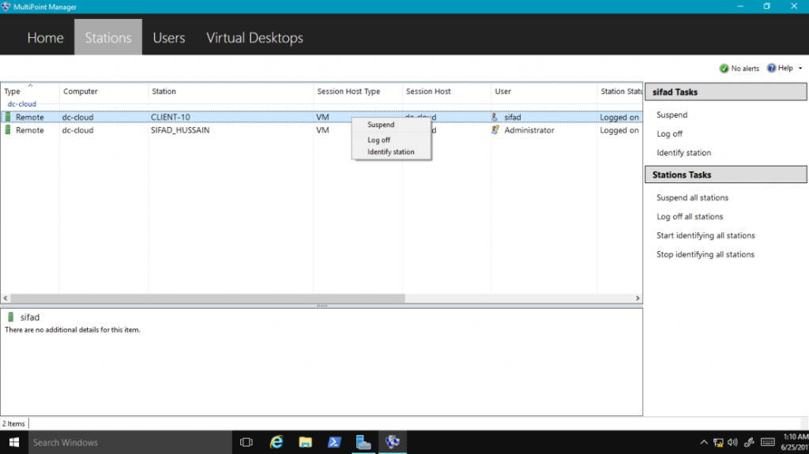

Thank you :)
