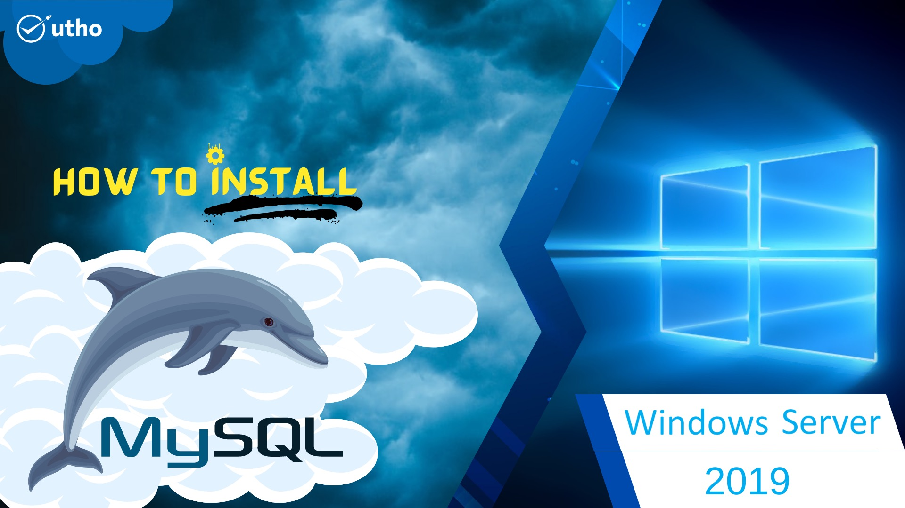
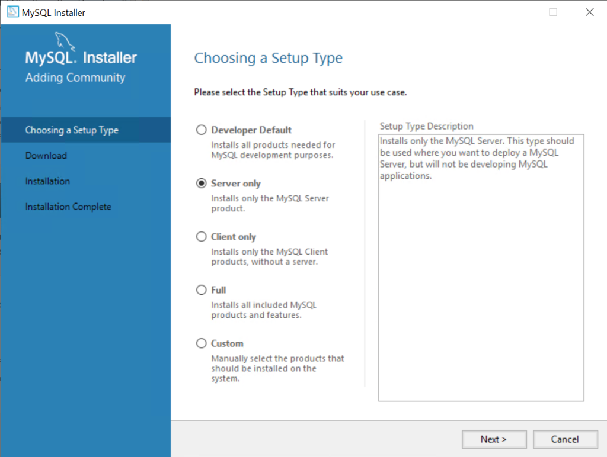
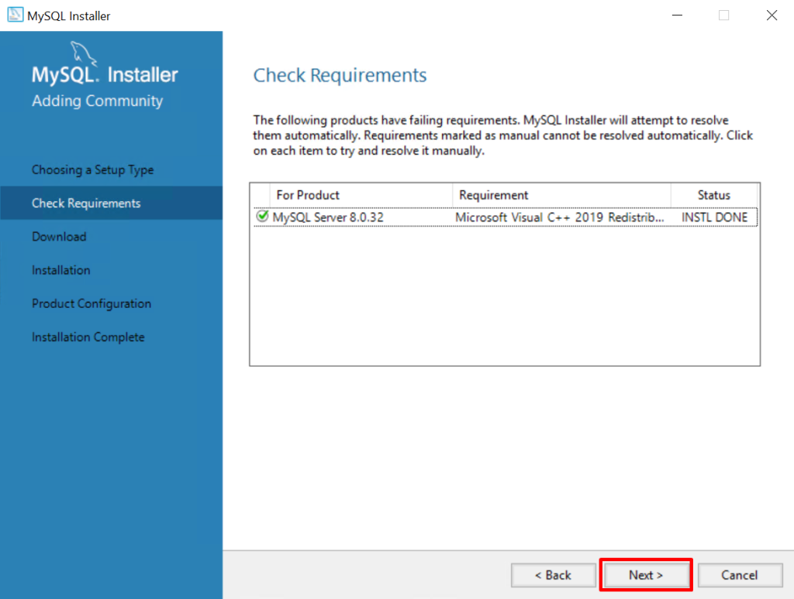
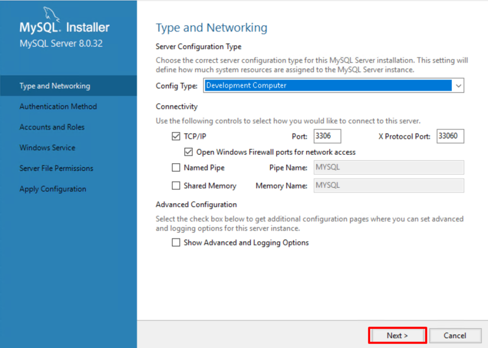
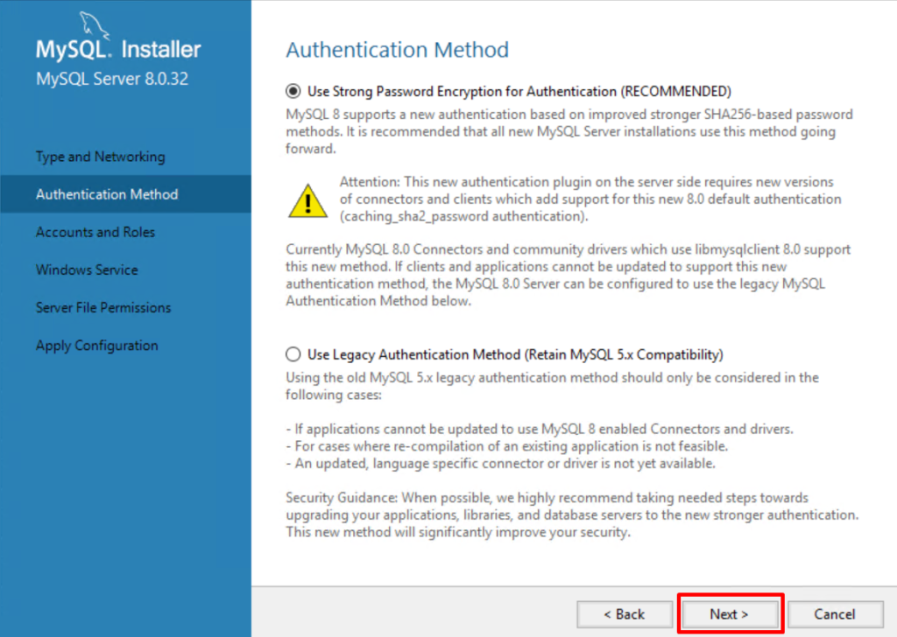
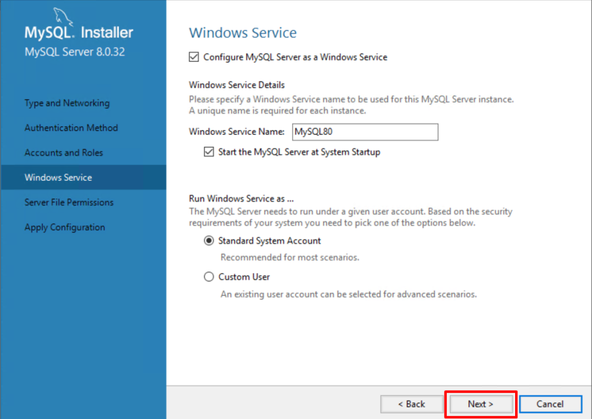
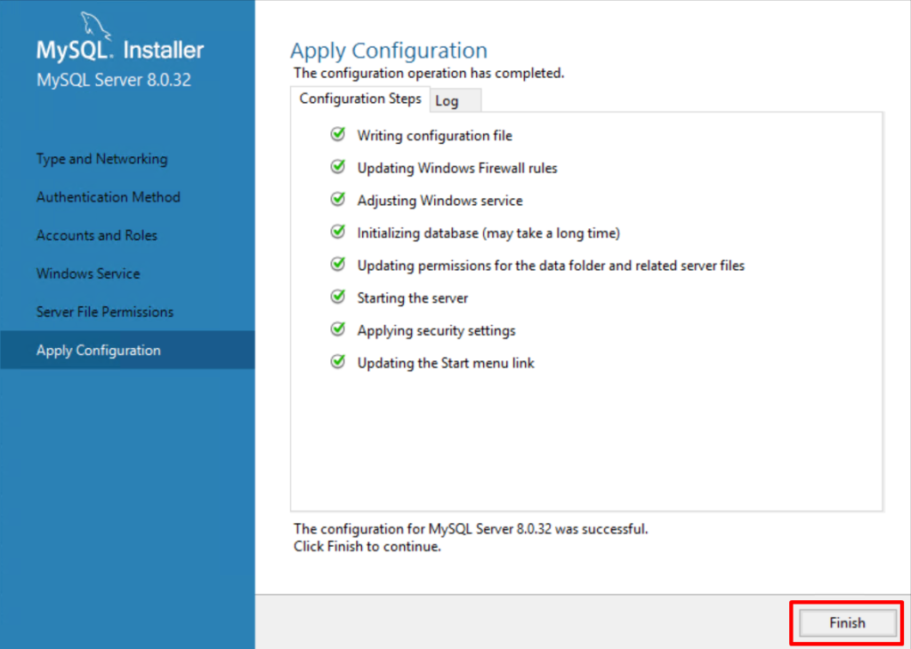

## Introduction

In this article, you will learn how to install MySQL on Windows Server 2019.

MySQL is a database that can be downloaded for free and is used by many people. It is a relational database management system that is used by a lot of people. Even though Linux servers use it more often, it works just as well with Windows Servers.

## Install MySQL

**Step 1: Start by installing the [Windows Server 2019 MySQL Installer](https://dev.mysql.com/downloads/installer/). Select the version that fits on your machine, then click Download.**


**Step 2: Run the programme from the pop-up window at the bottom of your computer after you've downloaded the file.**


## MySQL Installer Setup

**Step 1: When you ran the programme in the last step, a new window came up with the MySQL Installer setup. It asks you which MySQL items you want to put on the host.**



**One choice is to choose the setup type that is already set up and fits your needs. Here's a quick look at each mode:**

Developer Default: Installs MySQL Server, Shell, Router, Workbench, MySQL for Visual Studio, MySQL Connectors (for.NET, Python, ODBC, Java, and C++), MySQL Documentation, and MySQL Samples and Examples.

Server only: Only puts the MySQL server in place. This type of setup runs the GA (general availability) or development release server you chose when you downloaded MySQL Installer. It uses the download and data paths that are set by default.

Client only: Only downloads the latest MySQL applications and MySQL connectors. This setup type is similar to the Developer Default type, but it does not include the MySQL server or the client programmes that usually come with it, such as MySQL or mysqladmin.

Full: Installs all available MySQL tools.

Custom: With the custom setup type, you can search for and choose specific MySQL items from the MySQL Installer collection.

For this article, select Server only.

Step 2: Click on Execute.


**Step 3: Click on terms and conditions, then click install.**


**Step 4: Once the setup is done, it will show the message below, which says that the installation was successful. Click the close.**


**Step 5: Click on Check Requirements, which is on the left side of the screen.**



**Step 6: Click on Execute.**


**Step 7: Click on next.**


**Step 8: Click on Next to configure the MySQL server.**


**Step 9: Choose the setting that works your needs, then click Next.**



**Step 10: Use Strong Password Encryption for Authentication and click Next in the Authentication Method area.**



**Step 11: The Accounts and Role window is the next screen. This is where you can set your MySQL Root Password. Fill out this part, then click Next.**


**Step 12: You can set up MySQL Server as a Windows service and give the service a name on the Windows Service screen. The given name for this lesson is MySQL8.0.**

**You can also start the service at System Startup and use the normal system account or a custom user to run it. Choose what you want and then click Next.**



**Step 13: Click "Execute" after selecting "Configuration Steps."** 


**Step 14: When the operation is finished, click the Finish button.** 



## Using Command Prompt to access MySQL

**If you use the Windows Start menu to open Command Prompt and then run the mysql command, you may see an error below.**

```
# mysql

```


**This mistake happens because MySQL Bin has not been added to the path. To find where the MySQL Bin is, use the File Manager to go to This PC. Then go to C drive > Program Files > MySQL > MySQL Server 8.0 > bin. Right-click on "bin" in the bar at the top and choose "Copy address."**

```
# cd C:\\Program Files\\MySQL\\MySQL Server 8.0\\bin

```

**And then run the following to access your MySQL**.

```
# mysql -u root -p

```


## Conclusion

Hopefully, now that you have learned how to install MySQL on Windows Server 2019.

Also read: [How to Block or Allow TCP/IP Port in Windows Firewall](https://utho.com/docs/tutorial/how-to-block-or-allow-tcp-ip-port-in-windows-firewall/)

Thank You 🙂
