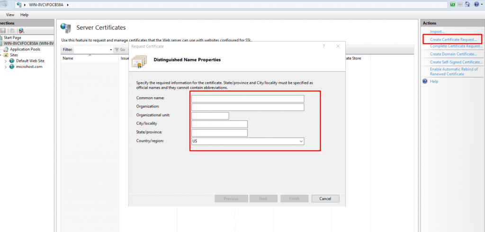
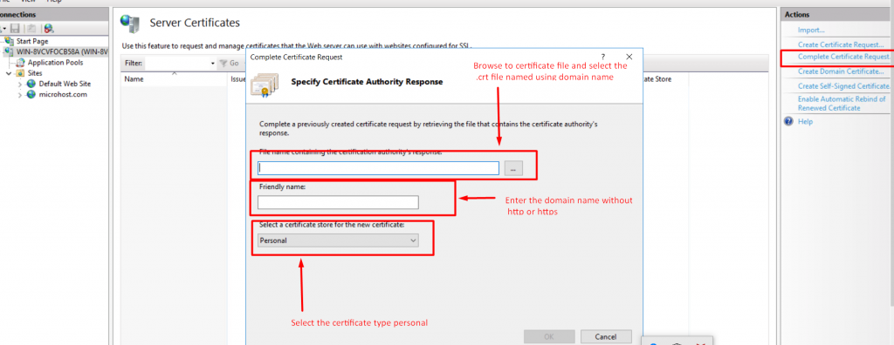
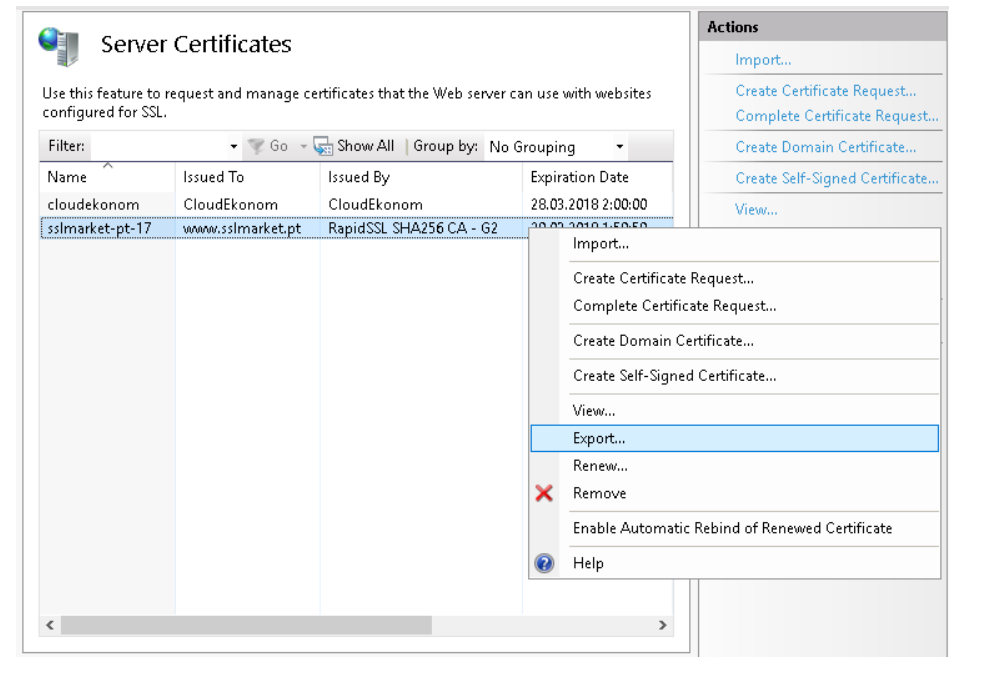
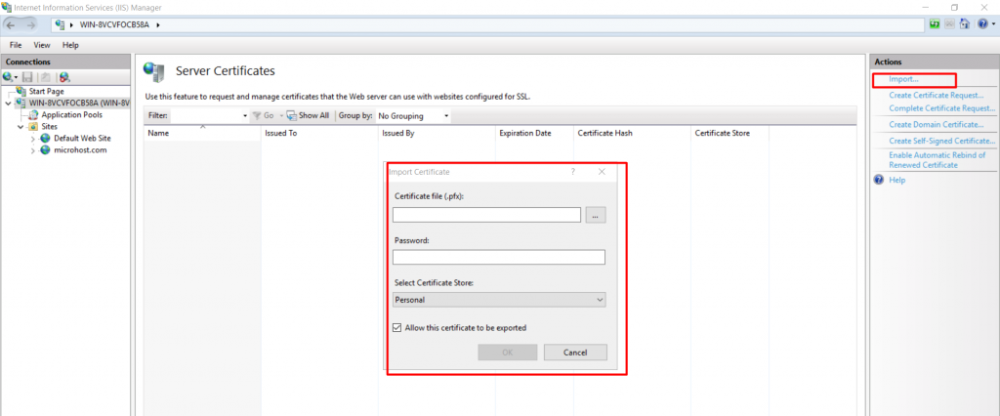

**Introduction :**  
SSL (Secure Sockets Layer) and its successor, TLS (Transport Layer Security), are protocols for establishing authenticated and encrypted links between networked computers. We can have secure communication over the internet using SSL.

**Prerequisite**

1. windows server with administrator permission

3. One Fully qualified domain name

5. IIS should be installed on the server

7. A SSL certificate

**Step 1:** The first thing , we have to do that, we need to generate a CSR certificate from the server, where we have to install the SSL certificate. We can generate the CSR certificate in the IIS ( Internet Information Services ) in windows server. Please have a look on the below screenshot for your reference.

**Step 2**: We have to click the option " Click Certificate Request" given in the write hand side of the screenshot. 

**Step 3**: Once you will click on the " Click Certificate Request", you will get the new prompt as per the above screenshot . We need to fill all the required details correctly as per the below screenshot and then click on the next button.

**Step 4**  : While clicking on the next button , a new prompt will appear, there we have to select the encryption bit. It can be of your choice. Usually we create it using 2048 bit.

**Step 5** : While clicking on the next button , a new prompt will appear, there we have to give the CSR file storage location . Weather, we can create a text file prior the installation or we can defile the file at that moment also.  

**Step 6** : Once you will click on finish , a CSR certificate will be create. We can view the CSR file content while opening the file using notepad or with any text editor.

**Step 7**: Now we have to share this CSR certificate with the concerned person to generate the SSL certificate. Once we will receive the certificate, we will proceed with the installation. In IIS there is a option of " Complete Certificate Request" just below the CSR option. We need to click on that, afterward a new prompt will appear where you need to select the .crt file afterward enter the domain name and then click on OK button. 

**Step 8**: Now as per the above screenshot, we have successfully completed the installation of the certificate on the server. Next we will see how we can import and export the certificate.

\*\*\*\*\*\*\*\*\*\*\*\*\*\*\*\*\*\*\*\*\*\*\*\*\*\*\*\*\*\*\*\*\*\*\*\*\*\*\*\*\*\*\*\*\*\*\*\*\*\*\*\*\*\*\*\*\*\*\*\*\*\*\*\*\*\*\*\*\*\*\*\*\*\*\*\*\*\*\*\*\*\*\*\*\*\*\*\*\*\*\*\*\*\*\*\*\*\*\*\*\*\*\*\*\*\*\*

HOW TO EXPORT AND IMPORT SSL CERTIFICATE USING IIS (Internet Information Services)

**Step 1**: Firstly we need to export the certificate, so we will move to the SERVER CCERTIFICATE option of IIS. There we need to select the certificate which we want to export as .pfx file . While exporting we have to assign a password for the certificate which will be used while importing the ssl in another server.

Please have a look on the below screenshot.

**Step 2:**  One the certificate  will be exported we need to import it on another server, where we want to install that ssl certificate. We can find the import option in the Server Certificate . We have to browse to the path of .pfx file then we need to enter the password which had been generated while exporting the ssl certificate. Please have a look on the screenshot.

We have completed the export and import task of ssl certificate now.

Thank you :)
